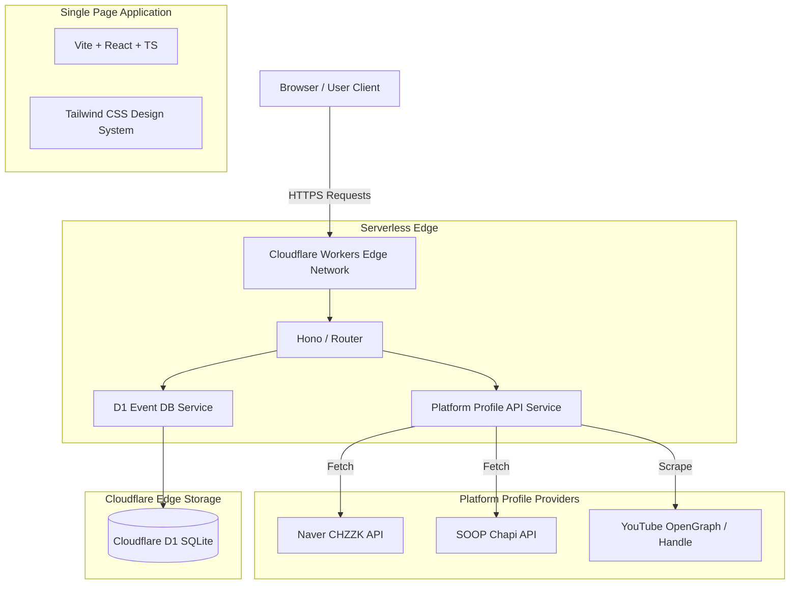

# 🏗️ [기획] 02_SYSTEM_ARCHITECTURE.md
**버전**: v1.0  
**최종 수정일**: 2026-07-30  

---

## 1. 전체 아키텍처 다이어그램 (Architecture Diagram)

---

## 2. 기술 스택 (Technology Stack)

| 구분 | 기술 / 라이브러리 | 설명 |
| :--- | :--- | :--- |
| **Frontend** | React 18, TypeScript, Vite, Tailwind CSS | 초고속 SPA 렌더링 및 모던 디자인 시스템 |
| **Backend** | Cloudflare Workers, TypeScript | 전 세계 Edge에서 실행되는 0ms Cold Start 서버리스 |
| **Database** | Cloudflare D1 (SQLite) | 서버리스 분산 SQL 데이터베이스 |
| **Hosting** | Cloudflare Pages / Workers Sites | 글로벌 CDN 에지 인프라 |
| **Icons & Utils**| Lucide-react, date-fns, ics | 벡터 아이콘, 시간대 처리, 캘린더 파일 생성 |

---

## 3. 데이터 흐름 (Data Flow)

1. **프로필자동조회**:
   `Client` ➔ `GET /api/v1/platform/profile?platform=SOOP&url=...` ➔ `Cloudflare Worker` ➔ `PlatformApiService` ➔ `외부 플랫폼` ➔ `JSON 반환`
2. **일정 생성/수정**:
   `Client` ➔ `POST/PUT /api/v1/events` ➔ `EventDbService` ➔ `D1 Database (SQL Transaction)` ➔ `성공 응답`
