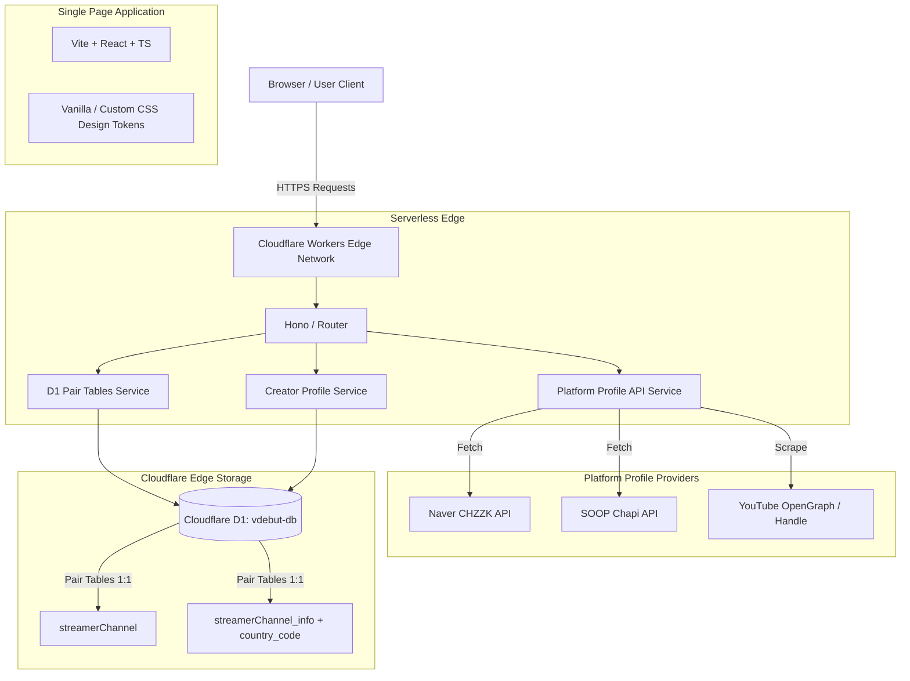

# 🏗️ [기획] 02_SYSTEM_ARCHITECTURE.md
**버전**: v2.0 (Intuitive Pair Tables Standard)  
**최종 수정일**: 2026-08-01  

---

## 1. 전체 아키텍처 다이어그램 (Architecture Diagram)

---

## 2. 기술 스택 (Technology Stack)

| 구분 | 기술 / 라이브러리 | 설명 |
| :--- | :--- | :--- |
| **Frontend** | React 18, TypeScript, Vite, Custom CSS | 반응형 렌더링 및 모던 디자인 시스템 |
| **Backend** | Cloudflare Workers, Hono, TypeScript | 전 세계 Edge에서 실행되는 0ms Cold Start 서버리스 라우팅 |
| **Database** | Cloudflare D1 (`vdebut-db`) | 1:1 Pair Tables 구조 (`streamerChannel` & `streamerChannel_info`) |
| **Hosting** | Cloudflare Workers / Sites | 글로벌 CDN 에지 인프라 배포 |
| **Icons & Utils**| Lucide-react, date-fns, ics | 벡터 아이콘, 시간대 처리, 캘린더 파일 생성 |

---

## 3. 데이터 흐름 (Data Flow)

1. **프로필 자동 조회**:
   `Client` ➔ `GET /api/v1/platform/profile?platform=SOOP&url=...` ➔ `Cloudflare Worker` ➔ `PlatformApiService` ➔ `외부 플랫폼` ➔ `JSON 반환`
2. **일정 조회 및 실시간 API 자동 보완 (Route B)**:
   `Client` ➔ `GET /api/v1/events` ➔ `EventDbService` ➔ `D1 Database (streamerChannel & streamerChannel_info JOIN)` ➔ `프로필 미설정 시 외부 API 자동 수집 및 DB UPDATE` ➔ `Events JSON 반환`
3. **일정 생성/수정 (Route A)**:
   `Client` ➔ `POST/PUT /api/v1/events` ➔ `EventDbService` ➔ `D1 Database 1:1 Pair Tables Transaction` ➔ `성공 응답`
