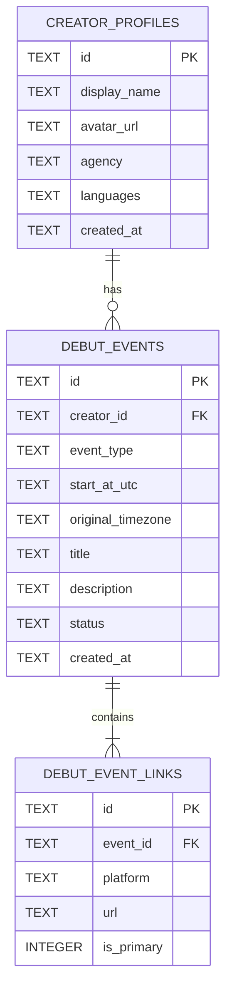

# 🗄️ [기획] 03_DATABASE_SCHEMA.md
**버전**: v1.0  
**최종 수정일**: 2026-07-30  
**DBMS**: Cloudflare D1 (SQLite)  

---

## 1. ERD (Entity Relationship Diagram)

---

## 2. 테이블 상세 명세 (Table Details)

### 2.1 `creator_profiles` (크리에이터 프로필)
| 컬럼명 | 타입 | 제약 조건 | 설명 |
| :--- | :--- | :--- | :--- |
| `id` | TEXT | PRIMARY KEY | 크리에이터 고유 ID (`cr_...`) |
| `display_name` | TEXT | NOT NULL | 활동명 (닉네임) |
| `avatar_url` | TEXT | | 프로필 이미지 / GIF URL |
| `agency` | TEXT | DEFAULT '개인세'| 소속사 (예: Stella lab, 개인세 등) |
| `languages` | TEXT | | 사용 언어 (JSON 배열 string e.g. `["KO"]`) |
| `created_at` | TEXT | NOT NULL | 생성 일시 (ISO-8601) |

### 2.2 `debut_events` (데뷔 일정)
| 컬럼명 | 타입 | 제약 조건 | 설명 |
| :--- | :--- | :--- | :--- |
| `id` | TEXT | PRIMARY KEY | 이벤트 고유 ID (`evt_...`) |
| `creator_id` | TEXT | FOREIGN KEY | `creator_profiles.id` 참조 |
| `event_type` | TEXT | NOT NULL | `FIRST_DEBUT` (최초데뷔) / `TRANSFER` (이적) |
| `start_at_utc` | TEXT | NOT NULL | UTC 기준 방송 시작 일시 |
| `original_timezone` | TEXT | DEFAULT 'Asia/Seoul' | 작성자 기준 원본 타임존 |
| `title` | TEXT | | 이벤트 제목 |
| `description` | TEXT | | 상세 설명 |
| `status` | TEXT | DEFAULT 'APPROVED' | 승인 상태 (`APPROVED`, `PENDING`) |

### 2.3 `debut_event_links` (방송국 및 방송 링크)
| 컬럼명 | 타입 | 제약 조건 | 설명 |
| :--- | :--- | :--- | :--- |
| `id` | TEXT | PRIMARY KEY | 링크 고유 ID (`link_...`) |
| `event_id` | TEXT | FOREIGN KEY | `debut_events.id` 참조 |
| `platform` | TEXT | NOT NULL | `CHZZK`, `SOOP`, `YOUTUBE`, `TWITCH` |
| `url` | TEXT | NOT NULL | 방송국/영상 대표 URL |
| `is_primary` | INTEGER | DEFAULT 1 | 대표 링크 여부 (1: 참, 0: 거짓) |
