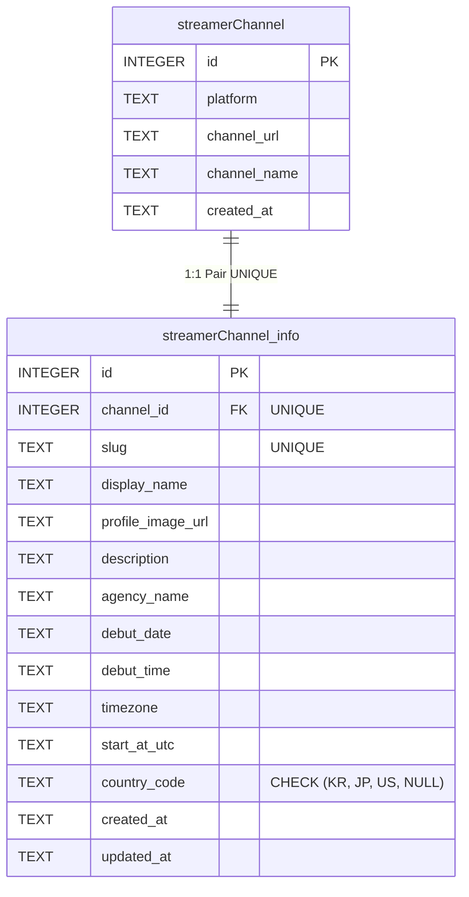

# 🗄️ [기획] 03_DATABASE_SCHEMA.md
**버전**: v2.0 (Intuitive Pair Tables + Country Code)  
**최종 수정일**: 2026-08-01  
**DBMS**: Cloudflare D1 (SQLite)  

---

## 1. ERD (Entity Relationship Diagram)

---

## 2. 테이블 상세 명세 (Table Details)

### 2.1 `streamerChannel` (상위 방송국 / 라이브 메인 테이블)
| 컬럼명 | 타입 | 제약 조건 | 설명 |
| :--- | :--- | :--- | :--- |
| `id` | INTEGER | PRIMARY KEY AUTOINCREMENT | 방송국 고유 ID |
| `platform` | TEXT | NOT NULL | 방송 플랫폼 (`CHZZK`, `SOOP`, `YOUTUBE` 등) |
| `channel_url` | TEXT | NOT NULL | 방송국 / 라이브 URL |
| `channel_name` | TEXT | | 수집 및 등록된 채널 이름 |
| `created_at` | TEXT | DEFAULT CURRENT_TIMESTAMP | 생성 일시 |

### 2.2 `streamerChannel_info` (하위 세부 정보 1:1 참조 테이블)
| 컬럼명 | 타입 | 제약 조건 | 설명 |
| :--- | :--- | :--- | :--- |
| `id` | INTEGER | PRIMARY KEY AUTOINCREMENT | 세부 정보 고유 ID |
| `channel_id` | INTEGER | NOT NULL UNIQUE (FK) | `streamerChannel.id` 1:1 참조 |
| `slug` | TEXT | NOT NULL UNIQUE | URL 식별용 슬러그 |
| `display_name` | TEXT | NOT NULL | 스트리머 활동명 (닉네임) |
| `profile_image_url` | TEXT | | 프로필 이미지 URL (미설정 시 API 자동 수집) |
| `description` | TEXT | | 프로필 소개글 |
| `agency_name` | TEXT | DEFAULT '개인세' | 소속사 (예: 개인세, 기업세 소속명 등) |
| `debut_date` | TEXT | NOT NULL | 데뷔 날짜 (YYYY-MM-DD) |
| `debut_time` | TEXT | NOT NULL | 데뷔 시간 (HH:MM) |
| `timezone` | TEXT | DEFAULT 'Asia/Seoul' | 기준 타임존 |
| `start_at_utc` | TEXT | NOT NULL | 표준 UTC 일시 (ISO-8601) |
| `country_code` | TEXT | CHECK (country_code IN ('KR', 'JP', 'US') OR NULL) | 활동 국가 코드 (`KR`, `JP`, `US`) |
| `created_at` | TEXT | DEFAULT CURRENT_TIMESTAMP | 생성 일시 |
| `updated_at` | TEXT | DEFAULT CURRENT_TIMESTAMP | 수정 일시 |
