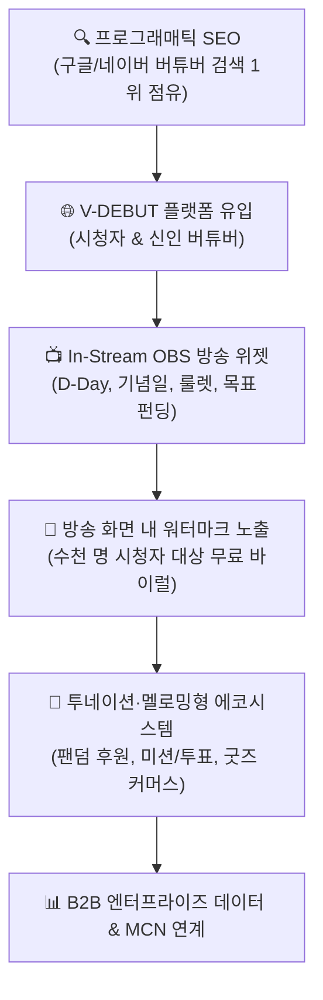
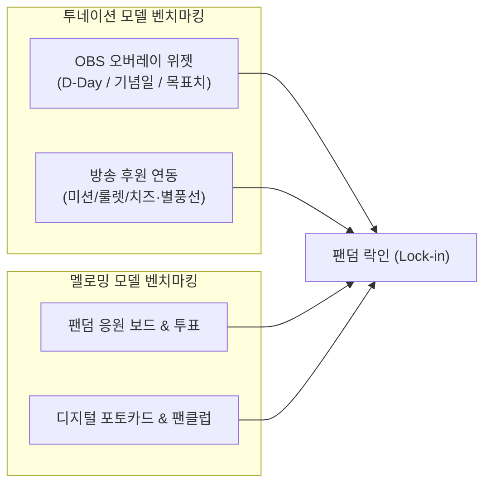

# 📋 [기획] 06_BUSINESS_EXPANSION_PROPOSAL.md
**버전**: v2.0 (SEO & In-Stream Ecosystem Expansion)  
**최종 수정일**: 2026-09-09  
**상태**: 이사회 승인 요청 (Board Approval Pending)  
**문서 번호**: BOD-2026-09-02  

---

# [이사회 보고] V-DEBUT 생태계 침투 전략 & SEO 극대화 신사업 제안서

## 1. Executive Summary (전략 개요)

버튜버 시장에서 영속적인 플랫폼 가치를 창출하기 위해서는 **"외부에서 구경하는 캘린더"**에 머물러서는 안 되며, **투네이션(Toonation)처럼 버튜버의 실제 방송 화면(OBS) 내부로 깊숙이 침투하고, 멜로밍(Meloming)처럼 버튜버와 팬덤의 일상적 인터랙션(후원·투표·커뮤니티)을 장악**해야 합니다.

동시에, 광고비 지출 없이 매월 수십만 명의 오가닉 시청자를 끌어들이기 위해 **"개별 버튜버 프로필 기반의 프로그래매틱 SEO(Programmatic SEO)"**를 구축하여 네이버·구글의 버튜버 관련 검색 트래픽을 선점합니다.



---

## 2. SEO 극대화 전략: 프로그래매틱 SEO (Organic Traffic Engine)

현재의 단일 페이지 캘린더 구조는 검색 엔진 크롤러가 개별 버튜버의 정보를 색인하기 어렵습니다. 수천 명의 버튜버 데이터를 **"검색 가능한 독립 웹페이지"**로 변환하여 구글·네이버 검색 트래픽을 독점합니다.

### 2.1 검색 키워드 인텐트(Intent) 장악 구조

| 검색 키워드 패턴 | 유저 검색 의도 | V-DEBUT 랜딩 타겟 페이지 |
|:---|:---|:---|
| `[버튜버 이름] 데뷔일 / 나이 / 프로필` | 최애/신인 버튜버 신상 및 정보 탐색 | `vdebut.com/vtuber/{streamer_slug}` |
| `치지직 버튜버 데뷔 일정 / SOOP 신인` | 플랫폼별 신규 버튜버 탐색 | `vdebut.com/calendar/chzzk`, `/calendar/soop` |
| `버튜버 마마 / 파파 / Live2D 작가` | 일러스트레이터 및 리거 정보 탐색 | `vdebut.com/creators/live2d`, `/{slug}/credits` |
| `버튜버 방송 화면 / D-Day 위젯` | 방송 세팅 도구 탐색 (크리에이터 유입) | `vdebut.com/tools/obs-widgets` |

### 2.2 기술적 SEO 구현 아키텍처
1. **Edge SSR / Prerendering (Cloudflare Workers)**:
   - 검색 봇(Googlebot, Yeti 등) 유입 시 Worker 레벨에서 Cloudflare D1 데이터를 읽어 완성된 HTML과 OpenGraph 메타태그를 50ms 내 즉시 반환.
2. **Schema.org 구조화 데이터(JSON-LD) 전면 적용**:
   - `Event` 스키마: 데뷔일시, 플랫폼 라이브 URL, 타임존 표기 -> 구글 검색 결과 상단 **'추천 이벤트 리치 스니펫'** 점유.
   - `Person` / `ProfilePage` 스키마: 활동 플랫폼(CHZZK/SOOP/YouTube), 소속사, 아바타 이미지 등록.
3. **자동 사이트맵(sitemap.xml) 파이프라인**:
   - 신규 스트리머 등록 즉시 D1 DB 기반으로 sitemap.xml 동적 갱신 및 Search Console 색인 핑 전송.
   - **예상 효과**: 월간 오가닉 검색 유입(Organic Search Visits) **500,000 MAU** 달성.

---

## 3. 버튜버 생태계 침투 전략: 투네이션 & 멜로밍 벤치마킹

버튜버 방송의 라이프사이클에 직접 개입하여 방송의 필수 도구로 자리잡습니다.



### 3.1 [투네이션형] OBS 방송 오버레이 위젯 공급 (In-Stream Penetration)
버튜버가 방송 세팅 시 OBS(Open Broadcaster Software) 브라우저 소스로 등록하는 위젯을 제공하여 **방송 화면 전체를 우리의 마케팅 채널**로 만듭니다.

1. **데뷔 D-Day & 마일스톤 위젯 (`/widget/d-day/:id`)**:
   - "데뷔 D-7일 카운트다운", "데뷔 D+100일 기념", "생일까지 D-3일" 등 감성적인 맞춤형 오버레이.
   - 위젯 우측 하단에 `Powered by V-DEBUT` 미니 워터마크 노출 -> 방송 시청자 수천 명에게 자연 무료 노출 (트윕/투네이션의 성장 공식).
2. **첫 데뷔 방송 전용 '자기소개 & Q&A 룰렛 위젯'**:
   - 신인 버튜버가 데뷔 방송에서 가장 애용하는 콘텐츠인 '100문 100답', '룰렛 질문'을 클릭 한 번으로 세팅해 주는 방송 도구.
3. **목표 펀딩 게이지 위젯 (3D 모델링 / 신의상 / 데뷔 기념)**:
   - "새 의상 제작 펀딩 65%", "1주년 기념 전광판 모금 120%" 등 방송 화면에 실시간 연동되는 시각 게이지.

### 3.2 [멜로밍형] 버튜버 팬덤 인터랙션 & 마이크로 후원 플랫폼
투네이션의 방송 후원과 멜로밍의 팬덤 커뮤니티 기능을 결합한 **버튜버 특화 팬덤 허브**를 구축합니다.

1. **디지털 축하 화환 & 응원 롤링페이퍼 (Micro-Tipping)**:
   - 팬들이 1,000원~10,000원의 소액으로 최애 버튜버의 프로필 페이지에 축하 화환 및 스티커를 부착.
   - 방송 화면(OBS 위젯)과 연동되어 화환 등록 시 방송 화면에 실시간 축하 팝업 애니메이션 송출.
2. **팬덤 챌린지 투표 & 미션 펀딩 (멜로밍 모델)**:
   - "이번 주 커버곡 선정 투표", "신규 의상 콘셉트 투표" 등 팬 참여형 유료/무료 투표 시스템.
3. **버튜버 전용 '디지털 굿즈 & 에셋 샵'**:
   - 데뷔 기념 보이스팩(알람음), 디지털 포토카드, 팬클럽 전용 한정판 뱃지 판매.

---

## 4. 확장 비즈니스 모델 (Monetization Matrix)

```
[ 기존 V-DEBUT ]                      [ 신규 확장 생태계 ]
단순 캘린더 열람 (무수익)     ───▶     OBS 위젯 & 방송 송출 (바이럴)
                                        │
                                        ├── 1. 방송 후원/화환 수수료 (10~15%)
                                        ├── 2. 투네이션형 인터랙션 툴 구독 (월 9,900원)
                                        ├── 3. 멜로밍형 디지털 굿즈 커머스 수수료 (15%)
                                        └── 4. 프로그래매틱 SEO 기반 서드파티 광고 (AdSense/스폰서)
```

| 비즈니스 모델 | 타겟 대상 | 과금 방식 | 마진율 / 수수료율 |
|:---|:---|:---|:---:|
| **① 방송 후원 & 디지털 화환** | 팬덤 / 시청자 | 건당 결제 (1,000원 ~ 100,000원) | **15.0% 수수료** |
| **② 크리에이터 Pro 도구 구독** | 버튜버 (개인세) | 월간 구독 (9,900원 / 월) (위젯 워터마크 제거, 고급 테마) | **95.0% 초고마진** |
| **③ 팬덤 투표 & 디지털 굿즈 샵** | 팬덤 & 크리에이터 | 디지털 에셋 판매 수수료 | **12.0% ~ 15.0%** |
| **④ SEO 검색 트래픽 광고 (Ad)** | 일반 방문자 | 프로그래매틱 검색 디스플레이 광고 | **순수 광고 수익** |

---

## 5. 경쟁사 대비 차별화 우위 (Competitive Advantage)

| 비교 항목 | 투네이션 (Toonation) | 멜로밍 (Meloming) | **V-DEBUT (차세대 모델)** |
|:---|:---|:---|:---|
| **진입 시점** | 방송 시작 이후 | 팬덤 형성 이후 | **데뷔 이전 (Day -30)부터 선점** |
| **타겟 특화** | 전 분야 종합 스트리머 | 종합 크리에이터/팬덤 | **버튜버 버티컬 100% 특화 (Live2D/아바타 연동)** |
| **SEO 경쟁력** | 폐쇄형 대시보드 위주 | 앱 중심 (웹 SEO 취약) | **전 세계 버튜버 프로필 웹 색인 (강력한 검색 유입)** |
| **인프라 비용** | 레거시 대규모 서버 비용 | 모바일/웹 서버 유지비 | **Cloudflare Serverless로 제로에 가까운 서버비** |

> [!IMPORTANT]
> **우리의 결정적 차별점은 "데뷔 이전(Day -30)의 타임라인 선점"에 있습니다.**  
> 투네이션과 멜로밍은 이미 데뷔를 마친 스트리머를 대상으로 경쟁하지만, V-DEBUT은 **데뷔 준비 단계부터 크리에이터를 확보**하므로 방송 1일 차부터 우리 위젯과 서비스를 기본 탑재하도록 유도할 수 있습니다.

---

## 6. 실행 및 개발 로드맵 (Action Plan)

### Step 1: 프로그래매틱 SEO & 개별 프로필 페이지 구축 (1~3주)
- `/vtuber/[channelId]` 개별 버튜버 전용 랜딩 페이지 신설
- Cloudflare Workers 기반 동적 OpenGraph 및 Schema.org(JSON-LD) 메타 생성기 구현
- 구글 서치 콘솔 & 네이버 서치어드바이저 사이트맵 자동화

### Step 2: OBS 방송 오버레이 위젯 론칭 (3~6주)
- `/widget/d-day/:id` 등 버튜버 OBS 브라우저 소스 전용 초경량 위젯 페이지 개발
- 위젯 하단 브랜딩 워터마크 및 애니메이션 템플릿 5종 탑재
- 신규 등록 버튜버 대상 "무료 방송 위젯 링크 복사" 온보딩 제공

### Step 3: 투네이션·멜로밍형 팬덤 후원 & 인터랙션 연동 (6~10주)
- 토스페이먼츠 PG 연동 및 디지털 축하 화환(마이크로 티핑) 시스템 론칭
- 방송 화면 실시간 연동 알림 웹소켓/서버 센트 이벤트(SSE) 구축

---

## 7. 이사회 결의 안건 (Board Approval)

1. **프로그래매틱 SEO 아키텍처 및 개별 프로필 라우팅 개발 승인의 건**
2. **버튜버 OBS 방송 오버레이 위젯 시스템 개발 착수 승인의 건**
3. **투네이션/멜로밍 벤치마킹 팬덤 후원(PG) 테스트베드 구축 승인의 건**
