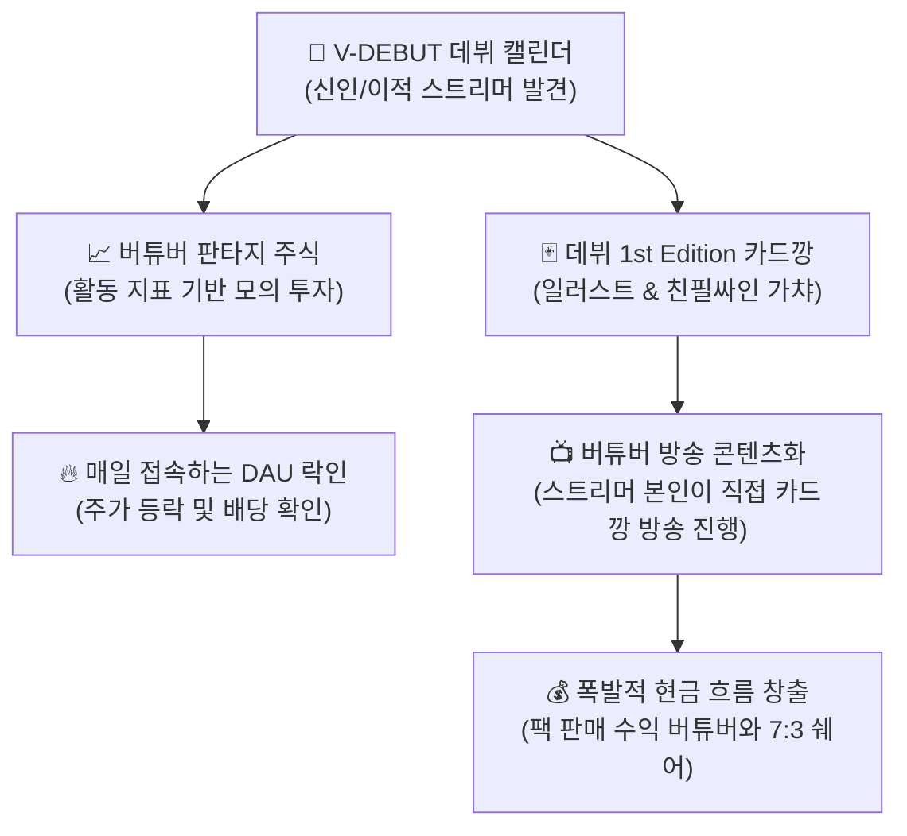
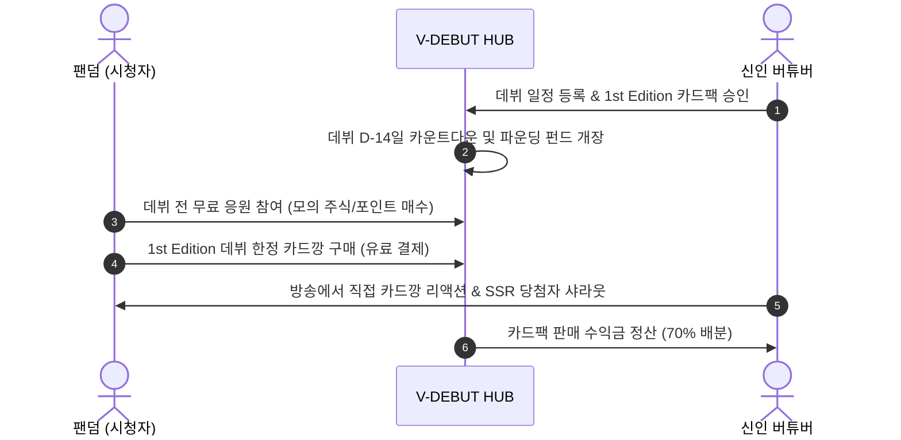

# 📋 [기획] 07_GAMIFICATION_STOCK_AND_CARDS.md
**버전**: v1.0 (Gamification & Collectibles)  
**최종 수정일**: 2026-09-09  
**상태**: 이사회 승인 요청 (Board Approval Pending)  
**문서 번호**: BOD-2026-09-03  

---

# [이사회 보고] 버튜버 모의 주식 & 디지털 카드깡 신사업 타당성 분석서

## 1. Executive Summary (제안 배경)

버튜버 팬덤 생태계에서 가장 폭발적인 자발적 바이럴과 체류 시간을 기록하는 두 가지 핵심 메커니즘은 **① 모의 주식(Fantasy Stock)**과 **② 포토카드 가챠(카드깡)**입니다.

이 두 모델은 단순 관람자에 불과했던 시청자를 **"능동적 참여자이자 주주, 열성 수집가"**로 전환시키는 강력한 무기입니다. 특히 **"데뷔(Day 0)"**라는 V-DEBUT의 고유 자산과 결합할 때, **"데뷔 1st Edition 한정판 카드"** 및 **"신인 초기 발굴 주주(Founding Investor)"**라는 강력한 팬덤 서사를 창출할 수 있습니다.



---

## 2. 모델 1: 버튜버 모의 주식 시장 (VTuber Fantasy Stock)

### 2.1 개념 및 메커니즘
- 스트리머의 실제 방송 활동 지표(팔로워 증가율, 평균 시청자 수, 방송 시간, 클립 재생 수)를 알고리즘으로 산출하여 **'버튜버 주가(Share Price)'**를 산출.
- 유저는 출석 체크, 데뷔 일정 공유, 응원 댓글 등으로 획득한 **무료 활동 포인트(V-Point)**로 유망 신인 주식을 매수/매도.

```
[주가 산출 알고리즘 예시]
주가 = 기본가(1,000P) + (주간 팔로워 순증 × W1) + (평균 시청자 수 × W2) + (팬덤 응원 화환 수 × W3)
```

### 2.2 비즈니스 기회 및 기대 효과
- **일간 활성 사용자(DAU)의 폭발적 증대**: 주가 변동 및 배당 정산을 확인하기 위해 매일 2~3회 이상 의무적으로 접속.
- **"내가 키운 하꼬" 서사 자극**: 아무도 모르는 신인 버튜버의 주식을 500원에 샀는데, 3달 뒤 1만 원 대기업이 되었을 때 팬이 느끼는 성취감 선사.
- **커뮤니티 자연 바이럴**: 디시인사이드(치지직/숲 갤러리), 트위터 등에서 *"오늘 신인 OOO 떡상했다"*, *"OOO 저평가 우량주 풀매수 추천"* 등 자발적 밈(Meme) 생성.

### 2.3 ⚠️ 법적 리스크 및 안전장치 (Critical Risk & Compliance)
| 리스크 요인 | 법적/운영적 위협 | V-DEBUT 전용 대응 솔루션 |
|:---|:---|:---|
| **사행성 및 도박법 위반** | 현금 입출금 및 현금 환전 시 도박/유사수신 처벌 | • **100% 비환전 무료 포인트제로 운영** (유료 현금 충전 불가)<br/>• 포인트는 굿즈 교환권이나 응원 배너 노출에만 사용 |
| **버튜버 서열화 및 악플** | "OOO 주가 떡락 망했네" 식의 악성 조롱 문화 | • **하락(공매도) 기능 전면 금지**<br/>• '주식'이라는 명칭 대신 **'성장 펀딩(Growth Fund)' 또는 '응원 지수'**로 리브랜딩 |

---

## 3. 모델 2: 버튜버 디지털 카드깡 (Digital TCG / Photocard Gacha)

### 3.1 개념 및 메커니즘
- 버튜버의 프로필, 데뷔 티저 일러스트, 3D 모델 컷, 미공개 보이스가 포함된 디지털 트레이딩 카드 팩(5장 1팩 = 1,000원~2,000원) 개봉 시스템.
- 등급 체계: `Normal (N)` ➔ `Rare (R)` ➔ `Super Rare (SR)` ➔ `Secret Sign (SSR, 친필 싸인 및 음성 낭독)`.

### 3.2 비즈니스 기회 및 기대 효과
1. **버튜버의 '자체 방송 콘텐츠화' (최고의 바이럴 파이프라인)**:
   - 버튜버 본인이 방송을 켜고 *"여러분 V-DEBUT에서 제 카드팩 출시됐대요! 오늘 5만 원어치 카드깡 갑니다!"* 라며 방송 콘텐츠로 소비.
   - 팬들에게 *"제 SSR 싸인 카드 뽑으신 분 디스코드에 인증해 주세요!"* 라며 직접 프로모션.
2. **크리에이터 상생 수익 쉐어 (Creator Monetization)**:
   - 카드팩 순매출의 **60~70%를 해당 버튜버에게 매월 정산**.
   - 버튜버 입장에서는 방송 굿즈 제작비(실물 인쇄비, 배송비, 재고 부담) 0원으로 순수 디지털 굿즈 수익 창출 가능.
3. **'1st Edition 데뷔 한정판'의 희소성 가치**:
   - 오직 **데뷔 전후 14일간만 한정 판매**되는 "1st Edition Debut Pack".
   - 해당 버튜버가 차후 대기업으로 성장할 경우, 초기 팬덤의 계정 가치와 자랑거리(Flex) 자산화.

### 3.3 ⚠️ 저작권 및 규제 리스크 안전장치
- **원작자(마마/일러스트레이터) 저작권 준수**:
  - 버튜버 본인이 상업적 이용 권리를 보유한 에셋만 등록할 수 있도록 **"사전 저작권 확인 및 승인 절차"** 의무화.
  - 마마(일러스트 작가)에게도 카드 판매액의 5~10%를 로열티로 직접 정산하는 '작가 상생 옵션' 제공 시 실력 있는 일러스트레이터 대거 유입 가능.
- **확률형 아이템 법적 공시 준수**:
  - 2024년 3월 개정된 게임산업진흥법에 의거, 각 등급별 카드 등장 확률을 백분율(소수점 셋째 자리)로 투명하게 사전 공시.

---

## 4. V-DEBUT 통합 시너지 모델: "데뷔 주주 & 파운딩 카드팩"

기존 데뷔 캘린더와 두 모델을 하나로 엮는 **『파운더스 클럽(Founders Club)』** 아키텍처를 제안합니다.



---

## 5. 단계별 실행 권고안

| 구분 | 모의 주식 (Fantasy Stock) | 디지털 카드깡 (Card Gacha) |
|:---|:---|:---|
| **개발 난이도** | 중 (지표 수집 배치 + 가상 거래 엔진) | 중상 (카드 연출 효과 + 가챠 로직 + 정산) |
| **수익 기여도** | 간접 기여 (DAU 및 체류시간 극대화) | **직접 기여 (즉각적인 고액 현금 매출)** |
| **도입 시점 추천** | **Phase 1 (트래픽 부스팅용 즉시 도입 가능)** | **Phase 2 (PG 연동 및 버튜버 파트너십 후)** |
| **추천 모델명** | **『버튜버 루키 인덱스 (Rookie Fund)』** | **『V-DEBUT 1st Edition 포토카드』** |

---

## 6. 이사회 의결 요청 사항

1. **'버튜버 루키 인덱스(모의 성장 펀딩)' 무료 게이미피케이션 기능 시범 개발 승인의 건**
   - 사행성 리스크를 원천 차단한 무료 포인트 기반 리텐션 엔진 구축
2. **'1st Edition 데뷔 디지털 포토카드' 시범 사업자 제휴 승인의 건**
   - 치지직/SOOP 데뷔 예정 버튜버 5팀과 사전 제휴하여 첫 번째 한정판 카드깡 파일럿 테스트 진행
