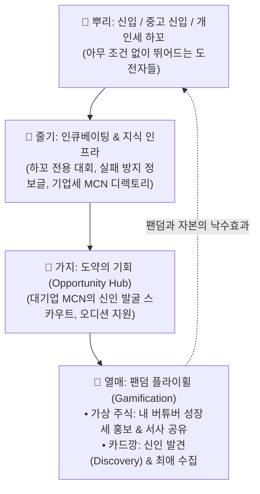

# 📋 [기획] 08_WORLDTREE_ECOSYSTEM_MASTERPLAN.md
**버전**: v1.0 (Master Vision - World Tree)  
**최종 수정일**: 2026-09-09  
**상태**: 이사회 승인 요청 (Board Approval Standard)  
**문서 번호**: BOD-2026-09-04  

---

# [이사회 보고] 버튜버 생태계의 세계수(世界樹) : V-DEBUT 통합 마스터플랜

## 1. Core Vision: "버튜버 생태계의 세계수(世界樹)"

> **"우리는 이미 성공한 대기업을 위한 서비스를 만들지 않는다.**  
> **아무것도 없는 신입·중고 신입·하꼬가 대기업으로 도약할 수 있는 기회와 사다리를 제공한다."**

V-DEBUT은 단순한 '일정 캘린더'가 아닙니다.  
뿌리(신인/하꼬 크리에이터)부터 줄기(MCN 스타트업, 외주 제작자, 정보 아카이브), 가지(대기업과의 스카우트 컨택), 열매(팬덤의 재미, 주식과 카드깡)에 이르기까지 **버튜버 생태계 전체가 뿌리내리고 기대어 자라나는 '세계수(World Tree)' 인프라**입니다.



---

## 2. 4대 전략 축: 세계수를 지탱하는 핵심 기둥

---

### 🏛️ 축 1. 기업세(MCN 스타트업) ↔ 인재 매칭 & 쇼케이스 (Audition & Directory)

현재 버튜버 기획사(기업세)는 대기업만 있는 것이 아닙니다. 수많은 1~5인 규모의 스타트업 MCN들이 설립되고 있으나, **"어디서 지원자를 모아야 할지, 어떻게 회사를 알려야 할지"** 막막한 상태입니다.

#### ① 기업세 디렉토리 & 브랜딩 쇼케이스 (`/companies`)
- **기업 리스트화**: 국내외 활동 중인 버튜버 MCN/기업세들의 프로필, 소속 버튜버 라인업, 기업 복지 및 지원 장비(아이폰 페이셜, Live2D 지원 여부 등) 투명 공개.
- **2가지 유저 가치 실현**:
  1. **예비 버튜버 (지원자)**: *"이런 버튜버 회사가 있었네? 오디션 지원해볼까?"* (안전한 회사 검증 및 지원 창구).
  2. **팬덤 (시청자)**: *"와, 이 회사 소속에 내가 좋아하는 OOO이랑 신인 XXX가 같은 패밀리였구나!"* (소속사 팬덤 형성).

#### ② 기업세 상시/정기 오디션 허브 (`/auditions`)
- MCN 스타트업의 오디션 공고 게재 및 1-Click 포트폴리오(음원, 자기소개) 접수 대행.
- V-DEBUT 인증 '루키 풀(Rookie Pool)' 데이터베이스 제공.

---

### 🛡️ 축 2. 하꼬 버튜버 전용 성장 아카이브 & 리그 (Growth & Safe Zone)

신인 버튜버가 3개월 내 80% 이상 폐업(졸업)하는 이유는 **"정보 부족으로 인한 사기/실수"**와 **"노출 기회(합방)의 부재"** 때문입니다.

#### ① 하꼬를 위한 "생존 가이드 & 지뢰 피하기" 정보 허브 (`/academy`)
- **실전 실패 방지 가이드**:
  - Live2D/외주 계약 시 사기당하지 않는 계약서 작성법 및 적정 시세 가이드.
  - 마이크/오디오 인터페이스 세팅 지뢰(노이즈, 딜레이) 해결법.
  - 치지직/SOOP 플랫폼별 방송 송출 규정 및 저작권 위반(음원, 영도) 방지 매뉴얼.
  - 버튜버 멘탈 케어 및 악성 시청자(분탕) 대응 프로토콜.

#### ② "오직 하꼬만을 위한" 마이크로 리그 & 스크림 (`/leagues`)
- 대기업이 참여하지 않는, **"평균 시청자 30명 이하 스트리머만 참가 가능한" 연합 게임 대회/합방 리그** 주최.
  - 예: *『V-DEBUT 루키 롤/발로란트 멸망전』*, *『신인 버튜버 노래자랑 배틀』*.
- 서로 다른 플랫폼의 신인들이 교류하고 시청자를 서로 믹싱(Cross-pollination)하여 함께 체급을 키우는 등용문.

---

### 🔭 축 3. 대기업·MCN의 "원석 발굴 및 스카우팅 창구" (Discovery Pipeline)

대형 스트리머와 대기업 기획사는 끊임없이 **"합방할 만한 센스 있는 신인"**, **"영입할 만한 잠재력 있는 보석"**을 찾고 있습니다.

- **원석 레이더 (Gem Radar)**:
  - 데뷔 후 꾸준히 방송을 켜고 있으나 알고리즘의 간택을 받지 못한 스트리머들을 데이터 기반(성실도, 클립 반응, 목소리 톤)으로 큐레이션.
- **원클릭 비즈니스 컨택**:
  - 대기업 매니저 및 MCN이 해당 버튜버 프로필에서 공식 섭외 메일/디스코드로 즉시 연락할 수 있는 공식 컨택 라우팅 제공.

---

### 🎮 축 4. 팬덤 게이미피케이션의 재정의: "주식과 카드깡의 선순환"

대표님께서 짚어주신 주식과 카드깡의 본질은 완벽한 **"자발적 바이럴 및 탐색(Discovery) 엔진"**입니다.

```mermaid
graph LR
    subgraph 📈 버튜버 모의 주식
        A["내 최애의 상장세(우상향) 확인"] --> B["팬들이 스스로 트위터/커뮤니티에<br/>'우리 버튜버 주가 오른다' 홍보"]
    end
    subgraph 🃏 버튜버 카드깡
        C["카드팩 오픈 (가챠)"] --> D["'어? 이 예쁜 버튜버는 누구지?'<br/>(신인 버튜버 자연 발견)"]
        D --> E["동시에 내 최애 카드도 뽑으러 재방문<br/>(반복 방문 루프 완성)"]
    end
```

#### ① 버튜버 주식 = "팬들이 자발적으로 뛰는 홍보 마케팅 엔진"
- 팬들은 내 버튜버의 주가(응원 지수)를 올리기 위해 방송을 켜두고, 클립을 따고, 트위터에 *"우리 애 주가 상장세 탔다! 풀매수해라"*라며 알아서 무료 마케팅을 해줍니다.
- 결과적으로 하꼬 버튜버에게는 **'팬들이 만들어주는 확산력'**이 생깁니다.

#### ② 버튜버 카드깡 = "신인 발견(Discovery)과 반복 방문(Retention)의 결합"
- 유저는 자기 최애 카드를 뽑으려고 팩을 뜯지만, 팩 안에서 나오는 수많은 신인 버튜버 카드를 보며 **"어? 이런 버튜버도 있었네? 목소리 좋네? 오늘 데뷔하나?"** 하고 방송 링크를 누르게 됩니다.
- 신인에게는 **'자연스러운 노출 기회'**를, 팬에게는 **'수집욕과 새로운 최애 발굴의 도파민'**을 제공합니다.

---

## 3. 세계수 에코시스템 플라이휠 (Ecosystem Flywheel)

```
[ 신입/하꼬 버튜버 유입 ] (진입장벽 없는 무료 데뷔 등록)
         ▼
[ 카드팩 발행 & 모의주식 상장 ] (데뷔와 동시에 팬덤 놀이터 형성)
         ▼
[ 팬덤의 카드깡 & 주식 바이럴 ] (새로운 신인 발견 + 외부 커뮤니티 전파)
         ▼
[ 하꼬 대회 & 생존 정보 습득 ] (방송 체급 성장 & 폐업률 감소)
         ▼
[ 기업세 MCN / 대기업의 발굴 & 영입 ] (대기업으로의 도약 실현)
         ▼
[ "V-DEBUT 출신" 성공 사례 탄생 ] ──▶ 더 많은 신입/기업세가 세계수로 집결!
```

---

## 4. 이사회 중장기 실행 로드맵

| 단계 | 집중 목표 | 핵심 구현 과제 |
|:---:|:---|:---|
| **Step 1**<br/>(뿌리 강화) | **신인 진입 & 정보 허브** | • 데뷔 캘린더 안정화 및 기업세/개인세 명확한 분기 UI<br/>• 하꼬 생존 가이드 아카이브 (`/academy`) 오픈 |
| **Step 2**<br/>(줄기 형성) | **기업세 디렉토리 & 오디션** | • 국내외 버튜버 MCN/스타트업 기업 리스트 페이지 (`/companies`)<br/>• 신인 모집 오디션 공고 게시판 론칭 |
| **Step 3**<br/>(열매 맺기) | **게이미피케이션 론칭** | • 무료 응원형 '버튜버 성장 주식(루키 인덱스)'<br/>• 신인 발견형 '디지털 카드깡(1st Edition)' 시스템 연동 |
| **Step 4**<br/>(세계수 완성) | **하꼬 연합 리그 & 스카우트** | • V-DEBUT배 하꼬 버튜버 게임/노래 대회 정례화<br/>• 대기업/MCN 전용 원석 발굴 스카우트 포털 가동 |

---

## 5. 결론 및 이사회 건의

대표님께서 설정하신 **"버튜버 생태계의 세계수"** 비전은, 기존의 단순 툴 서비스들이 도달할 수 없는 **대체 불가능한 네트워크 효과(Moat)**를 창출합니다. 

신인이 모이고, 정보가 흐르고, 팬들이 놀고, 기업이 인재를 찾는 이 거대한 순환 고리를 바탕으로 V-DEBUT을 대한민국 및 글로벌 버튜버 산업의 **표준 인큐베이팅 인프라**로 육성할 것을 제안합니다.
