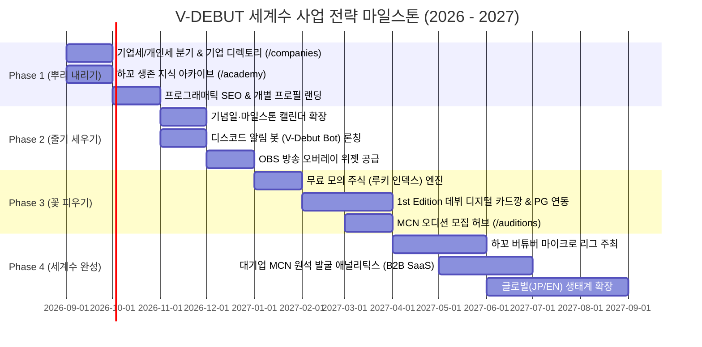

# 📋 [기획] 09_BUSINESS_STRATEGY_MILESTONES.md
**버전**: v1.0 (Master Milestones Standard)  
**최종 수정일**: 2026-09-09  
**상태**: 실행 준비 (Ready for Execution)  
**문서 번호**: STR-2026-09-01  

---

# 🗺️ [사업전략] V-DEBUT 생태계의 세계수 구축 마일스톤 로드맵

## 1. 마일스톤 종합 개요 (Master Timeline)

---

## 2. 단계별 상세 마일스톤 계획

---

### 🌱 Phase 1: "뿌리 내리기" - 신인 인큐베이팅 인프라 & 기업세 디렉토리
* **목표 기간**: 2026년 9월 ~ 11월 (2개월)
* **단계 테마**: 신인과 중소 MCN이 믿고 찾을 수 있는 **정보와 연결의 기본 인프라** 확립

#### 1) 핵심 실행 과제 (Deliverables)
- **[기능 1-1] 기업세(MCN) 브랜딩 디렉토리 (`/companies`)**:
  - 국내외 버튜버 기업세 프로필, 소속 버튜버 라인업, 기업 소개 및 복지 정보 카드화
  - "기업세별 보기" 필터링 및 소속사 팬덤 페이지 제공
- **[기능 1-2] 하꼬 생존 지식 아카이브 (`/academy`)**:
  - Live2D/외주 사기 방지 계약 가이드, 마이크/OBS 세팅 팁, 방송 저작권 매뉴얼 등록
  - 스트리머 검증 팁 공유 게시판(위키형 Q&A)
- **[기능 1-3] 프로그래매틱 SEO & 개별 프로필 랜딩 (`/vtuber/:id`)**:
  - 수천 명의 버튜버 전용 검색 랜딩 페이지 배포 및 Schema.org(Event/Person) 적용
  - 네이버/구글 검색 봇 전용 Edge SSR(Cloudflare Workers) 가동

#### 2) 단계 목표 KPI
- 등록 기업세(MCN 스타트업) 수: **15개 사 이상** 입점
- 하꼬 생존 가이드 아티클 수: **30편 이상** 축적
- 월간 오가닉 검색 유입(SEO Traffic): **50,000 MAU** 달성

---

### 🌿 Phase 2: "줄기 세우기" - 팬덤 유입 파이프라인 & 방송 침투 (In-Stream)
* **목표 기간**: 2026년 11월 ~ 2027년 1월 (2개월)
* **단계 테마**: 버튜버의 실제 **방송 화면(OBS)**과 **팬덤 커뮤니티(디스코드)** 속으로 침투

#### 1) 핵심 실행 과제 (Deliverables)
- **[기능 2-1] 기념일·마일스톤 캘린더 확장**:
  - 데뷔 100일, 1주년, 생일, 3D 공개, 신의상 기념일 캘린더 뷰 및 필터 추가
- **[기능 2-2] V-Debut 디스코드 알림 봇 배포**:
  - 팬클럽 디스코드 서버 대상 "오늘의 데뷔/기념일 알림", "내 최애 방송 ON 알림" 웹훅 봇 배포
- **[기능 2-3] 버튜버 In-Stream OBS 오버레이 위젯 공급**:
  - `D-Day 카운트다운`, `기념일 축하 배너`, `100문 100답 룰렛` OBS 브라우저 소스 URL 제공
  - 위젯 내 `Powered by V-DEBUT` 미니 워터마크를 통한 방송 화면 무료 바이럴 전파

#### 2) 단계 목표 KPI
- 디스코드 봇 도입 서버 수: **100개 팬 서버 이상**
- OBS 방송 위젯 활성 스트리머: **200명 이상** 사용
- 플랫폼 일간 재방문율(D-30 Retention): **35% 이상** 달성

---

### 🌸 Phase 3: "꽃 피우기" - 게이미피케이션 & 커머스 (주식 & 카드깡)
* **목표 기간**: 2027년 1월 ~ 4월 (3개월)
* **단계 테마**: 팬들에게 **바이럴과 수집의 재미**를, 스트리머에게 **수익 쉐어**를 제공

#### 1) 핵심 실행 과제 (Deliverables)
- **[기능 3-1] 무료 모의 주식 『루키 인덱스 (Rookie Fund)』**:
  - 방송 시간, 팔로워 순증률, 팬덤 응원 지표를 합산한 주가 알고리즘 론칭
  - 무료 출석/공유 포인트(V-Point)로 유망 신인 주식을 사고파는 팬덤 홍보 엔진 가동
  - *(공매도 및 현금 환전 전면 차단으로 사행성/비방 리스크 원천 차단)*
- **[기능 3-2] 『1st Edition 데뷔 한정 디지털 카드깡』 시스템 & PG 연동**:
  - 데뷔 전후 14일간만 한정 발행되는 디지털 포토카드 가챠 팩 (N/R/SR/SSR 친필싸인)
  - 스트리머 본인의 카드깡 방송 콘텐츠화 유도 및 **판매 수익 70% 스트리머 정산**
- **[기능 3-3] 기업세 오디션 접수 플랫폼 (`/auditions`)**:
  - MCN 스타트업의 신인 오디션 공고 게재 및 1-Click 포트폴리오 접수 대행

#### 2) 단계 목표 KPI
- 월간 거래액(GMV, 카드팩): **월 3,000만 원 이상** 돌파
- 카드팩 참여 파트너 버튜버: **50명 이상** 확보
- 월간 페이지뷰(PV): **1,500,000 PV** 달성

---

### 🌳 Phase 4: "세계수 완성" - 하꼬 리그 & 대기업 인재 발굴 (B2B SaaS)
* **목표 기간**: 2027년 4월 ~ 9월 (5개월)
* **단계 테마**: **대기업으로 도약하는 등용문 완성** 및 글로벌(JP/EN) 확장

#### 1) 핵심 실행 과제 (Deliverables)
- **[기능 4-1] V-DEBUT 루키 마이크로 리그 주최**:
  - 시청자 30명 이하 신인 대상 연합 게임/노래 대회 (리그오브레전드/발로란트/노래자랑)
  - 플랫폼 간 크로스 합방 생태계 조성 및 공식 중계 방송 진행
- **[기능 4-2] 대기업 MCN용 『원석 발굴 애널리틱스』 (B2B SaaS)**:
  - 대형 기획사/대기업 스트리머를 위한 잠재력 높은 신인 데이터 대시보드 및 원클릭 섭외 컨택
  - 월 구독형(B2B Enterprise) 엔터프라이즈 플랜 론칭
- **[기능 4-3] 글로벌 멀티 리전(JP/US) 본격 확장**:
  - 일본 및 북미 개인세 버튜버 커뮤니티 전용 타임존 및 로컬라이징 고도화

#### 2) 단계 목표 KPI
- 연간 반복 매출(ARR): **3억 원 이상** 조기 달성
- V-DEBUT 출신 대기업 이적/합방 성공 사례: **20건 이상** 배출
- 글로벌 유저 비중: **30% 이상** 확보

---

## 3. 리소스 및 실행 조직 구성 (Resource Allocation)

| 트랙 | 담당 영역 | 주요 역량 |
|:---|:---|:---|
| **트랙 A: 프론트/UI/UX** | 웹 플랫폼, OBS 위젯, 캘린더, 카드깡 연출 | React, TailwindCSS, Canvas/Web Audio, 반응형 모바일 |
| **트랙 B: 백엔드/데이터** | Cloudflare D1/KV, 주가 알고리즘, 파서, Discord Bot | Hono, Workers, Discord.js, 정산/결제(PG) 모듈 |
| **트랙 C: 콘텐츠/커뮤니티** | 하꼬 생존 가이드 집필, 기업세 제휴, 리그 기획 운영 | 버튜버 서브컬처 이해도, MCN 네트워크, 커뮤니티 매니징 |

---

## 4. 이사회 검토 및 즉시 승인 요청

본 마일스톤에 따라 **Phase 1(뿌리 내리기 - 기업세 디렉토리 & 하꼬 생존 가이드 & 프로그래매틱 SEO)**을 2026년 4분기 최우선 스프린트로 확정하고 즉시 상세 기획 및 개발 착수를 요청드립니다.
