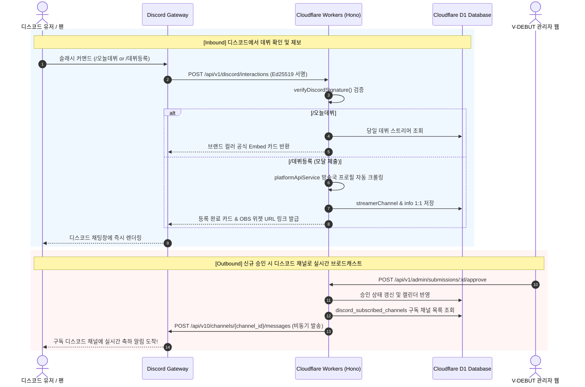

# 📋 [공식 매뉴얼] 10_DISCORD_BOT_WEB_INTEGRATION_PLAN.md
**문서명**: V-DEBUT HUB × 디스코드 봇 양방향 순환 연동 실전 셋업 및 운영 가이드  
**버전**: v1.2 (Production Ready)  
**최종 수정일**: 2026-09-10  
**상태**: 구현 완료 및 실서버 배포 준비 (Implemented & Validated)  
**문서 번호**: DOC-2026-09-10-DISCORD  

---

# 🤖 V-DEBUT HUB × 디스코드 봇 양방향 순환 연동 계획서

본 문서는 사용자가 웹사이트를 켜지 않고도 디스코드 내에서 버튜버 데뷔 일정을 실시간으로 확인·제보하고, 웹사이트의 신규 일정이 디스코드 팬 서버로 자동 전파되는 **"양방향 무인 트래픽 순환 시스템(Dual-Way Traffic Circulation System)"**의 실전 구축 순서와 운영 명세서입니다.

> [!NOTE]
> **서버비 0원 완전 서버리스 아키텍처**  
> 24시간 EC2 가상 서버를 켜두지 않고, Cloudflare Workers의 HTTP Interactions 엔드포인트(`POST /api/v1/discord/interactions`)에서 웹훅 요청을 수신하여 50ms 내 응답하는 초경량·무비용 구조입니다.

---

## 🧭 [핵심] 실전 4단계 구축 및 연동 순서 (Setup Checklist)

작업자가 디스코드 개발자 포털과 클라우드플레어에서 순서대로 진행하는 실전 셋업 로드맵입니다.

```
[1단계] 디스코드 봇 생성 (키 3개 발급)
   ↓
[2단계] 봇 권한 설정 & 슬래시 커맨드 전역 등록
   ↓
[3단계] 클라우드플레어 설정 & Interactions URL 연결
   ↓
[4단계] 웹 연동 & 실서버 동작 테스트
```

---

### 1단계: 디스코드 봇 만들기 (키 3개 발급받기)

1. **디스코드 개발자 포털 접속**:
   - [Discord Developer Portal](https://discord.com/developers/applications)에 접속하여 로그인합니다.
2. **새 애플리케이션 생성**:
   - 우측 상단 **[New Application]** 클릭 ➔ 이름 입력(예: `V-DEBUT HUB`) ➔ 약관 동의 후 **Create** 클릭.
3. **핵심 키 2개 복사 (`General Information` 탭)**:
   - **`Application ID`**: 앱 고유 식별자 (`Copy` 클릭 후 메모장에 저장).
   - **`Public Key`**: Ed25519 서명 검증용 퍼블릭 키 (`Copy` 클릭 후 메모장에 저장).
4. **봇 계정 생성 및 토큰 복사 (`Bot` 탭)**:
   - 좌측 메뉴 **[Bot]** 클릭.
   - **[Reset Token]** 버튼 클릭 (2차 인증 후 토큰 생성).
   - **`Bot Token`**: 채널 발송용 비밀 키 (`Copy` 클릭 후 메모장에 안전하게 저장).
   - *주의: 봇 토큰은 창을 닫으면 다시 확인할 수 없으므로 반드시 보관해야 합니다.*

---

### 2단계: 디스코드 봇 설정 & 내 서버에 초대하기

1. **봇 초대 링크 생성 (`OAuth2` ➔ `URL Generator`)**:
   - 좌측 메뉴 **[OAuth2]** ➔ **[URL Generator]** 클릭.
   - **Scopes (권한 범위)** 선택:
     - `[x] bot`
     - `[x] applications.commands` (슬래시 명령어 실행 권한)
   - **Bot Permissions (봇 권한)** 선택:
     - `[x] Send Messages` (메시지 보내기)
     - `[x] Embed Links` (임베드 카드 출력)
     - `[x] Attach Files` (이미지/에셋 출력)
     - `[x] Read Message History` (채널 메시지 확인)
   - 하단에 생성된 **Generated URL**을 복사하여 브라우저에서 열고, **테스트할 디스코드 서버로 봇을 초대**합니다.
2. **슬래시 명령어(/오늘데뷔, /데뷔등록 등) 일괄 등록**:
   - 프로젝트 터미널에서 준비된 스크립트를 실행하여 디스코드 전역(Global)에 명령어를 배포합니다:
     ```bash
     node backend/scripts/register_discord_commands.js <APPLICATION_ID> <BOT_TOKEN>
     ```
   - 등록 완료 메시지가 출력되면 디스코드 채팅창에 슬래시(`/`) 입력 시 명령어가 즉시 노출됩니다.

---

### 3단계: 클라우드플레어(Cloudflare) 설정 & URL 연결

1. **Cloudflare Workers 비밀 키(Secret) 등록**:
   - 백엔드 폴더(`StreamingService/backend`)에서 CLI로 환경변수를 바인딩합니다:
     ```bash
     # 1. 봇 토큰 등록
     npx wrangler secret put DISCORD_BOT_TOKEN
     # -> 프롬프트가 뜨면 복사해 둔 Bot Token을 붙여넣고 Enter

     # 2. 서명 검증 퍼블릭 키 등록
     npx wrangler secret put DISCORD_PUBLIC_KEY
     # -> 프롬프트가 뜨면 복사해 둔 Public Key를 붙여넣고 Enter
     ```
2. **Cloudflare Workers 백엔드 배포**:
   ```bash
   npm run deploy:live
   # (개발 환경 테스트 시: npm run deploy:dev)
   ```
3. **디스코드 포털과 Workers 엔드포인트 핸드셰이크**:
   - [Discord Developer Portal](https://discord.com/developers/applications) ➔ 내 앱 ➔ **[General Information]** 탭으로 이동.
   - **`Interactions Endpoint URL`** 항목에 배포된 URL 입력:
     - **운영(Live)**: `https://vdebut.live/api/v1/discord/interactions`
     - **개발(Dev)**: `https://dev.vdebut.live/api/v1/discord/interactions`
   - 우측 하단 **[Save Changes]** 클릭!
   - ➔ Workers 백엔드의 `verifyDiscordSignature` 및 `PING/PONG` 로직이 0.05초 만에 응답하여 즉시 녹색 체크로 승인됩니다.

---

### 4단계: 웹 연동 & 실서버 동작 테스트

1. **디스코드 알림 수신 채널 등록**:
   - 봇이 초대된 디스코드 서버의 공지 채널(예: `#데뷔-알림`)에서 명령어 입력:
     ```
     /알림채널설정
     ```
   - ➔ *"✅ 이 채널이 V-DEBUT HUB 공식 데뷔 알림 수신 채널로 설정되었습니다."* 메시지가 뜨며 D1 DB `discord_subscribed_channels`에 저장 완료.
2. **디스코드 ➔ 웹 (Inbound) 동작 검증**:
   - **`/오늘데뷔`**: 오늘 첫 방송을 시작하는 버튜버 Embed 목록 카드 및 바로가기 버튼 출력 확인.
   - **`/이번주데뷔`**: 이번 주(월~일) 데뷔 타임라인 카드 출력 확인.
   - **`/데뷔등록`**: 팝업 모달창이 뜨며 플랫폼, 방송국 URL, 데뷔 일시를 입력하여 즉시 등록 및 D-Day 위젯 URL 발급 확인.
3. **웹 ➔ 디스코드 (Outbound) 실시간 자동 전파 검증**:
   - 관리자 CMS(`https://vdebut.live/admin`)에서 신청서를 승인하면, 구독된 디스코드 `#데뷔-알림` 채널로 실시간 축하 카드가 1초 만에 자동 전송.
   - 매일 오전 9시(KST) Cloudflare Cron에 의해 당일 데뷔 스트리머 모닝 브리핑이 자동 발송.
4. **웹사이트 유저 초대 플로우 확인**:
   - 웹사이트 상단 헤더 우측의 **[🤖 디스코드 봇]** 버튼 클릭 시, 누구나 자신의 디스코드 서버로 봇을 초대할 수 있는 안내 모달이 열립니다.

---

## 📊 시스템 시퀀스 아키텍처 (Architecture Flow)



---

## 🗄️ 데이터베이스 스키마 (`0026_discord_subscribed_channels.sql`)

```sql
-- 디스코드 알림 구독 채널 관리 테이블
CREATE TABLE IF NOT EXISTS discord_subscribed_channels (
    id INTEGER PRIMARY KEY AUTOINCREMENT,
    guild_id TEXT NOT NULL,                  -- 디스코드 서버(길드) 고유 ID
    channel_id TEXT NOT NULL UNIQUE,         -- 알림 수신 채널 ID (중복 방지)
    guild_name TEXT,                         -- 디스코드 서버명
    subscribed_platforms TEXT DEFAULT 'ALL', -- 구독 대상 플랫폼 ('ALL', 'CHZZK', 'SOOP', 'YOUTUBE')
    created_at DATETIME DEFAULT CURRENT_TIMESTAMP
);

CREATE INDEX IF NOT EXISTS idx_discord_channel_id ON discord_subscribed_channels(channel_id);
CREATE INDEX IF NOT EXISTS idx_discord_guild_id ON discord_subscribed_channels(guild_id);
```

---

## 📁 주요 구현 소스 코드 위치 (Source Code Map)

| 구분 | 파일 경로 | 주요 역할 |
| :--- | :--- | :--- |
| **DB 마이그레이션** | [`backend/migrations/0026_discord_subscribed_channels.sql`](file:///j:/개인%20프로젝트/WEB/StreamingService/backend/migrations/0026_discord_subscribed_channels.sql) | 알림 채널 관리 테이블 생성 |
| **봇 코어 엔진** | [`backend/src/services/discordBotService.ts`](file:///j:/개인%20프로젝트/WEB/StreamingService/backend/src/services/discordBotService.ts) | Ed25519 서명 검증, 커맨드 파싱, Embed 카드 빌더, 브로드캐스트 엔진 |
| **커맨드 등록 CLI** | [`backend/scripts/register_discord_commands.js`](file:///j:/개인%20프로젝트/WEB/StreamingService/backend/scripts/register_discord_commands.js) | Discord REST API 커맨드 4종 일괄 등록 도구 |
| **단위 테스트 스크립트** | [`backend/scripts/test_discord_mock.js`](file:///j:/개인%20프로젝트/WEB/StreamingService/backend/scripts/test_discord_mock.js) | 브랜드 컬러, 모달 빌더, Embed 카드 단위 검증기 |
| **엔드포인트 라우팅** | [`backend/src/index.ts`](file:///j:/개인%20프로젝트/WEB/StreamingService/backend/src/index.ts) | `/api/v1/discord/interactions` 오픈 및 승인/Cron 연동 |
| **프론트엔드 모달** | [`frontend/src/components/DiscordBotModal.tsx`](file:///j:/개인%20프로젝트/WEB/StreamingService/frontend/src/components/DiscordBotModal.tsx) | 디스코드 봇 소개 및 1-클릭 서버 초대 모달 UI |
| **헤더 네비게이션** | [`frontend/src/components/Navbar.tsx`](file:///j:/개인%20프로젝트/WEB/StreamingService/frontend/src/components/Navbar.tsx) | 상단 `[🤖 디스코드 봇]` 퀵 액션 버튼 |

---

## 🛠️ 문제 해결 및 트러블슈팅 가이드 (FAQ)

### Q1. Interactions Endpoint URL 저장 시 `Invalid signature` 에러가 납니다.
- **원인**: Cloudflare의 `DISCORD_PUBLIC_KEY` 환경 변수가 누락되었거나 공백이 포함된 경우입니다.
- **해결**: Developer Portal의 `Public Key`를 다시 복사하여 `npx wrangler secret put DISCORD_PUBLIC_KEY`로 재등록합니다.

### Q2. 슬래시 명령어가 디스코드 채팅창에 뜨지 않습니다.
- **원인**: 디스코드 전역(Global) 커맨드 등록 스크립트를 실행하지 않았거나, 봇 초대 시 `applications.commands` 스코프를 체크하지 않은 경우입니다.
- **해결**: 
  1. `node backend/scripts/register_discord_commands.js <APP_ID> <BOT_TOKEN>` 실행.
  2. 봇을 서버에서 내보낸 후, `applications.commands` 권한이 포함된 새 초대 링크로 다시 초대합니다.

### Q3. 실시간 데뷔 공지가 디스코드 채널로 전송되지 않습니다.
- **원인**: 
  1. 해당 디스코드 채널에서 `/알림채널설정`을 실행하지 않아 DB에 채널 ID가 등록되지 않았거나,
  2. 봇에게 해당 채널의 `메시지 보내기(Send Messages)` 또는 `링크 첨부(Embed Links)` 권한이 없는 경우입니다.
- **해결**: 디스코드 채널 권한 설정에서 `V-DEBUT HUB` 봇 역할을 확인하고 권한을 허용합니다.
