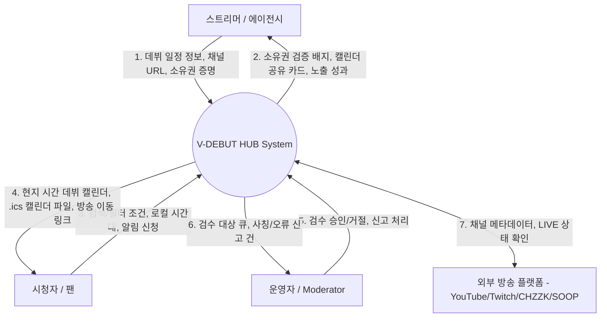
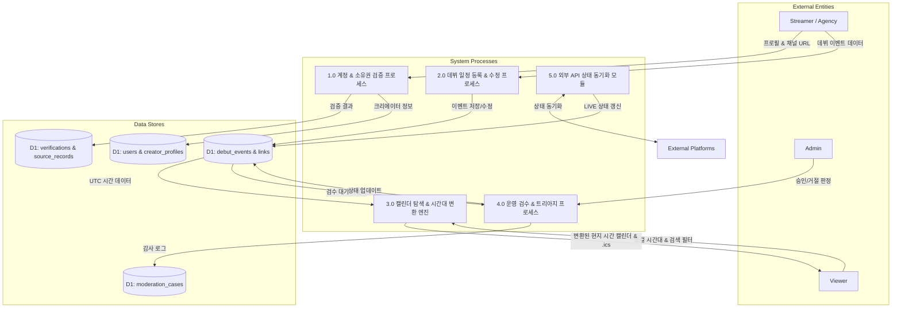
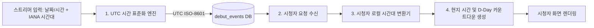

# 데이터 흐름도 명세서 (Data Flow Diagram - DFD)

- **제품명**: V-DEBUT HUB
- **작성일**: 2026-07-27
- **문서 상태**: Approved

---

## 1. DFD Level 0 (Context Diagram)
최상위 레벨 시스템 개요 다이어그램입니다. 사용자 주체(Streamer/Agency, Viewer, Admin)와 외부 플랫폼(YouTube, Twitch, CHZZK, SOOP) 간의 핵심 데이터 입출력을 보여줍니다.

---

## 2. DFD Level 1 (Subsystem Flow)
시스템 내부 서브시스템 레벨 데이터 흐름입니다.

---

## 3. DFD Level 2 (Detailed Event Processing)
데뷔 일정 등록 및 검수, 탐색의 데이터 정규화 및 변환 세부 프로세스입니다.

