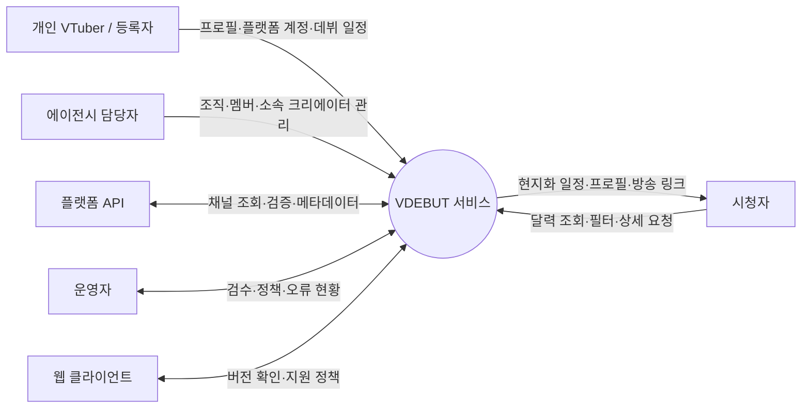
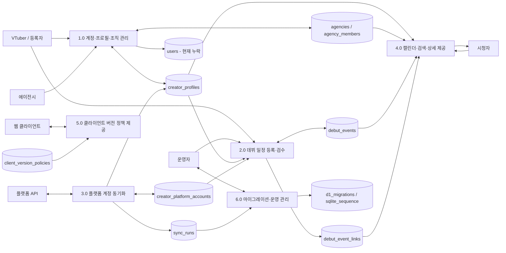

# VDEBUT DFD Mermaid Source

## Level 0

```mermaid
flowchart LR
  C[개인 VTuber / 등록자] -->|프로필·플랫폼 계정·데뷔 일정| S((VDEBUT 서비스))
  A[에이전시 담당자] -->|조직·멤버·소속 크리에이터 관리| S
  V[시청자] -->|달력 조회·필터·상세 요청| S
  S -->|현지화 일정·프로필·방송 링크| V
  P[플랫폼 API] <--> |채널 조회·검증·메타데이터| S
  O[운영자] <--> |검수·정책·오류 현황| S
  W[웹 클라이언트] <--> |버전 확인·지원 정책| S
```

## Level 1

```mermaid
flowchart LR
  Creator[VTuber / 등록자] --> P1[1.0 계정·프로필·조직 관리]
  Agency[에이전시] --> P1
  Creator --> P2[2.0 데뷔 일정 등록·검수]
  Admin[운영자] --> P2
  Platform[플랫폼 API] <--> P3[3.0 플랫폼 계정 동기화]
  Viewer[시청자] --> P4[4.0 캘린더·검색·상세 제공]
  P4 --> Viewer
  Client[웹 클라이언트] <--> P5[5.0 클라이언트 버전 정책 제공]
  Admin <--> P6[6.0 마이그레이션·운영 관리]

  D0[(users - 현재 누락)]
  D1[(creator_profiles)]
  D2[(agencies / agency_members)]
  D3[(creator_platform_accounts)]
  D4[(debut_events)]
  D5[(debut_event_links)]
  D6[(sync_runs)]
  D7[(client_version_policies)]
  D8[(d1_migrations / sqlite_sequence)]

  P1 <--> D1
  P1 <--> D2
  P1 --> D0
  P2 <--> D4
  P2 --> D5
  D1 --> P2
  D3 --> P2
  P3 <--> D3
  P3 --> D1
  P3 --> D6
  D1 --> P4
  D2 --> P4
  D4 --> P4
  D5 --> P4
  D7 --> P5
  P6 --> D8
  D6 --> P6
```
