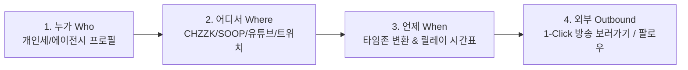

# 🎯 제품 요구사항 정의서 (PRD v0.2 - 본질 & 개인세 버튜버 노출 극대화)

- **제품명**: V-DEBUT HUB (스트리머 & 버튜버 데뷔 일정 모아보기)
- **작성 버전**: v0.2 (Core Focus: Who - Where - When - Outbound + Indie Creator Highlight)
- **작성일**: 2026-07-29
- **문서 상태**: Approved (핵심 가치 보완)

---

## 1. 서비스의 핵심 목적 및 존재하는 이유 (Core Value Proposition)

> **"대기업뿐만 아니라 특히 홍보가 어려운 개인세(Indie) 및 중소 에이전시 버튜버가 같은 날 언제, 어떤 이벤트로 데뷔하는지 시각적으로 잘 드러내고, 시청자가 해당 플랫폼으로 즉시 이동하여 팔로우하도록 돕는다."**

- **수요자 (시청자)**: 같은 날 릴레이로 진행되는 신입 버튜버들의 데뷔 시간표와 방송 이벤트를 놓치지 않고 한눈에 파악.
- **공급자 (개인세 & 신생 버튜버)**: 대기업 소속에 묻히지 않고 자신의 데뷔 일정 및 이벤트(Q&A, 노래, 신의상, 굿즈 등)를 시청자에게 직접 어필할 수 있는 통합 공칭 창구.

---

## 2. 버추얼 스트리머 노출 극대화 핵심 4가지 전략 (Key Exposure Strategies)

### 1️⃣ 같은 날 데뷔 릴레이 타임라인 (Debut Relay Timeline)
- **개념**: 같은 날짜에 데뷔하는 버추얼 스트리머들의 방송 시각을 **시간순 릴레이 스케줄표(예: 18:00 A ➡️ 19:00 B ➡️ 20:00 C)** 형태로 시각화.
- **효과**: 한 버튜버를 보러온 시청자가 같은 날 데뷔하는 다른 신입 버튜버(특히 개인세)로 연속 유입되어 시너지 발생.

### 2️⃣ 개인세 / 소속사 식별 배지 & 개인세 전용 필터 (Indie Highlight)
- **개념**: 캘린더 그리드 및 모달 카드에 **[🌱 개인세 (Indie)]** 와 **[🏢 에이전시]** 태그를 직관적인 아이콘으로 명확히 구별.
- **효과**: 신선한 신입 개인세 버튜버를 발굴하고 싶은 시청자가 **'개인세만 보기'** 필터로 쉽게 탐색 가능.

### 3️⃣ 데뷔 이벤트 하이라이트 (Debut Event Details)
- **개념**: 단순 데뷔 알림을 넘어 **"어떤 데뷔 이벤트를 진행하는가?"** (예: `🎵 1st 앨범/노래 릴레이`, `🎨 자기소개 & Q&A`, `✨ 3D 모델 최초 공개`)에 대한 핵심 칩 태그 제공.
- **효과**: 방송의 시청 포인트(Hooking Element)를 시청자에게 즉시 전달.

### 4️⃣ 1-Click 플랫폼 방송 보러가기 & 팔로우 (Direct Outbound CTA)
- **개념**: CHZZK, SOOP, YouTube, Twitch로 지체 없이 연결되는 강력한 아웃링크 CTA 버튼 제공.
- **효과**: 시청자가 마음에 드는 버튜버의 채널로 즉시 넘어가 **방송 시청 및 팔로우/구독**을 누르도록 최단 동선 설계.

---

## 3. 핵심 4단계 사용자 흐름 (Core 4-Step Flow)

| 단계 | 본질 요소 | 기능 명세 |
|------|-----------|-----------|
| **1. 누가 (Who)** | 크리에이터 프로필 | 버튜버 이름, 프로필 이미지, 활동 언어, **개인세/에이전시 태그**, 데뷔 이벤트 성격 |
| **2. 어디서 (Where)** | 플랫폼 구분 | CHZZK, SOOP, YouTube, Twitch 브랜드 테마 색상 및 필터링 |
| **3. 언제 (When)** | 데뷔 시각 & 캘린더 | 사용자 로컬 타임존 릴레이 시간표 및 1-Click `.ics`/구글 캘린더 등록 (방송 URL 포함) |
| **4. 외부 (Outbound)** | 방송 보러가기 / 팔로우 | 클릭 즉시 해당 플랫폼의 실제 방송 채널 및 팔로우 페이지로 이동 |

---

## 4. 프론트엔드 UI 개선 반영 항목 (UI Action Items)

- **[달력 상세 모달]**: 
  - 같은 날 데뷔 버튜버들을 **시간순 릴레이 카드**로 정렬.
  - **[🌱 개인세]** 배지 시각적 강조 및 이벤트 요약 태그(노래, Q&A 등) 표시.
- **[플랫폼 필터 바]**: 
  - 플랫폼 필터 옆에 **[🌱 개인세만 보기]** 토글 버튼 추가.
