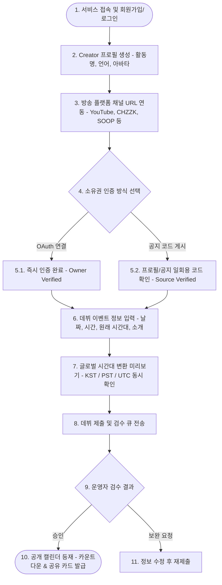
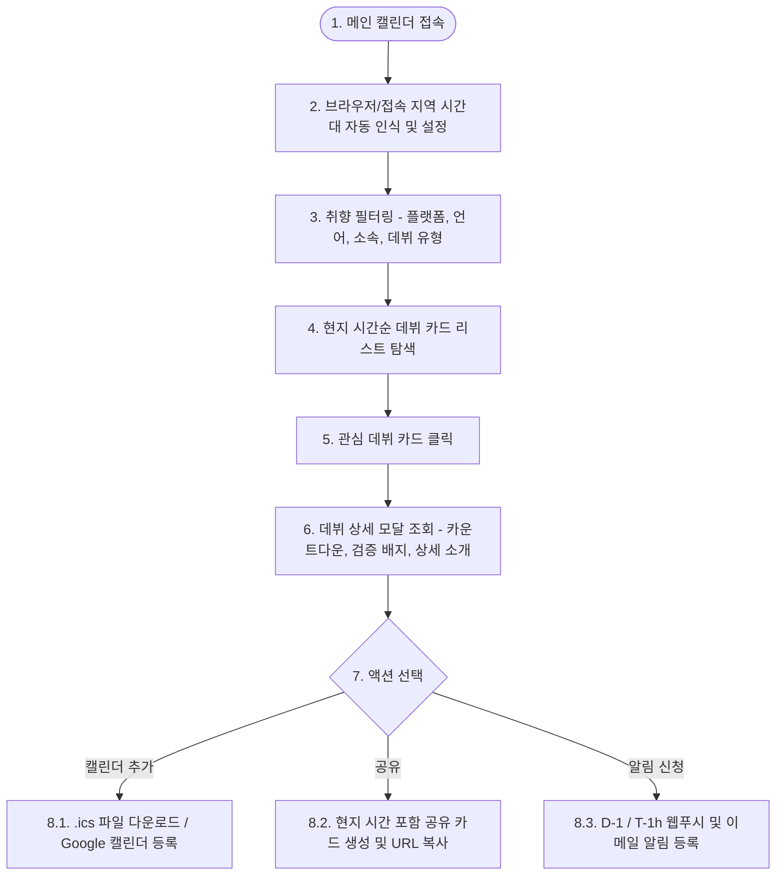
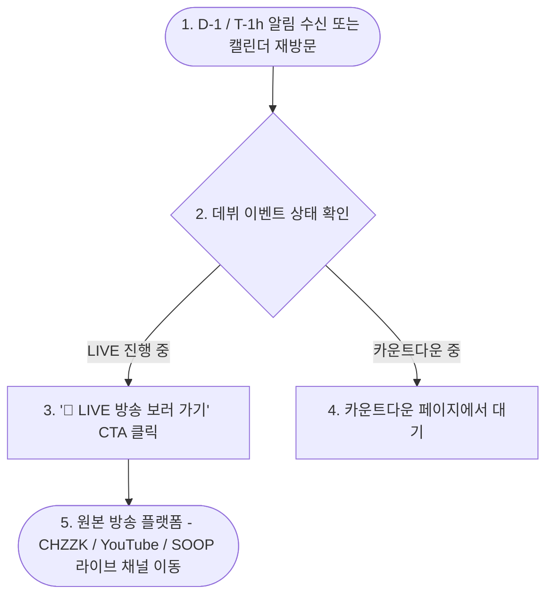
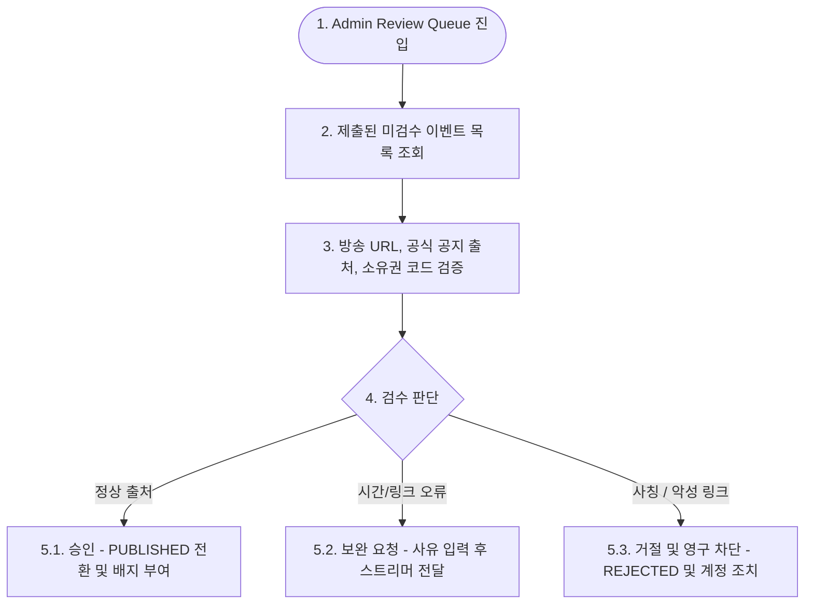

# 사용자 흐름 정의서 (User Flow v0.1)

- **서비스명**: V-DEBUT HUB (가칭)
- **작성 버전**: v0.1 (Final)
- **작성일**: 2026-07-27
- **문서 상태**: Approved

---

## 1. 주요 사용자 여정 (User Journeys)

### 1.1. 스트리머/에이전시 데뷔 등록 & 소유권 인증 여정

---

### 1.2. 시청자 탐색, 시간대 변환 & ICS 알림 저장 여정

---

### 1.3. 데뷔 라이브 직전/진행 중 시청자 전환 여정

---

### 1.4. 운영자 검수 & 사칭/오정보 트리아지 여정

