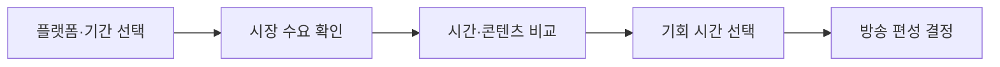
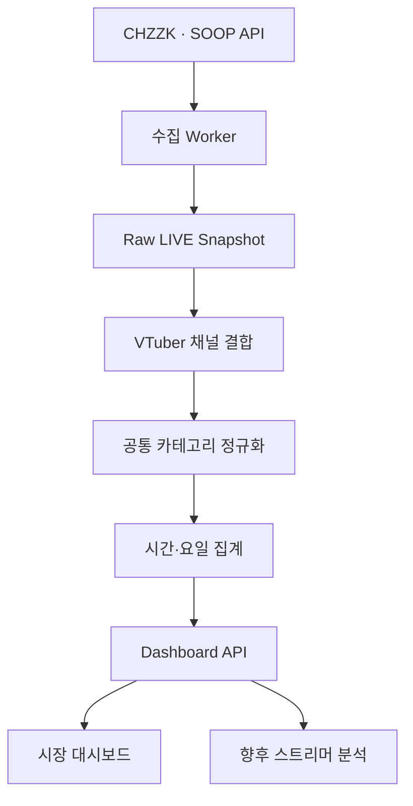

# VDébut Analytics 대시보드 기획서

> 버전: v0.1  
> 작성 기준일: 2026-09-14  
> 1차 대상 플랫폼: CHZZK, SOOP  
> 기준 시간대: Asia/Seoul (KST)

---

## 0. 문서의 결론

VDébut Analytics는 단순한 스트리머 랭킹이나 실시간 방송 모음이 아니다.

> **치지직·SOOP의 버튜버 방송 데이터를 시간·요일·콘텐츠별로 분석해, 신규·중소 버튜버가 언제 어떤 콘텐츠로 방송할지 판단하게 하는 의사결정 대시보드**

대시보드가 먼저 답해야 하는 질문은 아래 네 가지다.

1. 언제 버튜버 방송을 보는 수요가 커지는가
2. 그 시간에 어떤 콘텐츠로 시청이 몰리는가
3. 수요에 비해 방송 경쟁이 낮은 시간은 언제인가
4. 신규·중소 스트리머가 진입하기 상대적으로 좋은 시간은 언제인가

따라서 MVP의 GNB와 화면도 `시장 현황 → 시간대 분석 → 콘텐츠 분석 → 방송 기회` 순서로 설계한다. 개별 스트리머 검색·분석은 이 시장 데이터가 충분히 쌓인 뒤 같은 지표 체계 위에 연결한다.

---

## 1. 제품 방향을 잃지 않기 위한 기준

### 1.1 핵심 사용자

| 우선순위 | 사용자 | 해결할 질문 |
|---:|---|---|
| 1 | 데뷔 예정·신규 버튜버 | 어떤 요일과 시간에 방송을 시작해야 상대적으로 유리한가 |
| 2 | 중소 버튜버·운영자 | 현재 편성 시간과 콘텐츠가 시장 환경에 맞는가 |
| 3 | 버튜버 기획사·마케터 | 어떤 시간·콘텐츠에 신인 노출 기회가 있는가 |
| 4 | 시청자 | 내가 보는 시간에 어떤 버튜버 콘텐츠가 활발한가 |

MVP는 1~2순위 사용자의 판단을 가장 먼저 돕는다. 시청자용 실시간 방송 탐색은 부가 가치이며, 핵심 목적을 밀어내지 않는다.

### 1.2 핵심 사용자 행동

대시보드의 성공 흐름은 다음과 같다.



### 1.3 하지 않는 것

- 단순 인기 스트리머 랭킹을 서비스의 첫 화면으로 두지 않는다
- 공식 API로 알 수 없는 성별·연령·직업 등 개인정보성 시청자 유형을 추정하지 않는다
- 동시시청 합계를 고유 시청자 수 또는 MAU처럼 표현하지 않는다
- 충분한 표본 없이 특정 시간이 반드시 성공한다고 단정하지 않는다
- 근거와 산식을 숨긴 채 AI 추천만 보여주지 않는다
- 전체 플랫폼 통계와 버튜버 시장 통계를 섞어 보여주지 않는다

### 1.4 데이터 표현 원칙

공식 API의 `concurrentUserCount`는 방송별 동시 시청 수다. 동일한 사람이 여러 방송을 동시에 시청할 가능성이 있으므로 합산값은 **고유 사용자 수가 아니라 동시시청 합계(viewer slots)**다.

따라서 사용자 화면에서는 다음 용어를 사용한다.

| 사용하지 않을 표현 | 사용할 표현 |
|---|---|
| 현재 사용자 수 | 현재 동시시청 합계 |
| 시청자 성별·연령 | 콘텐츠 소비 구성 |
| 성공 확률 | 방송 기회 점수 |
| 최적 시간 확정 | 상대적으로 유리한 시간 |

---

## 2. GNB 및 정보 구조

### 2.1 VDébut 전체 GNB

| GNB | 경로 | 포함 내용 | 존재 목적 | 도입 시점 |
|---|---|---|---|---|
| 데뷔 일정 | `/` 또는 `/debut` | 월·주간 데뷔 일정, 플랫폼 필터, 프로필 진입 | 기존 VDébut의 핵심 가치 유지 | 기존 |
| 방송 인사이트 | `/analytics` | 버튜버 시장 대시보드와 분석 기능 | 언제·무엇을 방송할지 판단 | MVP |
| 스트리머 분석 | `/creators` | 스트리머 검색, 채널별 성장·편성·경쟁 분석 | 시장 분석을 개인 행동으로 연결 | Phase 3 |
| 데뷔 등록 | `/submit` | 데뷔 일정 및 채널 등록 | 일정 확보와 버튜버 판별 DB 확장 | 기존/개선 |

`스트리머 분석`은 데이터가 충분히 축적되기 전에는 GNB에 노출하지 않는다. 빈 메뉴 또는 준비 중 화면은 제품 신뢰를 떨어뜨린다.

### 2.2 방송 인사이트 내부 메뉴

| LNB/탭 | 경로 | 사용자가 얻는 답 | MVP |
|---|---|---|---:|
| 대시보드 | `/analytics` | 지금 시장이 어떤 상태이며 언제 기회가 있는가 | 필수 |
| 시간대 분석 | `/analytics/time` | 요일·시간별 수요와 경쟁은 어떻게 다른가 | 필수 |
| 콘텐츠 분석 | `/analytics/category` | 게임·잡담·음악 등 무엇이 언제 소비되는가 | 필수 |
| 방송 기회 | `/analytics/opportunity` | 내 조건에서 상대적으로 유리한 편성은 언제인가 | 조건부 필수 |
| 데이터 기준 | `/analytics/methodology` | 데이터 출처·갱신 시각·지표 산식·한계 | 필수, GNB가 아닌 도움말 |

### 2.3 랭킹을 핵심 GNB에서 제외하는 이유

랭킹은 조회 욕구는 만들지만 신규 버튜버의 편성 판단에는 직접적인 답을 주지 못한다. 상위 채널이 고정적으로 노출되면 대시보드가 다시 인기 순위 서비스로 변질될 가능성도 높다.

랭킹 정보는 다음처럼 분석의 근거로만 사용한다.

- `상위 10개 방송의 동시시청 점유율`
- `동시간대 대형 채널 집중도`
- `카테고리별 상위 방송 점유율`

---

## 3. 공통 필터

모든 분석 페이지에서 같은 필터 문법을 사용한다. 사용자가 페이지를 이동해도 선택값을 유지하며 URL 쿼리에도 반영한다.

| 필터 | 값 | 기본값 | 필요한 이유 |
|---|---|---|---|
| 플랫폼 | CHZZK / SOOP / 전체 | 수집 완료 플랫폼 | 플랫폼별 시장 차이 비교 |
| 기간 | 오늘 / 최근 7일 / 28일 / 직접 선택 | 최근 7일 | 일시적 이벤트와 일반 패턴 분리 |
| 요일 | 전체 / 평일 / 주말 / 개별 요일 | 전체 | 주중·주말 편성 차이 확인 |
| 시간 | 전체 / 3시간 구간 / 직접 선택 | 전체 | 실제 방송 가능 시간에 맞춘 분석 |
| 콘텐츠 대분류 | 전체 / 게임 / 잡담 / 음악 / 그림 / ASMR / 먹방 / 기타 | 전체 | 방송 유형별 수요·경쟁 비교 |
| 세부 카테고리 | 게임명 또는 플랫폼 원본 카테고리 | 전체 | 특정 게임 시장 분석 |
| 채널 규모 | 전체 / 신규 / 소형 / 중형 / 대형 | 전체 | 같은 규모의 경쟁 환경 비교 |

권장 채널 규모 기준은 고정 숫자보다 해당 플랫폼 버튜버 분포의 백분위로 시작한다.

| 구분 | 초기 기준안 |
|---|---|
| 신규 | 확인된 데뷔일로부터 30일 이내 |
| 소형 | 팔로워 수 하위 50% |
| 중형 | 팔로워 수 50~90백분위 |
| 대형 | 팔로워 수 상위 10% |

백분위 기준과 절대 기준은 실제 데이터 분포를 확인한 뒤 재조정한다. 플랫폼 간 팔로워 규모 차이가 크기 때문에 동일한 절대 숫자를 양쪽에 바로 적용하지 않는다.

---

## 4. PAGE 1 — 시장 대시보드

### 4.1 페이지 목적

사용자가 처음 진입한 뒤 30초 안에 아래를 판단하도록 한다.

- 현재 버튜버 시장의 동시시청 규모와 LIVE 공급량
- 선택 기간의 피크 시간
- 수요 대비 경쟁이 상대적으로 낮은 시간
- 현재 가장 소비되는 콘텐츠

### 4.2 화면 노출 순서

| 순서 | 영역 | 보여줄 정보 | 기능 | 보여주는 이유 |
|---:|---|---|---|---|
| 1 | 데이터 상태 바 | 기준 시각, KST, 수집 성공률, 마지막 갱신 | 데이터 기준 열기 | 실시간처럼 보이는 오래된 데이터 방지 |
| 2 | 오늘의 해석 | 핵심 변화 1~3문장 | 근거 지표 펼치기 | 사용자가 차트를 읽기 전 결론 파악 |
| 3 | KPI 카드 | 동시시청 합계, LIVE 수, 방송당 시청, 상위 10 집중도 | 이전 기간 비교 | 시장 수요·공급·집중을 한 번에 확인 |
| 4 | 수요·공급 추이 | 시간별 동시시청 합계와 LIVE 수 | 지표 토글, 툴팁, 구간 선택 | 시청 수요 증가와 방송 공급 증가를 함께 비교 |
| 5 | 기회 히트맵 | 요일 × 시간의 기회 점수 | 셀 선택 후 상세 보기 | 방송 편성 후보를 빠르게 탐색 |
| 6 | 콘텐츠 소비 구성 | 카테고리별 동시시청 점유율과 LIVE 점유율 | 평일/주말 비교 | 무엇을 보는지와 무엇이 공급되는지 비교 |
| 7 | 추천 시간 후보 | 상위 3개 시간대, 점수와 이유 | 콘텐츠·가능 시간 입력 | 통계를 실제 편성 결정으로 연결 |
| 8 | 현재 LIVE 참고 | 선택 조건의 대표 방송 일부 | 플랫폼 방송으로 이동 | 통계가 어떤 실제 방송으로 구성됐는지 확인 |

### 4.3 KPI 카드 정의

| KPI | 산식 | 보조 정보 | 목적 |
|---|---|---|---|
| 현재 동시시청 합계 | 최신 정상 Snapshot의 `viewer_count` 합 | 직전 주 동일 요일·시각 대비 | 현재 수요 규모 |
| 현재 LIVE 수 | 최신 정상 Snapshot의 고유 `stream_id` 수 | 직전 주 대비 | 현재 공급량 |
| 방송당 시청 | 동시시청 합계 ÷ LIVE 수 | 중앙값 함께 제공 | 대형 방송 왜곡을 보완한 공급 대비 수요 |
| 상위 10 집중도 | 상위 10개 방송 동시시청 ÷ 전체 동시시청 | 전주 대비 | 대형 채널 쏠림 확인 |
| 피크 시간 | 기간 내 시간 셀별 평균 동시시청이 최대인 구간 | 표본 일수 | 절대 수요가 가장 큰 시간 |
| 방송 기회 시간 | 동일 비교군에서 기회 점수가 가장 높은 구간 | 신뢰도와 근거 | 편성 후보 제안 |

LIVE 수가 0이면 방송당 시청은 `0`이 아니라 `계산 불가`로 표시한다.

### 4.4 오늘의 해석 예시

> 최근 4주 기준, CHZZK 게임 버튜버 방송은 토요일 00:00~03:00에 방송당 시청이 평균보다 18% 높았습니다. 같은 시간 상위 10개 방송 집중도는 31%로, 토요일 21:00~24:00보다 22%p 낮았습니다.

해석 문장은 반드시 근거 지표, 비교 기간, 플랫폼, 콘텐츠 조건을 함께 보여준다.

---

## 5. PAGE 2 — 시간대 분석

### 5.1 페이지 목적

`사람이 많은 시간`과 `방송하기 유리한 시간`이 다를 수 있음을 보여준다.

### 5.2 포함 정보와 기능

| 영역 | 조회 내용 | 기능 | 의사결정 목적 |
|---|---|---|---|
| 요일 × 시간 히트맵 | 동시시청 / LIVE 수 / 방송당 시청 / 집중도 / 기회 점수 | 지표 탭 전환, 셀 클릭 | 시간 후보 탐색 |
| 시간대 상세 패널 | 선택 셀의 평균·중앙값·표준편차·표본 수 | 기준 시간과 비교 | 우연한 피크인지 확인 |
| 평일·주말 비교 | 같은 시간대의 수요·공급 차이 | 비교 기준 전환 | 반복 편성 설계 |
| 플랫폼 비교 | CHZZK와 SOOP의 동일 시간대 지표 | 단위·수집률 표시 | 플랫폼 선택 |
| 변동성 그래프 | 날짜별 값의 범위와 중앙값 | 이벤트 날짜 제외 | 안정적인 시간인지 판단 |

히트맵 기본 지표는 `방송당 시청`이 아니라 `방송 기회 점수`로 둔다. 단, 점수가 아직 검증되지 않았거나 표본이 부족하면 `동시시청 합계`를 기본값으로 사용하고 점수는 숨긴다.

---

## 6. PAGE 3 — 콘텐츠 분석

### 6.1 페이지 목적

어떤 콘텐츠가 인기인지 나열하는 것이 아니라, **콘텐츠별 수요와 공급이 언제 어긋나는지** 찾는다.

### 6.2 포함 정보와 기능

| 영역 | 조회 내용 | 기능 | 의사결정 목적 |
|---|---|---|---|
| 수요·공급 사분면 | X=LIVE 수, Y=동시시청 합계, 점 크기=방송당 시청 | 카테고리 선택 | 수요는 높고 공급은 낮은 영역 발견 |
| 콘텐츠 소비 구성 | 카테고리별 동시시청 점유율 | 시간·요일 비교 | 시청이 어디로 이동하는지 확인 |
| 콘텐츠 공급 구성 | 카테고리별 LIVE 점유율 | 수요 구성과 겹쳐 보기 | 과잉·과소 공급 판단 |
| 시간대별 변화 | 선택 카테고리의 24시간 추이 | 평일/주말 토글 | 콘텐츠에 맞는 편성 시간 탐색 |
| 세부 카테고리 | 게임명·세부 장르별 지표 | 검색, 정렬 | 특정 게임 방송 검토 |

`게임`, `잡담`, `음악` 같은 대분류는 플랫폼 원본 카테고리를 VDébut 공통 분류로 매핑해 사용한다. 원본 값도 함께 보관하여 분류 변경과 재집계가 가능해야 한다.

---

## 7. PAGE 4 — 방송 기회

### 7.1 페이지 목적

사용자 조건에 맞는 시간 후보를 제시하고, 추천 이유와 위험을 함께 설명한다.

### 7.2 입력값

| 입력 | 필수 | 예시 |
|---|---:|---|
| 플랫폼 | 필수 | CHZZK |
| 콘텐츠 | 필수 | 게임 > 마인크래프트 |
| 방송 가능한 요일 | 필수 | 화·목·토 |
| 방송 가능한 시간 | 필수 | 20:00~03:00 |
| 예상 방송 길이 | 선택 | 3시간 |
| 본인 채널 규모 | 선택 | 팔로워 1,200명 |
| 신규 여부 | 선택 | 데뷔 30일 이내 |

### 7.3 결과값

| 결과 | 내용 |
|---|---|
| 추천 시간 후보 | 최대 3개, 점수순 |
| 추천 근거 | 수요, 공급, 상위 채널 집중도, 성장 추세 |
| 주의 요인 | 변동성, 표본 부족, 특정 이벤트 영향 |
| 비교 시간 | 사용자가 원래 고려한 시간과 추천 시간 비교 |
| 데이터 신뢰도 | 높음 / 보통 / 낮음 및 표본 수 |

결과 문구 예시:

> **토요일 00:00~03:00 · 기회 점수 78점 · 신뢰도 보통**  
> 최근 4주 동일 시간 기준 방송당 시청은 비교군보다 16% 높고, 상위 10개 방송 집중도는 11%p 낮았습니다. 다만 분석 표본이 4일이므로 확정적인 성과 예측으로 사용할 수 없습니다.

---

## 8. 방송 기회 점수

### 8.1 초기 산식

점수는 동일 플랫폼·콘텐츠·요일 유형 안에서 시간 셀을 상대 비교한다. 서로 다른 플랫폼의 절대 수치를 그대로 섞지 않는다.

```text
Opportunity Score =
  방송당 시청 백분위             × 0.40
+ 시청 증가율 백분위             × 0.20
+ (1 - 상위 10 집중도 백분위)    × 0.20
+ 소형·신규 채널 시청 점유 백분위 × 0.10
+ 데이터 안정성 점수             × 0.10
```

### 8.2 각 항목의 의미

| 항목 | 의미 | 주의점 |
|---|---|---|
| 방송당 시청 | 수요 대비 LIVE 공급 | 평균만 쓰면 대형 채널 영향이 큼 |
| 시청 증가율 | 해당 시간 진입 전후 수요 방향 | 이벤트성 급등 제거 필요 |
| 상위 10 집중도 | 대형 방송 쏠림 | 낮을수록 신규 진입 여지가 있다고 해석 |
| 소형·신규 채널 점유 | 작은 채널에도 시청이 분산되는지 | 데뷔일·규모 데이터가 확보돼야 함 |
| 데이터 안정성 | 표본 수와 누락률 | 수집 품질을 추천 점수에 반영 |

### 8.3 점수 노출 조건

- 최소 14일을 수집하고, 권장 28일 데이터가 쌓인 뒤 노출한다
- 비교 셀당 정상 Snapshot 80% 이상일 때만 계산한다
- 이벤트 또는 대규모 장애가 포함된 날은 별도 표기하거나 제외한다
- 산식 버전을 저장한다: `opportunity_formula_version`
- 점수 옆에 반드시 근거 2개 이상과 신뢰도를 표시한다

초기 데이터가 부족할 때는 점수를 억지로 만들지 않고 `분석 준비 중 · 현재 8/28일 수집`처럼 진행 상태를 보여준다.

---

## 9. 외부 API 참조 및 확보 가능성

### 9.1 판단 요약

| 소스 | 상태 | 활용 판단 |
|---|---|---|
| CHZZK Open API | 핵심 필드 확인 완료 | 1차 POC 가능 |
| SOOP Developers | 공식 포털 운영 확인, 현행 방송 목록 응답은 실호출 검증 필요 | 앱 등록·응답 검증 후 도입 |
| Streams Charts API | CHZZK·SOOP Korea와 5분 갱신 LIVE endpoint 제공 확인 | 직접 수집 한계 시 비교·보완용 |

### 9.2 CHZZK 공식 Open API

#### 라이브 목록 조회

- 문서: <https://chzzk.gitbook.io/chzzk/chzzk-api/live>
- Endpoint: `GET https://openapi.chzzk.naver.com/open/v1/lives`
- 인증: 애플리케이션 등록 후 `Client-Id`, `Client-Secret`
- 요청: `size` 1~20, `next` 페이지 커서
- 정렬: 시청자 수 높은 순

| CHZZK 필드 | 저장 필드 | 사용처 |
|---|---|---|
| `liveId` | `external_stream_id` | 방송 세션 식별 |
| `liveTitle` | `title` | 분류 보조·실제 방송 참고 |
| `concurrentUserCount` | `viewer_count` | 수요·점유율·집중도 |
| `openDate` | `started_at` | 방송 지속시간·세션 분석 |
| `tags` | `source_tags_json` | 버튜버 후보·콘텐츠 분류 보조 |
| `categoryType` | `source_category_type` | GAME/SPORTS/ETC 1차 구분 |
| `liveCategory` | `source_category_id` | 원본 카테고리 식별 |
| `liveCategoryValue` | `source_category_name` | 공통 카테고리 매핑 |
| `channelId` | `external_channel_id` | 채널 결합 키 |
| `channelName` | `channel_name_snapshot` | 표시·변경 추적 |
| `channelImageUrl` | `channel_image_url` | 방송·채널 표시 |

#### 채널 정보 조회

- 문서: <https://chzzk.gitbook.io/chzzk/chzzk-api/channel>
- Endpoint: `GET https://openapi.chzzk.naver.com/open/v1/channels`
- 요청: `channelIds` 최대 20개

| CHZZK 필드 | 저장 필드 | 사용처 |
|---|---|---|
| `channelId` | `external_channel_id` | 채널 식별 |
| `channelName` | `display_name` | 검색·표시 |
| `channelImageUrl` | `profile_image_url` | 프로필 |
| `followerCount` | `follower_count` | 채널 규모와 성장 |
| `verifiedMark` | `is_verified` | 채널 메타데이터 |

#### 카테고리 검색

- 문서: <https://chzzk.gitbook.io/chzzk/chzzk-api/category>
- Endpoint: `GET https://openapi.chzzk.naver.com/open/v1/categories/search`
- 활용: 원본 카테고리 ID·이름·포스터 확인 및 VDébut 공통 분류 매핑

#### Quota 및 수집 위험

- 공식 문서는 Quota 초과 시 HTTP `429 TOO_MANY_REQUESTS`가 발생한다고 안내하지만 공개된 고정 호출량은 확인되지 않았다
- 전체 LIVE 목록은 페이지당 최대 20개이므로 전체 방송 수를 `N`이라 하면 1회 전수 수집에 `ceil(N / 20)`회가 필요하다
- 5분 주기로 전수 수집할 때 예상 일 호출량은 `ceil(N / 20) × 288`이다
- 예를 들어 LIVE 2,000개라면 라이브 목록만 약 28,800회/일이므로 앱 Quota와 1회 순회 소요 시간을 실제로 검증해야 한다
- `Client-Secret`은 브라우저에 노출하지 않고 서버/Worker에서만 사용한다
- 문서: <https://chzzk.gitbook.io/chzzk/chzzk-api/tips>

### 9.3 SOOP Developers

- 공식 포털: <https://developers.sooplive.com/>
- 현재 문서 화면이 동적 렌더링 중심이므로, 이 기획서 작성 시점에는 최신 방송 목록 Endpoint와 응답 필드를 공개 문서만으로 확정하지 않는다
- 과거 SOOP/AfreecaTV 응답 사례를 현재 운영 스키마로 간주하지 않는다

앱 등록 후 아래 항목을 실제 응답 JSON과 이용 정책으로 검증해야 한다.

| 검증 항목 | 통과 기준 |
|---|---|
| 전체 LIVE 목록 | 특정 계정이 아닌 공개 방송 전체를 순회 가능 |
| 페이지네이션 | 마지막 페이지까지 안정적으로 순회 가능 |
| 현재 동시시청 | 방송별 숫자 필드 제공 |
| 방송 시작 시각 | 세션 시작 기준 시각 제공 |
| 채널 식별자 | 방송 간 동일 채널 결합 가능 |
| 카테고리 | ID와 표시명 제공 |
| 팔로워·애청자 | 공개 범위와 갱신 주기 확인 |
| 호출 제한 | 5~10분 Snapshot 정책 허용 여부 확인 |
| 저장·재가공 정책 | 장기 저장, 통계 가공, 외부 노출 허용 여부 확인 |

위 항목 중 동시시청·시작 시각·전체 순회·저장 정책이 충족되지 않으면 CHZZK와 동일한 지표를 억지로 제공하지 않는다. 플랫폼별 제공 범위를 명확히 분리한다.

### 9.4 Streams Charts API — 선택형 대체 소스

- 안내: <https://streamscharts.com/news/streams-charts-opens-self-serve-api-access>
- API: <https://streamscharts.com/api>
- 확인 내용: CHZZK와 SOOP Korea 포함, channel/stream/game/ranking/live snapshot 데이터, LIVE endpoint 5분 갱신
- 비용: 2026-08-17 안내 기준 월 500~5,000 credits, $199~$1,099 범위

활용 원칙:

- 1차는 CHZZK 공식 API로 직접 수집 가능성과 비용을 검증한다
- SOOP 공식 API가 요구 필드를 제공하지 않거나 전체 수집이 정책·Quota상 불가능하면 공급업체를 비교한다
- 외부 공급업체를 사용할 때는 플랫폼 간 정규화 편의뿐 아니라 VTuber 판별 범위, 과거 데이터 접근, 재배포 권한, 비용을 함께 확인한다

---

## 10. VTuber 판별 체계

CHZZK 라이브 API에는 `is_vtuber` 필드가 없다. SOOP도 현행 API 검증 전까지 제공된다고 가정하지 않는다. 따라서 전체 LIVE에서 버튜버 시장만 분리하려면 별도 채널 레지스트리가 필수다.

### 10.1 판별 소스 우선순위

1. VDébut에 본인이 등록하고 채널 소유를 확인한 계정
2. VDébut 운영자가 검수한 채널
3. 소속사·공식 프로필 등 공개 출처로 확인한 채널
4. 플랫폼 태그·방송 제목·설명을 이용한 자동 후보
5. 사용자 제보 후 운영 검수

자동 규칙만으로 확정하지 않고 `후보 → 검수 완료` 상태를 둔다.

### 10.2 필수 필드

```text
platform
external_channel_id
is_vtuber
classification_status       # CANDIDATE / VERIFIED / REJECTED
classification_confidence   # 0.00~1.00
classification_source       # SELF_REGISTERED / MANUAL / OFFICIAL / RULE
evidence_url
verified_at
debut_date
```

### 10.3 시장 범위 표시

대시보드에는 `확인된 버튜버 채널 기준`이라는 범위 문구를 노출한다. 판별 DB가 완전하지 않은 초기에는 전체 시장 규모라고 표현하지 않는다.

---

## 11. 데이터 수집·집계 구조



### 11.1 권장 수집 주기

| 데이터 | 초기 주기 | 안정화 후 | 이유 |
|---|---:|---:|---|
| 전체 LIVE 목록 | 10분 | Quota 검증 후 5분 | 전수 순회 호출량 위험 |
| 확인된 채널 팔로워 | 24시간 | 6~24시간 | 초단위 변화 불필요 |
| 카테고리 사전 | 24시간 또는 변경 시 | 동일 | 자주 바뀌지 않음 |
| 시간 집계 | 수집 완료 직후 | 5~10분 | 대시보드 응답 최적화 |

수집 Snapshot 시각은 작업 시작 시각이 아니라 **해당 전수 순회가 대표하는 기준 시각**과 수집 완료 시각을 모두 저장한다. 전체 순회가 오래 걸리면 상위 페이지와 마지막 페이지 사이 시점 차이가 생기기 때문이다.

### 11.2 Raw와 Aggregate 분리

| 계층 | 목적 | 보존 권장안 |
|---|---|---|
| Raw Snapshot | 재분류·산식 변경·오류 검증 | 90일 |
| Live Session | 방송 단위 시작·종료·최대·평균 | 장기 |
| Hourly Aggregate | 화면 조회와 장기 추세 | 장기 |
| Opportunity Score | 산식 버전별 추천 재현 | 장기 |

---

## 12. 권장 DB 스키마

### 12.1 `analytics_channels`

```sql
id
platform
external_channel_id
display_name
profile_image_url
follower_count
follower_count_updated_at
is_verified_platform
is_vtuber
vtuber_status
vtuber_confidence
vtuber_source
debut_date
first_seen_at
last_seen_at
created_at
updated_at
```

Unique: `(platform, external_channel_id)`

### 12.2 `analytics_live_sessions`

```sql
id
platform
external_stream_id
channel_id
title_first
started_at
ended_at
duration_seconds
peak_viewers
avg_viewers
last_source_category_id
created_at
updated_at
```

Unique: `(platform, external_stream_id)`

### 12.3 `analytics_live_snapshots`

```sql
id
snapshot_at
collection_started_at
collection_completed_at
platform
external_stream_id
channel_id
viewer_count
title
source_category_type
source_category_id
source_category_name
source_tags_json
normalized_category_id
page_order
collected_at
```

Unique: `(platform, external_stream_id, snapshot_at)`  
Index: `(platform, snapshot_at)`, `(channel_id, snapshot_at)`, `(normalized_category_id, snapshot_at)`

### 12.4 `analytics_category_map`

```sql
id
platform
source_category_id
source_category_name
normalized_group        # GAME / TALK / MUSIC / ART / ASMR / FOOD / ETC
normalized_name
mapping_status          # AUTO / REVIEWED / UNMAPPED
updated_at
```

### 12.5 `analytics_market_hourly`

```sql
bucket_at
timezone
platform
normalized_category_id
day_of_week
is_weekend
live_count_avg
live_count_median
viewer_sum_avg
viewer_sum_median
viewer_per_live_avg
stream_viewer_median
top10_viewer_share
small_channel_viewer_share
new_channel_viewer_share
snapshot_expected
snapshot_received
data_completeness
```

### 12.6 `analytics_opportunity_scores`

```sql
bucket_at
platform
normalized_category_id
day_scope
hour_start
hour_end
score
confidence
reason_json
sample_days
data_completeness
formula_version
calculated_at
```

---

## 13. VDébut 내부 Dashboard API

외부 플랫폼 응답을 프런트에서 직접 호출하지 않는다. 서버에서 수집·정규화한 뒤 VDébut 내부 API가 화면 전용 응답을 제공한다.

### 13.1 공통 파라미터

```text
platform=CHZZK|SOOP|ALL
from=2026-08-17T00:00:00+09:00
to=2026-09-14T23:59:59+09:00
timezone=Asia/Seoul
day_scope=ALL|WEEKDAY|WEEKEND|MON...SUN
category_group=ALL|GAME|TALK|MUSIC...
category_id={normalized_category_id}
creator_tier=ALL|NEW|SMALL|MID|LARGE
```

### 13.2 Endpoint 목록

| Endpoint | 반환 내용 | 사용 화면 |
|---|---|---|
| `GET /api/analytics/overview` | KPI, 피크 시간, 요약 해석 | 대시보드 |
| `GET /api/analytics/timeseries` | 시간별 수요·공급·집중도 | 대시보드·시간대 분석 |
| `GET /api/analytics/heatmap` | 요일 × 시간 셀 | 대시보드·시간대 분석 |
| `GET /api/analytics/categories` | 카테고리 수요·공급·점유율 | 콘텐츠 분석 |
| `POST /api/analytics/opportunities` | 사용자 조건별 추천 시간 | 방송 기회 |
| `GET /api/analytics/live-samples` | 통계 조건을 구성한 실제 LIVE 일부 | 대시보드 참고 영역 |
| `GET /api/analytics/methodology` | 지표 산식·버전·수집 상태 | 데이터 기준 |
| `GET /api/creators/search` | 채널명·플랫폼 검색 | Phase 3 |
| `GET /api/creators/{platform}/{channelId}` | 개인 요약·편성·경쟁 분석 | Phase 3 |

### 13.3 응답 공통 메타데이터

모든 분석 응답에 아래 메타데이터를 포함한다.

```json
{
  "meta": {
    "timezone": "Asia/Seoul",
    "generatedAt": "2026-09-14T12:05:00+09:00",
    "dataThrough": "2026-09-14T12:00:00+09:00",
    "platforms": ["CHZZK"],
    "scope": "VERIFIED_VTUBER_CHANNELS",
    "completeness": 0.974,
    "sampleDays": 28,
    "formulaVersion": "opportunity-v1"
  },
  "data": {}
}
```

이 메타데이터가 있어야 프런트가 신뢰도, 갱신 시각, 분석 범위를 일관되게 표시할 수 있다.

---

## 14. 데이터 품질 및 예외 처리

| 상황 | 처리 원칙 | 화면 표시 |
|---|---|---|
| API 429 | 지수 백오프, 기존 데이터 유지, 다음 주기 재시도 | 갱신 지연 |
| 일부 페이지만 실패 | 해당 Snapshot을 불완전으로 저장 | 수집률과 경고 표시 |
| 플랫폼 장애 | 이전 값을 현재 값처럼 재사용하지 않음 | 플랫폼 데이터 없음 |
| 방송 종료 직전 누락 | 연속 Snapshot과 다음 수집으로 종료 추정 | 개인 분석에 추정 표시 |
| 채널명 변경 | ID 기준 결합, 이름은 Snapshot 보관 | 최신 이름 표시 |
| 카테고리 변경 | Snapshot별 원본·정규화 값 저장 | 시간 구간별 실제 분류 반영 |
| 대형 이벤트 | 이벤트 태그 또는 이상치 플래그 | 포함/제외 토글 |
| 데이터 14일 미만 | 기회 점수 미노출 | 수집 진행 상태 |
| LIVE 수 0 | 나눗셈 금지 | 계산 불가 |
| 플랫폼별 필드 차이 | 최소 공통 필드와 확장 필드 분리 | 비교 불가 항목 설명 |

`데이터 완전성`은 단순 API 성공 여부가 아니라 예상 Snapshot 수, 전체 페이지 순회 성공, 수집 지연을 함께 반영한다.

---

## 15. UI/UX 원칙

### 15.1 화면에서 먼저 보여줄 것

1. **해석** — 오늘 무엇이 다른가
2. **근거** — 수요·공급·집중도 수치
3. **비교** — 다른 시간 또는 이전 기간과 얼마나 다른가
4. **행동** — 어느 시간 후보를 검토할 것인가

### 15.2 차트 규칙

- 수요와 공급은 같은 색으로 표현하지 않는다
- 이중 축을 사용할 때 각 축의 단위와 색을 명확히 표시한다
- 평균만 제시하지 않고 가능하면 중앙값·범위·표본 수를 제공한다
- 히트맵 색상만으로 상태를 전달하지 않고 숫자·등급을 함께 표시한다
- 모바일에서는 7×24 전체 히트맵을 축소하지 않고 3시간 구간 또는 요일 선택형으로 바꾼다
- 모든 그래프 툴팁에 기준 시각, 값, 비교값, 표본 수를 표시한다

### 15.3 빈 화면 규칙

데이터가 부족할 때 가짜 예시 숫자를 실제 데이터처럼 보여주지 않는다.

예시:

> 방송 기회 분석을 준비하고 있습니다. 신뢰도 있는 비교를 위해 최소 14일이 필요하며 현재 8일을 수집했습니다.

---

## 16. MVP 개발 범위

### Phase 0 — CHZZK 수집 POC, 7일

목적은 화면 제작이 아니라 수집 가능성 검증이다.

- 애플리케이션 등록과 Client 인증
- 10분 주기 전체 LIVE 순회
- 호출량, 429 발생, 1회 순회 시간 측정
- LIVE·채널·카테고리 필드 저장
- 확인된 버튜버 채널 레지스트리 결합
- 수집 완전성 리포트 작성

**통과 조건**

- 전체 목록 순회 성공률 95% 이상
- 기준 주기 안에 다음 수집과 겹치지 않고 완료
- 방송별 동시시청·시작 시각·카테고리·채널 ID 저장 가능
- 이용 정책상 통계 저장·가공·노출 가능

### Phase 1 — CHZZK 대시보드, 누적 14~28일

- 시장 대시보드
- 시간대 분석
- 콘텐츠 분석
- 공통 필터
- 데이터 기준 페이지
- 기회 점수는 데이터 조건 충족 후 Beta 노출

### Phase 2 — SOOP 연동

- 앱 등록 후 9.3 검증표 수행
- CHZZK와 최소 공통 스키마 정의
- 플랫폼별 수집 품질 표시
- 전체 플랫폼 합산은 중복 채널·동시 송출 처리 정책 확정 후 제공

### Phase 3 — 스트리머 검색·개인 분석

- 채널명·플랫폼 검색
- 평균 시작 시각과 방송 길이
- 평균·중앙·최고 동시시청
- 콘텐츠 구성 변화
- 동일 시간·동일 콘텐츠 경쟁도
- 현재 편성 대비 대안 시간 비교

---

## 17. 대시보드에서 개인 분석으로 이어지는 데이터 계약

대시보드와 개인 페이지가 서로 다른 기준을 사용하면 추천을 신뢰할 수 없다. 아래 지표는 처음부터 공통 서비스로 구현한다.

| 공통 지표 | 시장 대시보드 | 개인 분석 |
|---|---|---|
| 시간 버킷 | 시장의 시간별 수요·공급 | 개인의 실제 편성 시간 |
| 공통 카테고리 | 콘텐츠 시장 비교 | 개인 방송 콘텐츠 구성 |
| 채널 규모 | 규모별 시장 점유 | 유사 규모 비교군 |
| 상위 집중도 | 시장 쏠림 | 개인 방송 시간의 경쟁 위험 |
| 방송당 시청 | 시장 효율 | 개인 성과의 시장 대비 수준 |
| 기회 점수 | 추천 시간 후보 | 현재 편성과 대안 비교 |
| 데이터 완전성 | 시장 지표 신뢰도 | 개인 결과 신뢰도 |

개인 분석은 다음 문장까지 답할 수 있어야 한다.

> 이 채널은 최근 28일 평균 22:30에 방송을 시작했습니다. 동일 플랫폼·게임 카테고리·유사 규모 채널과 비교하면 00:00~02:00에 상위 방송 집중도가 14%p 낮았지만, 전체 동시시청도 9% 낮았습니다.

이는 성공을 보장하는 추천이 아니라 **수요와 경쟁의 교환관계**를 보여주는 분석이다.

---

## 18. 제품 검증 지표

### 데이터 품질 KPI

- Snapshot 수집 완전성 95% 이상
- 페이지 전수 순회 성공률 95% 이상
- 미분류 카테고리 비율 5% 이하
- 검증된 버튜버 채널의 LIVE 매칭률 95% 이상
- 데이터 갱신 지연 15분 이내

### 사용자 가치 KPI

- 대시보드 진입자의 시간·콘텐츠 필터 사용률
- 히트맵 셀 상세 조회율
- 추천 시간 후보 조회 완료율
- 추천 결과에서 근거 펼치기 비율
- 대시보드에서 향후 스트리머 분석으로 이동하는 비율
- 7일 내 재방문율

단순 페이지뷰보다 `필터 → 비교 → 시간 후보 확인` 퍼널을 우선 측정한다.

---

## 19. 구현 전 결정이 필요한 항목

| 우선순위 | 결정 | 이유 |
|---:|---|---|
| P0 | CHZZK 앱 Quota와 5~10분 전수 순회 가능성 | 수집 구조 전체를 결정 |
| P0 | 플랫폼 API 데이터 저장·재가공·외부 노출 정책 | 서비스 운영 가능 여부 |
| P0 | 버튜버 채널 판별·검수 범위 | 분석 모집단의 정확도 |
| P0 | SOOP 현행 LIVE 응답 스키마 | 양 플랫폼 공통 지표 가능 여부 |
| P1 | 신규·소형·중형·대형 기준 | 비교군과 기회 점수에 영향 |
| P1 | 콘텐츠 공통 분류표 | 플랫폼 비교 정확도 |
| P1 | 기회 점수 v1 가중치 | 추천 해석과 신뢰도 |
| P2 | 동시 송출 채널 중복 처리 | 전체 플랫폼 합산값 정확도 |
| P2 | 원본 Snapshot 보존 기간 | 비용과 재분석 범위 |

---

## 20. 방향 점검 체크리스트

새로운 메뉴·차트·기능을 추가하기 전에 아래를 확인한다.

- 이 정보가 사용자의 방송 편성 또는 콘텐츠 결정에 영향을 주는가
- 수요와 공급 중 한쪽만 보여주고 있지 않은가
- 동일 플랫폼·콘텐츠·요일이라는 비교 기준이 명확한가
- 공식 API로 확보할 수 있는 데이터인가
- 고유 사용자와 동시시청 합계를 혼동하지 않았는가
- 버튜버 판별 범위와 데이터 누락을 표시하는가
- 추천 결과의 산식과 근거를 설명할 수 있는가
- 이 데이터가 향후 스트리머 개인 분석에도 재사용되는가

위 질문에서 두 개 이상 답하지 못하면 MVP 범위에서 제외한다.

---

## 21. 최종 권장안

1. **CHZZK 7일 수집 POC부터 진행한다**  
   화면보다 Quota, 전수 순회, 버튜버 매칭, 데이터 완전성을 먼저 검증한다.

2. **MVP GNB는 대시보드·시간대·콘텐츠·방송 기회로 제한한다**  
   인기 랭킹과 개별 스트리머 검색은 첫 버전의 중심이 아니다.

3. **첫 화면은 수요·공급·집중도·시간 후보를 한 흐름으로 보여준다**  
   사용자가 차트를 보고 끝나는 것이 아니라 방송 편성 후보까지 선택하게 한다.

4. **Opportunity Score는 최소 14일 이후 Beta로 공개한다**  
   28일 표본을 권장하고 신뢰도와 근거를 함께 제공한다.

5. **동일한 데이터 모델로 스트리머 개인 분석을 확장한다**  
   시장의 시간 버킷, 카테고리, 비교군, 집중도 지표가 개인 페이지에서도 그대로 작동해야 한다.

---

## 22. 공식 참조 링크

- CHZZK Live API: <https://chzzk.gitbook.io/chzzk/chzzk-api/live>
- CHZZK Channel API: <https://chzzk.gitbook.io/chzzk/chzzk-api/channel>
- CHZZK Category API: <https://chzzk.gitbook.io/chzzk/chzzk-api/category>
- CHZZK 인증·Quota 참고: <https://chzzk.gitbook.io/chzzk/chzzk-api/tips>
- SOOP Developers: <https://developers.sooplive.com/>
- Streams Charts API 안내: <https://streamscharts.com/news/streams-charts-opens-self-serve-api-access>
- Streams Charts API: <https://streamscharts.com/api>

