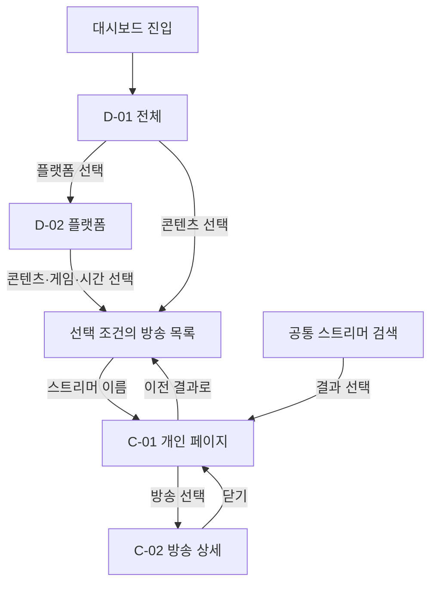

# VDébut 대시보드 개선안 — 페이지 흐름·레이아웃·개발 명세

버전: 2.0 · 작성일: 2026-09-15  
상태: 구현을 위한 제안. 실제 사이트 수정·배포 없음.  
범위: 전체 대시보드 / 플랫폼 대시보드 / 스트리머 개인 페이지

## 0. 이번에 고정할 방향

**전체 방송 상황을 파악하고 → 플랫폼·콘텐츠·시간으로 좁혀 보고 → 특정 스트리머의 방송 기록을 확인한다.**

이 구조가 이전 ‘지금 방송 / 지난 방송 / 방송 동향’ 중심 IA를 대체한다. 현재·과거는 시간 조회 조건이며, GNB를 나누는 기준은 아니다. 방송 목록은 집계의 근거와 개인 페이지로 가는 진입점이다.

시청자는 취향에 맞는 방송과 스트리머를 찾는다. 스트리머는 동시간대 콘텐츠 및 자신의 방송 기록을 확인한다. 신규 스트리머 대상 추천·기회 점수는 핵심 범위에서 제외한다.

### 기획 완료의 기준

- 전체에서 치지직을 선택하고 게임 → GTA5를 펼친 뒤 실제 해당 방송을 찾을 수 있다.
- 특정 날짜·시간을 선택하면 그 구간에 관측된 방송을 확인할 수 있다.
- 스트리머를 검색하면 플랫폼 대시보드를 거치지 않고 개인 페이지에 도착한다.
- 개인 페이지에서 방송 하나를 선택하면 당시 콘텐츠와 시청 추이를 확인한다.
- 이전 페이지로 돌아가면 기간·콘텐츠·시간 선택과 목록 위치가 복원된다.

## 1. 근거와 적용 범위

사용자가 제시한 구조 참고:

- [전체 대시보드](https://viewership.softc.one/platforms/dashboard)
- [치지직 대시보드](https://viewership.softc.one/platforms/dashboard/naverchzzk)
- [SOOP 대시보드](https://viewership.softc.one/platforms/dashboard/afreeca)
- [스트리머 개인 페이지](https://viewership.softc.one/channel/naverchzzk/80b36a0ae8e887e893ce0014dbfece4a)

참고 URL은 이전 확인에서 HTTP 429로 세부 화면을 읽지 못했다. 본 문서는 사용자가 명시한 3단계 구조와 직접 확인한 VDébut 화면의 문제를 바탕으로 작성했으며, 참고 사이트의 세부 기능을 재현했다고 주장하지 않는다.

VDébut에서 이전 검토 때 확인한 문제: 반복된 제목·안내, 동일 방송 카드 중복, 일부 빈 썸네일, 연결되지 않은 기록 보기, 지난 방송의 준비 중 안내. 이번 작성 시점의 재검증 결과는 아니다.

## 2. IA·GNB·경로

| ID | 페이지·위치 | 제안 경로 | 역할 |
| --- | --- | --- | --- |
| D-01 | 전체 대시보드 | `/analytics` | 플랫폼별 현재 규모와 기간별 현황 비교 |
| D-02 | 치지직 대시보드 | `/analytics/chzzk` | 치지직 내 콘텐츠·시간·방송 상세 탐색 |
| D-02 | SOOP 대시보드 | `/analytics/soop` | SOOP 내 콘텐츠·시간·방송 상세 탐색 |
| C-01 | 스트리머 개인 페이지 | `/creators/{platform}/{channelId}` | 현재 상태, 방송 이력, 방송별 상세 |
| C-02 | 개인 페이지 내부 방송 상세 | C-01에 `broadcastId` 쿼리 추가 | 선택 방송의 관측 추이·콘텐츠 구간 |

GNB는 **데뷔 일정 / 대시보드**로 한다. 스트리머 검색은 GNB 우측에 지속 노출한다. 등록·언어·기존 보조 메뉴는 별도 보조 영역에 둔다.

대시보드 하위 탐색은 **전체 / 치지직 / SOOP**이다. 플랫폼 선택은 경로를 이동하며, 현재 페이지를 명확히 표시한다. 개인 페이지에도 ‘대시보드 > 치지직 > 스트리머명’ 탐색 경로를 제공한다.

경로는 구현 제안이다. 현재 라우터·기존 프로필 경로를 확인하고 이미 정식 개인 URL이 있으면 재사용한다. 중복 개인 페이지를 새로 만들지 않는다.

## 3. 페이지 흐름

F는 독립 페이지가 아니라 D-01 또는 D-02의 하단 영역이다. C-02도 C-01 내부 상세 영역으로 먼저 구현한다. 페이지를 불필요하게 늘리지 않는다.

### 핵심 시나리오

| 시나리오 | 클릭 순서 | 최종 결과 |
| --- | --- | --- |
| 전체 상황 확인 | 대시보드 → 플랫폼 요약·추이 | 플랫폼별 규모와 시간에 따른 변화 파악 |
| 현재 GTA5 방송 찾기 | 치지직 → 게임 펼치기 → GTA5 → 현재 방송 목록 | 이름·제목·현재 시청 수·방송 보기 |
| 어제 22시 확인 | 플랫폼 → 날짜 선택 → 추이에서 22시 선택 | 그 시간에 관측된 방송·당시 콘텐츠 |
| 사람 먼저 찾기 | GNB 검색 → 검색 결과 선택 | 해당 스트리머의 개인 페이지 |
| 개인 방송 이력 확인 | 개인 페이지 → 방송 이력 행 선택 | 해당 방송의 제목·게임 변경·시청 추이 |

## 4. 공통 시간·필터 정책

### 4.1 현재와 기간 분석 분리

대시보드는 두 구역으로 구분한다.

1. **지금 현황:** 마지막 유효 수집 묶음의 방송 수·동시시청 합계. ‘현재 · 21:00 KST 기준’처럼 시각을 붙인다.
2. **기간별 현황:** 기간 필터 아래의 추이·콘텐츠 집계·방송 목록. 기간과 선택한 구간이 이 영역에만 적용된다.

상단 현재 숫자는 과거 날짜를 고를 때 바뀌지 않는다. 대신 기간 분석 제목에 실제 날짜를 표시하고, 하단이 과거 기준임을 명확히 구분한다. ‘전체 페이지가 같은 기간을 본다’고 오해시키는 최상단 기간 필터를 두지 않는다.

### 4.2 기간 선택

- 기본: 오늘 00:00부터 마지막 관측 시각까지, KST.
- 빠른 선택: 오늘 / 어제 / 최근 7일 / 최근 30일 / 직접 선택.
- 최근 7일·30일: 오늘 포함 여부를 고정하고 시작·끝 날짜를 함께 표시한다. 초기 제안은 오늘을 포함한 달력 날짜 범위다.
- 미래 시각은 데이터 없음. 조회 시작 전 수집이 없던 기간도 데이터 없음으로 표시한다.
- 일 단위 화면의 클릭 단위는 1시간. 실제 집계 해상도는 데이터 품질에 맞게 표시한다.
- 여러 날짜 추이는 날짜 선택 → 해당 날짜의 시간별 추이 → 1시간 선택 순서로 좁힌다.
- 요일 평균 히트맵은 고급 보기로 후순위 배치한다. 평균 셀을 특정 하루의 기록인 것처럼 연결하지 않는다.

### 4.3 조건 적용 범위

| 조작 | 바뀌는 영역 | 유지되는 영역 |
| --- | --- | --- |
| 플랫폼 이동 | 페이지의 모든 데이터와 제목 | 기간·시간·공통 콘텐츠 선택 |
| 기간 변경 | 기간 추이·콘텐츠 집계·방송 목록 | 상단 지금 현황 |
| 시간 구간 선택 | 선택 구간의 콘텐츠 집계·방송 목록 | 전체 기간 추이, 선택 구간 표시 유지 |
| 콘텐츠·게임 선택 | 기간 추이·방송 목록 | 부모 콘텐츠 구성표의 전체 분모 |
| 스트리머 검색 | 검색 결과 패널 | 페이지 데이터와 필터 |
| 개인 페이지 이동 | 해당 채널 데이터 | 조회 기간, 돌아갈 탐색 상태 |

콘텐츠 표는 ‘현재 플랫폼·선택 기간/구간의 전체 콘텐츠’를 유지한다. 게임을 선택해도 게임이 전체의 100%로 바뀌지 않는다. 추이는 ‘GTA5 시청 현황’처럼 제목을 바꾼다. 없는 플랫폼별 세부 카테고리는 전환 시 해제하고 짧게 알린다.

## 5. D-01 전체 대시보드 레이아웃

데스크톱 기준 콘텐츠 최대 폭 1,280px, 12열, 열 간격 24px. 바깥 여백은 최소 24px. 공통 헤더 64px. 화면 제목은 하나만 사용한다.

| 영역 ID | 순서·폭 | 레이아웃·노출 정보 | 목적·클릭 |
| --- | --- | --- | --- |
| G-01 | 최상단·전체 | 로고 / 데뷔 일정 / 대시보드 / 스트리머 검색 | 검색으로 개인 페이지 직행 |
| D1-01 | 1·전체 | ‘버튜버 방송 현황’ + 전체/치지직/SOOP | 현재 위치와 탐색 범위 |
| D1-02 | 2·6열+6열 | 치지직·SOOP 각각 현재 동시시청 합계, LIVE 수, 관측 시각 | 플랫폼별 현재 규모. 카드 내 플랫폼 보기 |
| D1-03 | 3·전체 | ‘기간별 현황’ + 날짜 범위·빠른 기간 선택 | 현재 영역과 기간 영역 경계 |
| D1-04 | 4·8열 | 시간별 시청 합계 그래프, 아래 같은 X축의 방송 수 그래프 | 시청 수와 방송 수를 각각 해석. 지점 선택 가능 |
| D1-05 | 4·4열 | 콘텐츠별 구성: 게임·잡담·음악 등, 시청 합계/방송 수 기준 전환 | 어떤 콘텐츠가 많은지 파악. 클릭 시 목록 필터 |
| D1-06 | 5·전체 | ‘선택 조건의 방송’ + 조건 요약 + 방송 목록 | 숫자를 구성하는 실제 방송 확인 |

### 첫 화면 목표

1,440×900 기준으로 플랫폼 요약과 주 그래프가 보여야 한다. 제목·안내·필터만 첫 화면을 채우지 않는다. 긴 소개, 별도 KPI 6개, 거대한 상태 카드를 추가하지 않는다.

### 전체 합산 정책

두 플랫폼의 유효 수집 시점과 관측 범위가 비교 가능한 경우에만 합산 요약을 제공한다. 서로 다른 시점이면 플랫폼별 수치와 시각을 분리한다. 동시시청 합계는 중복 시청자를 제거한 고유 인원 수가 아니다. ‘한국 버튜버 전체’로 표현하지 않고 검증·수집 범위를 명시한다.

콘텐츠 통합 매핑이 검증되지 않은 항목은 미분류에 보존한다. 조회하지 못한 플랫폼을 0명으로 포함하지 않는다.

## 6. D-02 플랫폼 대시보드 레이아웃

| 영역 ID | 순서·폭 | 레이아웃·노출 정보 | 목적·클릭 |
| --- | --- | --- | --- |
| D2-01 | 1·전체 | ‘치지직 버튜버 방송 현황’ / 플랫폼 하위 탐색 | 플랫폼 범위 고정 |
| D2-02 | 2·전체 | 현재 동시시청 합계 · LIVE 수 · 관측 시각을 한 줄 요약 | 현재 규모 확인 |
| D2-03 | 3·전체 | 기간 선택 + 콘텐츠·게임 선택 조건 | 분석 범위 설정 |
| D2-04 | 4·8열 | 시청 합계·방송 수의 시간별 추이 | 시간 변화 파악·특정 시간 선택 |
| D2-05 | 4·4열 | 콘텐츠 구성표, 게임 행 펼치기 | GTA5 등으로 좁히기 |
| D2-06 | 5·전체 | 선택 구간 요약: 날짜·시간·게임·관측 상태 | 지금 아래 목록이 무엇인지 설명 |
| D2-07 | 6·전체 | 실제 방송 목록 20개 단위 더 보기 | 스트리머 개인 페이지로 연결 |

### 게임 펼치기 규칙

- 기본은 상위 콘텐츠만 보인다.
- 게임 행의 펼치기 버튼은 하위 게임을 펼친다. 게임 이름 선택은 전체 게임을 필터링한다. 두 동작을 별도 버튼으로 구분한다.
- 하위 목록은 최대 5개 + ‘게임 더 보기’. 검색은 항목이 많을 때만 제공한다.
- 각 항목에는 게임명, 선택 기준의 값, 단위를 표시한다.
- GTA5 선택 시 추이 제목과 하단 목록 조건이 바뀐다. 부모 구성표의 분모는 유지한다.
- 표의 임의 행 클릭으로 외부 방송을 열지 않는다. 게임 선택은 페이지 내 필터, 스트리머 이름은 내부 개인 페이지, ‘방송 보기’는 외부 플랫폼이다.
- 같은 방송이 게임을 바꿨다면 시간 구간에 맞는 콘텐츠로 조회한다.

### 현재·과거 목록

| 기준 | 필수 열 | 행동 |
| --- | --- | --- |
| 최신 관측 | 스트리머, 방송 제목, 플랫폼, 콘텐츠, 현재 시청 수, 제공되는 시작 시각 | 이름 → 개인 / 방송 보기 → 외부 |
| 과거 1시간 | 스트리머, 해당 구간 제목·콘텐츠, 관측 구간, 구간 평균·관측 최고 시청 수 | 이름 → 개인 / 기록 보기 → 해당 방송 상세 |
| 다일 기간 | 방송 날짜, 스트리머, 제목·콘텐츠, 관측 구간, 기간 내 관측 요약 | 방송 기록 선택 |

과거 목록에 현재 시청 수를 표시하지 않는다. 같은 방송의 반복 관측을 여러 방송 행으로 노출하지 않는다. 한 방송의 콘텐츠 변경은 행 안의 구간 상세로 제공한다.

## 7. C-01 스트리머 개인 페이지 레이아웃

| 영역 ID | 순서·폭 | 레이아웃·노출 정보 | 목적·클릭 |
| --- | --- | --- | --- |
| C1-01 | 1·전체 | 탐색 경로 / 이전 결과로 | 유입 위치와 뒤로 가기 |
| C1-02 | 2·전체 | 프로필, 이름, 플랫폼, 현재 방송 상태·제목·콘텐츠, 방송 보기 | 누구인지·현재 무엇을 하는지 |
| C1-03 | 3·전체 | 기간 선택 + 방송일 수·관측 방송시간·시간가중 평균 시청 수 | 선택 기간 활동 요약 |
| C1-04 | 4·8열 | 날짜별 방송 시간선 | 언제 방송했는지, 방송 선택 |
| C1-05 | 4·4열 | 콘텐츠별 관측 방송시간 비중 | 무엇을 주로 방송했는지 |
| C1-06 | 5·전체 | 방송 이력: 날짜·제목·콘텐츠·구간·시청 요약 | 특정 방송 확인 |
| C1-07 | 6·전체·선택 시 | C-02 선택 방송 상세 | 시간별 시청 추이와 콘텐츠 변경 |

대시보드의 콘텐츠 필터는 개인 페이지 전체 이력을 제한하지 않는다. 선택 방송이 있다면 그 기록을 먼저 열되, 다른 콘텐츠의 방송 이력도 볼 수 있어야 한다. 기간만 전달한다.

### C-02 방송 상세

1. 방송 제목과 날짜, 시작·종료의 확인 수준.
2. 관측된 시청 수 추이. 공백은 연결하지 않는다.
3. 같은 시간축에 콘텐츠 구간: 예를 들어 잡담 → GTA5 → 잡담.
4. 제목 변경이 있으면 해당 시각과 함께 상세로 제공한다.
5. 다시보기는 실제 검증된 VOD URL이 있을 때만 노출한다.

모바일에서는 이력 행 아래로 상세를 펼치고 제목에 포커스를 이동한다. 닫으면 선택 행으로 포커스를 돌린다. 직접 URL 진입도 동일 방송이 열린 상태로 복원한다.

## 8. 검색·이동·상태 복원 명세

| 이벤트 | 동작 | 예외 |
| --- | --- | --- |
| 검색 입력 | 이름·별칭 검색, 플랫폼+프로필로 결과 구분. 오프라인 채널 포함 | 입력 중 상태·검색 결과 없음 구분 |
| 검색 결과 선택 | 안정적인 플랫폼+채널 ID의 개인 경로로 이동 | 동명이인 합치지 않음 |
| 플랫폼 선택 | 경로 변경, 적용 가능한 분석 조건 유지 | 해당 플랫폼에 없는 세부 게임은 해제 |
| 그래프 시간 선택 | 선택 구간 강조, 콘텐츠표·방송 목록 갱신 | 데이터 누락 구간은 ‘관측 누락’, 0으로 처리하지 않음 |
| 게임 선택 | 콘텐츠 조건 갱신, 추이·방송 목록 갱신 | 결과 없으면 조건 해제 제공 |
| 개인 페이지 진입 | 기존 목록 상태 보관 | 직접 접속이면 ‘플랫폼 대시보드’ 링크 제공 |
| 브라우저 뒤로 가기 | 경로·기간·게임·선택 구간·목록 위치 복원 | 삭제된 조건은 알리고 가능한 범위 복원 |

제안 쿼리: `from`, `to`, `category`, `game`, `windowStart`, `windowEnd`, `sort`, `broadcastId`. 내부 시각은 UTC ISO 8601, 화면은 KST. 서버는 잘못된 범위·종료 전 시작·미지원 값에 명시적인 오류를 반환한다. 공개 URL에 개인 정보나 자격 증명을 넣지 않는다.

## 9. 지표 정의·신뢰성 규칙

| 지표 | 정의 | 잘못된 해석 방지 |
| --- | --- | --- |
| 현재 LIVE 수 | 최신 유효 수집 묶음의 고유 방송 수 | 반복 수집·조인 중복 제거 |
| 현재 동시시청 합계 | 동일 범위·수집 묶음의 방송별 시청 수 합계 | 고유 사용자 수가 아님 |
| 시간대 평균 동시시청 합계 | 유효 관측 시점의 합계를 유효 시간으로 가중 평균 | 시간별 수치를 더해 누적 시청자로 표시하지 않음 |
| 기간 평균 LIVE 수 | 관측 시점별 LIVE 수의 시간가중 평균 | 기간 내 고유 방송 개수와 구분 |
| 개인 평균 시청 수 | 유효 관측의 viewer × 유효 지속시간 합 / 유효 지속시간 합 | 방송별 평균의 단순 평균 금지 |
| 관측 최고 시청 수 | 수집된 값 중 최대 | 실제 최고치를 놓칠 수 있어 ‘관측 최고’ 사용 |
| 콘텐츠 시청 비중 | 현재는 시청 합계 비율, 기간은 유효 시청시간 비율 | 현재 비중·기간 비중 명칭 구분 |
| 콘텐츠 방송시간 비중 | 해당 콘텐츠의 유효 관측 방송시간 / 전체 유효 관측 방송시간 | 시청자 취향·연령·고유 시청자 집단으로 해석하지 않음 |

유효 관측 구간은 다음 관측 또는 허용 최대 간격 중 짧은 구간으로 제한한다. 허용 최대 간격은 실제 수집 간격 검증 후 운영 설정으로 확정한다. 누락 시간을 임의 보간해 연속 방송이나 0명으로 채우지 않는다.

플랫폼 수집이 실패하면 이전 수치에 ‘지연’을 표시한다. 비교 불가능한 플랫폼까지 합쳐 전체 수치로 만들지 않는다. 수집 범위는 확인된 버튜버 채널 등 실제 모집단을 설명하며, 분류 불명 채널을 임의로 버튜버로 확정하지 않는다.

‘최적 시간’, ‘신입 유입’, ‘낙수 효과’, ‘자석 태그’, ‘합방 이벤트’는 관측 수치나 태그만으로 단정하지 않는다. 데이터가 적으면 부족한 부분을 표시하며 샘플 데이터를 실제 통계처럼 섞지 않는다.

## 10. 데이터·내부 API 요구사항

외부 수집 API와 사용자 화면 API를 분리한다. 화면 필터 조작마다 외부 플랫폼 전체 목록을 다시 호출하지 않는다. 기존 수집기의 현행 필드·사용 조건 검증은 구현 착수 때 필요하다. 아래 경로는 제안이며 이미 존재한다고 가정하지 않는다.

| API | 입력 | 응답·사용처 |
| --- | --- | --- |
| `GET /api/analytics/current` | platform 또는 all, scope | 플랫폼별 현재 요약, 수집 시각·품질 |
| `GET /api/analytics/timeseries` | platform, from, to, category, game, interval | 시간별 시청 합계·LIVE 수·coverage |
| `GET /api/analytics/content` | platform, from, to, window, metric, parent | 전체 콘텐츠·하위 게임 구성, 명시된 분모 |
| `GET /api/analytics/broadcasts` | platform, from, to, window, category, game, cursor | 중복 없는 방송 목록·구간 요약 |
| `GET /api/creators/search` | q, platform, cursor | 이름·별칭에 해당하는 온라인/오프라인 채널 |
| `GET /api/creators/{platform}/{channelId}` | from, to | 프로필·현재 상태·기간 요약 |
| `GET /api/creators/{platform}/{channelId}/broadcasts` | from, to, cursor | 방송 이력·콘텐츠 구간 |
| `GET /api/broadcasts/{broadcastId}` | 없음 | 방송별 관측 추이·제목·콘텐츠 변경 |

공통 응답: `scope`, `timezone`, `from`, `to`, `generatedAt`, `sourceObservedAt`, `coverage`, `freshness`. 현재는 `snapshotId`, 기간 집계는 `aggregateVersion`도 제공한다. 프런트엔드는 서로 다른 조건·버전의 응답을 섞지 않는다. 조건을 빠르게 바꾸면 이전 요청을 취소하거나 응답 키를 비교해 오래된 결과를 폐기한다.

데이터 최소 단위: 채널, 방송, 수집 실행, 방송별 관측, 콘텐츠 매핑 버전, 제목·콘텐츠 구간. 방송 ID가 플랫폼에서 안정적으로 제공되지 않으면 세션 식별 규칙을 별도 검증한다. 채널별 현재 방송 한 건을 선택하는 기준과 DB 고유 제약을 함께 둔다.

원본 수집 검증 출발점: [CHZZK Live](https://chzzk.gitbook.io/chzzk/chzzk-api/live), [CHZZK Channel](https://chzzk.gitbook.io/chzzk/chzzk-api/channel). 이 문서는 현행 외부 응답의 재검증 결과가 아니다. SOOP은 현행 공식 응답·호출 조건·보관 조건을 확인한 기능만 개방한다.

## 11. 반응형·시각 디자인

| 항목 | 데스크톱 | 모바일 |
| --- | --- | --- |
| 기준 | 1,440px, 최대 본문 1,280px | 390px 기준, 320px까지 대응 |
| 그리드 | 12열 / 간격 24px | 1열 / 좌우 16px |
| 현재 플랫폼 요약 | 2열 | 두 개의 짧은 행 |
| 그래프+콘텐츠 | 8열+4열 | 그래프 다음 콘텐츠 |
| 검색 | GNB 우측 입력창 | 검색 버튼 → 전체 폭 입력·결과 |
| 목록 | 비교 가능한 행 중심 | 이름·제목·콘텐츠·핵심 수치로 축약 |
| 시간 선택 | 포인터와 시간 선택 컨트롤 | 탭 또는 시간 드롭다운 병행 |
| 개인 방송 상세 | 이력 아래 확장 | 선택 행 아래 확장 |

본문 14~16px, 보조 12~13px, 제목 24~28px를 초기 디자인 기준으로 한다. 클릭 영역은 모바일 44px 이상. 키보드 포커스와 선택 상태를 유지한다. 차트는 색뿐 아니라 선 종류·텍스트로 플랫폼을 구분한다.

페이지 제목은 한 번, 주요 섹션 제목은 짧게 쓴다. 각 패널에 소개문을 반복하지 않는다. 기본 표면·경계·강조색을 통일하고 빨간색은 LIVE 또는 실제 오류 상태에 제한한다. 중첩 카드를 반복하지 않는다. 데이터 방법론은 짧은 범위 문구 + 상세 안내로 이동한다.

빈 썸네일은 고정 대체 이미지 또는 이름·콘텐츠가 있는 배경으로 대체한다. 로딩과 이미지 오류를 검은 빈 사각형으로 방치하지 않는다. 방송 이력은 썸네일 없이도 이해되게 한다.

## 12. 기존 화면에서의 변경 목록

| 기존 | 개선 | 우선순위 |
| --- | --- | --- |
| 지금/지난/동향 메인 탭 | 전체/치지직/SOOP 페이지 위계 | P0 |
| 방송 탐색 소개와 중복 제목 | 페이지 제목 하나·짧은 관측 범위 | P0 |
| 전체 방송 카드가 메인 전체를 점유 | 플랫폼 현재 요약·추이·콘텐츠 뒤의 근거 목록 | P0 |
| 동일 방송 카드 반복 | ID 기준 중복 제거·집계 재검증 | P0 |
| 작동하지 않는 기록 보기 | 개인 URL과 최근 방송·방송 상세 연결 | P0 |
| 과거 탭의 내부 기획 설명 | 실제 기간 조회 또는 수집 시작일·빈 상태 | P0 |
| 기본부터 긴 게임 목록 노출 | 게임 펼치기 후 5개·더 보기 | P1 |
| 추천성 문구·기회 점수 | 제거, 관측 지표만 유지 | P0 |
| 고급 히트맵·집중도·다운로드 | 핵심 3페이지 완료 후 상세로 검토 | P2 |

## 13. 구현 순서·출시 판정

### 단계 1: 데이터와 공통 구조

채널·방송 중복 제거, 범위·시각 통일, 라우팅, 플랫폼 탐색, 공통 검색, 로딩·오류·빈 상태를 구현한다.

### 단계 2: 세 페이지의 최소 연결

전체 플랫폼 요약 → 플랫폼 추이·콘텐츠·방송 목록 → 개인 최근 방송 → 방송 상세까지 연결한다. 이 단계는 수집된 실제 기간으로만 제공해도 된다. 과거 30일을 꾸며 채우지 않는다.

### 단계 3: 기간 조회와 게임 탐색

날짜·시간 선택, 게임 펼치기, 콘텐츠 변경 구간, URL 상태, 뒤로 가기 복원을 완성한다. 단계 2와 3까지를 핵심 개편 범위로 한다.

### 단계 4: 시각·접근성 마무리

데스크톱·모바일, 이미지 대체, 키보드 탐색, 시각·단위·용어, 실제 사용자 과제 수행을 확인한다. 추가 지표는 이 이후 판단한다.

### 수용 기준

| ID | 확인 과제 | 통과 조건 |
| --- | --- | --- |
| AC-01 | 전체 → 플랫폼 이동 | 해당 플랫폼 범위·제목·숫자가 일치 |
| AC-02 | 게임 → GTA5 선택 | 추이·방송 목록이 해당 조건이며 분모 설명 유지 |
| AC-03 | 어제 22~23시 선택 | 해당 구간에 겹쳐 관측된 방송만 표시, 현재 수치 혼입 없음 |
| AC-04 | 오프라인 스트리머 검색 | 검색 결과에서 개인 기록 접근 가능 |
| AC-05 | 방송 상세 선택 | 시청 추이와 콘텐츠 구간의 시간축 일치 |
| AC-06 | 뒤로 가기 | 원래 플랫폼·기간·게임·구간·목록 위치 복원 |
| AC-07 | 동일 ID 중복 입력 | 목록과 방송 수·시청 합계에서 중복 제거 |
| AC-08 | 한 플랫폼 수집 실패 | 0으로 합산하지 않고 지연·미수집 표시 |
| AC-09 | 방송 중 게임 변경·자정 통과 | 구간별 콘텐츠·날짜 경계 조회가 정확 |
| AC-10 | 모바일 390px·320px | 제목·필터·핵심 수치 잘림 없음, 주요 행동 가능 |
| AC-11 | 빠른 필터 변경 | 늦게 도착한 과거 요청이 새 조건의 화면을 덮지 않음 |
| AC-12 | 실제 기록 없음 | 예시 수치 대신 수집 시작일과 비어 있는 이유 표시 |

검증 범위는 위 과제와 실제 계산 위험에 집중한다. 단순 문구·색 변경마다 별도 테스트를 늘리지 않는다.

## 14. 화면 시안의 해석

대화에 제공한 클릭 가능한 시안은 전체 → 치지직/SOOP → 게임 → 스트리머 → 방송 상세 흐름과 영역 배치를 확인하기 위한 것이다. 가상 채널과 예시 수치를 사용하며 실제 API에 연결되지 않는다.

시안의 기간은 오늘·어제, 시간은 대표 4개 관측 구간으로 축약했다. 실제 구현은 위 명세의 연속된 유효 관측과 전체 날짜 범위를 사용한다. 시안에서 직접 실행되지 않는 외부 방송 연결·운영 API·전체 날짜 선택은 문서의 구현 범위로 남는다.

시안을 보고 먼저 확정할 사항은 ‘지금 현황의 위치’, ‘추이와 콘텐츠의 배치’, ‘게임 선택 후 목록 연결’, ‘개인 기록의 읽는 순서’다. 메뉴 구조를 다시 늘리지 않는다.
