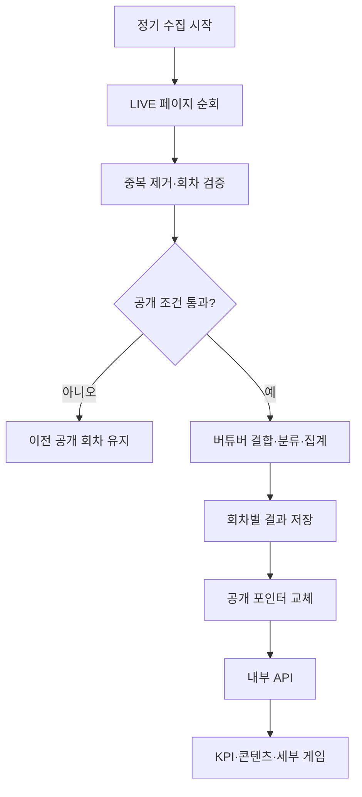

# VDébut 현재 콘텐츠·게임 드릴다운 개발 기획서

버전: v1.0 · 작성일: 2026-09-14  
대상: `/analytics`의 현재 콘텐츠 영역 및 `/analytics/category`의 동일 기준 조회  
문서 상태: 구현 제안 명세. 실제 저장소·운영 DB·인증된 플랫폼 응답을 검사한 결과가 아니며, 기존 테이블에 그대로 실행하는 마이그레이션이 아니다.

## 1. 이번 개발의 목적과 범위

> **현재 확인된 버튜버 LIVE에서 어떤 콘텐츠에 동시시청이 모여 있는지 보여주고, 게임을 펼쳐 GTA 5·마인크래프트 등 실제 세부 게임까지 확인하게 한다.**

사용자는 세 가지 질문에 답을 얻어야 한다.

1. 지금 어떤 콘텐츠에 동시시청이 가장 많이 모여 있는가?
2. 게임 중에서는 어떤 게임에 많이 모여 있는가?
3. 해당 수치가 많은 방송에 분산돼 있는가, 한 방송의 영향이 큰가?

### 1.1 결정사항

| 항목 | 이번 구현 결정 | 이유 |
|---|---|---|
| 데이터 소스 | CHZZK 공식 LIVE 목록 우선 | 이번에 확인한 공식 응답으로 구성 가능 |
| SOOP | 검증 완료 전 선택지 숨김 | 개발자 포털 존재만으로 동일 수집 가능성을 보장하지 않음 |
| 분석 대상 | 검수 완료 버튜버 채널 중 이번 수집에서 확인된 LIVE | 사이트 등록자·전체 플랫폼 이용자를 혼동하지 않음 |
| 시간 기준 | 최근 공개 가능한 수집 회차 | 최근 7일 평균과 현재값을 섞지 않음 |
| 기본 정렬 | 동시시청 합계 내림차순 | 사용자의 ‘어디에 사람이 많은가’에 직접 답함 |
| 부모 클릭 | 게임 아래 세부 목록 펼침·접음 | 페이지 이탈 없이 비교 유지 |
| 세부 게임 클릭 | 같은 영역에 관측 수치 상세 펼침 | 관측값 설명, 이후 개인 분석의 연결점 확보 |
| 기본 데이터 전달 | 전체 요약·대분류·세부 분류를 내부 API 한 응답으로 전달 | 부모·자식·KPI의 시점과 분모 일치 |
| 제외 | 기회 점수, 최적 시간, 성공 확률, 신규 유입 추정 | 이 기능의 데이터로 증명할 수 없음 |

‘현재 카테고리 현황’은 과거 8주를 쌓아야만 제공할 수 있는 기능이 아니다. 최신 회차의 수집·분류·집계 검증이 선행 조건이다. 장기 패턴 분석과 추천 검증은 별도 과제다.

### 1.2 이전 제안에서 바로잡는 사항

- `종합게임`은 실제 플랫폼 카테고리이고, `게임 카테고리 미설정`과 합치지 않는다.
- 동일 요일 값이 반복된다는 사실만으로 데이터 복사를 확정하지 않는다. 집계 로직 확인 전에는 검증 항목으로 취급한다.
- 관측된 모든 시청 수의 합은 중복 시청을 제거한 사람 수가 아니다.
- 정기 수집 페이지를 끝까지 읽었다고 전체 버튜버를 모두 확보했다고 표현하지 않는다.
- 특정 시간의 평균·방송 수가 높다는 사실로 신규 스트리머의 예상 성과를 계산하지 않는다.

## 2. GNB와 화면 내 위치

전체 GNB는 `데뷔 일정 / 방송 인사이트 / 데뷔 일정 등록`을 유지한다. 방송 인사이트 하위 메뉴는 `시장 현황 / 시간대 분석 / 콘텐츠 분석`이다. 게임 펼치기를 위해 새 GNB를 만들지 않는다.

| 시장 현황 노출 순서 | 영역 | 역할 |
|---:|---|---|
| 1 | 수집 대상·기준 시각 | 어떤 범위의 수치인지 알림 |
| 2 | 현재 동시시청 합계·현재 LIVE 수 | 전체 규모 확인 |
| 3 | **현재 콘텐츠별 동시시청** | 본 문서의 핵심 기능 |
| 4 | 시간별 추이 | 현재와 과거 비교 |
| 5 | 시간대·콘텐츠 상세 진입 | 필요한 사용자가 심화 분석 |

현재 콘텐츠 영역에는 상위의 `최근 7일/28일`, `요일`, `시간대`, `채널 규모` 필터를 적용하지 않는다. MVP에서 이 필터를 적용할 데이터가 준비되지 않았기 때문이다. 현재 KPI와 본 영역을 별도의 ‘현재 현황’ 묶음에 배치하고, 과거 분석 필터는 그 아래 분석 영역에 둔다.

게임 펼치기·검색·정렬은 화면에 보이는 목록만 바꾸며 전체 KPI나 점유율 분모를 바꾸지 않는다.

## 3. PC 레이아웃

기준: 콘텐츠 최대 폭 1,200px, 좌우 여백 최소 24px. 기존 디자인 토큰이 있으면 해당 토큰을 우선 재사용한다.

| 영역 | 레이아웃 명세 | 실제 표시 내용 |
|---|---|---|
| A. 제목 | 좌측 제목, 우측 정렬 선택·갱신 | 현재 콘텐츠별 동시시청 / 동시시청순 / 새 데이터 확인 |
| B. 범위 | 제목 아래 1~2줄 | CHZZK · 확인된 버튜버 LIVE 기준 · 수집 HH:mm~HH:mm KST |
| C. 상태 | 정상은 짧게, 경고만 강조 | 수집 지연·표본 제한·샘플 데이터 상태 |
| D. 부모 표 | 대분류 행 56px 이상 | 콘텐츠, 동시시청 합계, 전체 점유율, LIVE 수, 방송당 평균 |
| E. 자식 표 | 게임 행 바로 아래 삽입, 연한 배경·16px 들여쓰기 | 게임별 세부 수치, 검색, 더 보기 |
| F. 세부 설명 | 선택 게임의 자식 행 바로 아래 삽입 | 평균·중앙값·최대 방송 점유율과 해석 한계 |
| G. 기준 안내 | 표 아래 고정 | 중복 시청 가능, 모집단 한계, 평균의 의미 |

제목은 정렬에 따라 의미가 바뀌지 않는 ‘현재 콘텐츠별 동시시청’으로 유지한다. 정렬 선택값을 옆에 명시한다. 영어 부제와 ‘정밀’, ‘최적’, ‘효율’ 등 과장될 수 있는 문구는 제외한다.

### 3.1 접힌 상태 예시

아래 및 이후 수치는 UI·QA용 가상 데이터이며 실제 시장 통계가 아니다.

| 콘텐츠 | 동시시청 합계 | 전체 점유율 | LIVE 수 | 방송당 평균 |
|---|---:|---:|---:|---:|
| **게임 · 펼치기** | 9,240 | 39.5% | 31 | 298.1 |
| 잡담·소통 | 7,480 | 32.0% | 22 | 340.0 |
| 음악·노래 | 3,160 | 13.5% | 8 | 395.0 |
| ASMR | 1,870 | 8.0% | 5 | 374.0 |
| 그림·아트 | 1,050 | 4.5% | 7 | 150.0 |
| 기타 | 400 | 1.7% | 3 | 133.3 |
| 미분류 | 200 | 0.9% | 2 | 100.0 |
| 합계 | 23,400 | 100% | 78 | 300.0 |

각 행의 동시시청 숫자 옆에 보조 막대를 둘 수 있다. 막대 길이는 **전체 점유율**에 비례하며 순위별 임의 색상·성공 배지는 넣지 않는다. 반올림한 행 점유율의 합은 100%와 소폭 다를 수 있다는 안내를 제공한다.

### 3.2 게임을 펼친 상태 예시

부모 게임 행은 그대로 두고 아래에 독립된 자식 표를 넣는다. 자식 표 헤더는 반드시 ‘게임 내 점유율’이라고 쓴다. 부모의 ‘전체 점유율’ 열 아래 다른 분모를 설명 없이 넣지 않는다.

| 게임 · 접기 | 동시시청 9,240 | 전체의 39.5% | LIVE 31개 |
|---|---:|---:|---:|

세부 게임 검색 / 동시시청순

| 세부 게임 | 동시시청 합계 | 게임 내 점유율 | LIVE 수 | 방송당 평균 |
|---|---:|---:|---:|---:|
| GTA 5 · 상세 | 2,440 | 26.4% | 5 | 488.0 |
| 마인크래프트 · 상세 | 2,130 | 23.1% | 7 | 304.3 |
| 리그 오브 레전드 · 상세 | 1,870 | 20.2% | 9 | 207.8 |
| 발로란트 · 상세 | 1,120 | 12.1% | 4 | 280.0 |
| 종합게임 · 상세 | 980 | 10.6% | 3 | 326.7 |
| 접힌 나머지 2개 항목 · 펼치기 | 700 | 7.6% | 3 | 233.3 |

나머지 2개는 테스트 예시에서 `그 밖의 실제 게임 카테고리 400/2개 방송`과 `게임 카테고리 미설정 300/1개 방송`으로 구성한다. 실제 서비스에서는 개별 카테고리의 원래 이름을 표시한다. **더 보기용 나머지 합계는 실제 ‘기타 게임’ 카테고리와 구분한다.**

더 보기를 누르면 다음 10개씩 펼친다. 이미 받은 데이터를 렌더링하는 것으로 추가 플랫폼 호출은 없다. 필터 검색 중에는 나머지 합계 대신 ‘검색 결과 X개 / 전체 Y개’를 보여준다.

### 3.3 세부 게임 상세

GTA 5 행의 제목 버튼을 누르면 아래 정보를 같은 표 안에 펼친다.

| 정보 | 목적 |
|---|---|
| 동시시청 합계 / 해당 게임 LIVE 수 | 게임의 관측 규모 확인 |
| 방송당 평균 / 방송별 중앙값 | 대형 방송으로 평균이 올라갔는지 비교 |
| 최대 방송 점유율 | 특정 방송의 영향 확인 |
| 현재 수집 범위·시각 | 부모 표와 같은 데이터임을 확인 |

최대 방송 점유율은 항상 숫자로 제공한다. 임의 기준의 ‘시청 분산’, ‘경쟁 낮음’, ‘블루오션’ 배지는 사용하지 않는다. 방송이 1개라면 ‘방송 1개 기준’이라고 표시하고 점유율 100%를 위험 판정으로 바꾸지 않는다.

표준 안내: ‘이 수치는 해당 게임 방송들의 관측값이며, 새로 방송하는 채널의 예상 시청자 수가 아닙니다.’

현재 버전은 개별 스트리머 목록이나 닉네임 링크를 추가하지 않는다. 다음 개인 분석 단계에서 검증된 채널 ID 기반 연결을 붙인다. 닉네임을 URL 뒤에 붙여 방송 링크를 추정하지 않는다.

## 4. 모바일·반응형·접근성

| 화면 폭 | 표시 방식 | 간격 |
|---|---|---|
| 1,024px 이상 | 5열 표 | 컨테이너 24px, 카드 내부 24px |
| 768~1,023px | 5열 표, 콘텐츠 이름 줄바꿈 허용 | 좌우 16px |
| 767px 이하 | 콘텐츠별 2줄 카드 목록 | 좌우 16px, 카드 내부 12~16px |

모바일 부모 카드: 첫 줄은 ‘게임’과 동시시청 합계, 둘째 줄은 ‘전체 점유율 / LIVE 수’, 펼치기 버튼은 우측에 둔다. 방송당 평균은 펼친 상세에 표시한다. 자식 카드도 동일하되 ‘게임 내 점유율’로 표시한다. 5열 표를 축소해서 가로 스크롤시키지 않는다.

- 터치 타깃 최소 44×44px, 제목 18~20px, 본문 14~16px, 보조 12~13px.
- 이름은 최대 2줄. 전체 이름은 포커스·상세에서 확인 가능하게 한다.
- 접힌 게임은 `button` + `aria-expanded=false`; 펼치면 true와 `aria-controls`로 대상 연결.
- 부모·자식은 의미가 다른 별도 표와 caption 또는 제목을 사용한다.
- 버튼 내부에 버튼을 중첩하지 않는다. 행 전체 클릭 대신 이름·펼치기 영역을 하나의 버튼으로 묶는다.
- Enter·Space로 펼치고 접기. 닫을 때 내부 포커스가 사라지면 부모 버튼으로 복귀.
- 정렬 select는 label 연결. 색상·호버만으로 지표와 동작을 전달하지 않는다.
- 좁은 화면·키보드에서도 기준 시각, 분모, 새 데이터 알림을 볼 수 있어야 한다.

## 5. 인터랙션 및 상태 전이

| 행동 | 화면 반응 | 데이터 규칙 |
|---|---|---|
| 최초 진입 | skeleton 후 현재 KPI와 전체 콘텐츠 표시, 게임 접힘 | 내부 API 1회 |
| 게임 펼치기 | 상위 5개 세부 게임 + 나머지 합계 | 받은 회차를 그대로 사용 |
| 게임 접기 | 자식 숨김 | 검색·정렬은 세션 내 유지 |
| 게임명 검색 | 실제 수집된 게임명·검수된 별칭만 검색 | 전체/게임 점유율 분모는 유지 |
| 정렬 변경 | 해당 계층 내에서만 재정렬 | 부모와 자식 정렬은 별도 상태 |
| 세부 게임 클릭 | 관측 상세 펼침 | 한 번에 상세 1개 열기 |
| 다른 게임 클릭 | 기존 상세 닫고 새 상세 열기 | 외부 API 호출 없음 |
| 수동 갱신 | 최신 내부 응답 확인 | 플랫폼 즉시 수집을 유발하지 않음 |
| 더 보기 | 다음 10개 표시 | 자식 데이터 재요청 없음 |

정렬값은 `viewers_desc`, `live_desc`, `average_desc`. 동률은 동시시청 내림차순, 최종 키는 `groupKey/detailKey` 오름차순으로 고정한다. 숫자 평균은 반올림 전 값으로 정렬한다.

새 수집 데이터는 탭이 보이는 동안 내부 API를 60초마다 확인한다. 회차가 같으면 아무것도 바꾸지 않는다. 게임이 접혀 있으면 KPI와 콘텐츠를 한 번에 갱신하고, 펼쳐져 있으면 ‘새 수집 데이터가 있습니다 · 적용’만 표시한다. 적용 시 KPI·부모·자식을 한 번에 교체한다. API 캐시 시간을 고려해 탭 포커스 복귀 시에도 1회 확인한다.

표를 읽는 도중 순위가 자동으로 이동하지 않게 한다. 새 회차에서 선택 게임이 사라졌다면 상세를 닫고 ‘새 수집에서는 해당 게임 LIVE가 확인되지 않았습니다’라고 안내한다. 이를 방송 종료 확정으로 기록하지 않는다.

URL 예: `/analytics?contentGroup=GAME&detail=local-detail-key&sort=viewers_desc`  
위 key는 내부 API가 반환한 값을 사용하며 외부 플랫폼 ID를 추정하지 않는다. 공유 URL은 최신 데이터에서 같은 선택을 복원하는 링크이지, 과거 결과 영구 재현 링크가 아니다. 만료된 게임 키는 선택만 해제한다.

## 6. 공식 외부 API 참조

확인 수준은 ‘공개 공식 문서 검증’이다. 실제 앱 발급·실호출·Quota·저장/재노출 정책 검증은 아직 수행하지 않았다.

### 6.1 방송 목록: 집계의 원천

`GET https://openapi.chzzk.naver.com/open/v1/lives?size=20`

애플리케이션 Client 인증을 사용한다. 다음 페이지는 응답 `content.page.next`를 URL 인코딩해 `next`로 전달한다. 목록은 시청 수 내림차순이며 페이지 크기는 최대 20이다. 카테고리별 합산 통계를 별도로 받는 방식이 아니라 LIVE 행들을 직접 합산한다. [CHZZK Live 공식 문서](https://chzzk.gitbook.io/chzzk/chzzk-api/live)

| 원본 필드 | 내부 저장값 | 목적 |
|---|---|---|
| `liveId` | stream_id | 중복 제거, 세션 식별 |
| `channelId` | channel_id | 버튜버 레지스트리 결합 |
| `concurrentUserCount` | viewer_count | 합계·평균·중앙값 |
| `categoryType` | source_category_type | GAME/SPORTS/ETC 원본 유지 |
| `liveCategory` | source_category_id | 세부 분류 키 |
| `liveCategoryValue` | source_category_name | 세부 표시명 |
| `openDate` | source_started_at | 이후 방송 세션 분석 |

방송 제목·태그로 게임을 추측하지 않는다. 필요 시 별도 검수 자료로만 사용한다. 버튜버 확정 여부도 태그가 아니라 운영 레지스트리로 관리한다.

요청 헤더는 `Client-Id`, `Client-Secret`, `Content-Type: application/json`. 응답은 공통 wrapper `code/message/content` 안에서 읽는다. 인증 비밀은 서버 환경에만 보관한다. Quota 초과는 429이며, 이 참고 문서에서 앱별 고정 허용량은 확인되지 않았다. [CHZZK 인증·공통 응답](https://chzzk.gitbook.io/chzzk/chzzk-api/tips)

### 6.2 카테고리 검색: 이름·이미지 보강

`GET https://openapi.chzzk.naver.com/open/v1/categories/search?query={검색어}&size=20`

카테고리 ID·이름·포스터 확인용이다. 시청 수를 가져오는 API가 아니며, 화면의 게임 검색도 매번 이 API를 호출하지 않는다. query는 필수, size는 최대 50이다. 매칭은 문자열 이름이 아니라 반환된 categoryId와 관측된 원본 ID가 일치하는 경우에만 확정한다. 이미지가 없어도 텍스트로 출시 가능하다. [CHZZK Category 공식 문서](https://chzzk.gitbook.io/chzzk/chzzk-api/category)

### 6.3 지금 호출하지 않는 API

팔로워·채널 구독자·채팅·방송 스트림키 API는 이 기능에 필요하지 않다. 개인 인증·방송 설정 권한도 요구하지 않는다. SOOP은 공식 현행 응답·시청 수 정의·전체 순회·허용 정책이 검증되기 전 이 표에 합산하지 않는다.

## 7. 수집 아키텍처

제안 스택은 서버 Worker + 정기 스케줄 + D1 + 기존 프런트 컴포넌트다. 기존 저장소와 배포 구성을 먼저 확인하고 호환되는 부분만 적용한다. 이번 문서는 서비스 생성·배포·키 발급을 수행하지 않는다.



### 7.1 스케줄과 호출량

초기 수집 목표는 10분 간격. Cloudflare Cron은 UTC 기준으로 설정한다. 표시 시간만 KST로 바꾼다. [Cloudflare Cron Triggers](https://developers.cloudflare.com/workers/configuration/cron-triggers/)

예상 호출량은 `ceil(전체 LIVE 수 / 20) × 하루 회차 수 + 재시도 + 사전 보강`이다. LIVE 2,000개라는 가정에서는 10분 간격 144회 수집에 약 14,400회/일이 필요하다. 버튜버가 50개만 있어도 그 방송을 찾기 위해 전체 LIVE를 순회해야 할 수 있다.

목표 간격은 정책 허용과 Quota 및 실행 한도 측정 후 확정한다. 10분 전수 수집이 불가능하면 간격을 늘리고 UI 문구도 변경한다. 상위 N페이지에서 수집을 중단한 뒤 전체 버튜버 통계로 공개하지 않는다.

### 7.2 회차 수명주기

1. 플랫폼별 lease를 얻고 run_id와 예정 슬롯을 생성한다. 동일 슬롯 중복 실행은 기존 실행에 결합하거나 건너뛴다.
2. 검수 레지스트리 버전과 카테고리 매핑 버전을 회차 시작 시 고정한다.
3. 첫 페이지 요청 후 next 커서를 따라 순차 수집한다. 알려지지 않은 다음 페이지를 임의 병렬 호출하지 않는다.
4. 모든 행에서 필수 ID·시청 수 타입을 검증한다. viewer_count는 0 이상 정수이고, 누락·음수·잘못된 타입을 0으로 바꾸지 않는다.
5. 같은 run_id·stream_id 중복은 가장 나중에 관측한 유효 행 한 개를 사용한다. 카테고리 변경도 그 행 기준으로 통일한다.
6. 커서 종료·실패 없음·검증 통과를 확인한다. 커서 반복, 시간 예산 초과, 필수 행 오류는 회차 실패로 둔다.
7. 검수 완료 채널 LIVE만 추려 각 행을 정확히 하나의 대분류·세부 분류로 매핑한다.
8. KPI·부모·자식·중앙값·최대 점유율을 한 데이터 집합에서 계산한다.
9. 모든 합계 검증 후 결과를 저장하고 공개 포인터를 교체한다. 공개 후 payload는 불변이다.

플랫폼 순위가 수집 도중 바뀌면 페이지 중복·누락이 생길 수 있다. 중복 제거는 가능하지만 누락을 완전히 복원할 수 있다고 주장하지 않는다. `페이지 순회 완료`와 `시장 전수 확보`는 다르다.

### 7.3 시간·오류 기준

운영 초기 제안값: 요청 timeout 10초, 동일 페이지 재시도 최대 2회, 회차 총시간 예산 120초. 실제 실행 환경·호출 제한 확인 후 조정하고 설정 버전을 기록한다. 120초를 넘는 수집을 억지로 정상 처리하지 않는다.

- 429: Retry-After가 있으면 준수. 남은 회차 예산 안에서만 대기·재시도. 없으면 지수 백오프+지터.
- 5xx·일시 네트워크 실패: 제한적 재시도. 회차 실패 시 부분 결과를 현재값으로 공개하지 않음.
- 401·403: 인증/권한 점검이 필요한 상태로 중단. 키 교체·다른 경로 우회 자동 실행 금지.
- 마지막까지 빈 결과가 정상 반환됐으면 빈 관측 회차와 오류를 구분. 확인된 LIVE가 0이라는 사실만 표시.
- lease 만료 후 이전 실행이 결과를 쓰지 못하도록 fencing token을 비교한다. 포인터는 더 최신 성공 회차로만 이동한다.

## 8. 분류·집계 정책

### 8.1 버튜버 범위

검수 레지스트리는 `(platform, channel_id)`가 고유 키이고 상태는 `VERIFIED/CANDIDATE/REJECTED`이다. VERIFIED만 포함한다. 검수 출처, 기준일, 버전을 보관한다. ‘VDébut 등록 계정’과 ‘검수 완료 채널’을 동일시하지 않는다.

과거 회차를 조회할 때 최신 검수 상태를 다시 조인해 과거 숫자를 조용히 변경하지 않는다. 재분류가 필요하면 새 결과 버전으로 발행하고 설명한다.

### 8.2 분류 우선순위

| 관측 조건 | 대분류 | 세부 항목 |
|---|---|---|
| 원본 categoryType=GAME, ID 있음 | GAME | 해당 원본 카테고리 ID·표시명 |
| GAME, 실제 종합게임 ID | GAME | 종합게임을 독립 항목으로 유지 |
| GAME, ID 없음 | GAME | 내부 키 GAME_UNSET / 게임 카테고리 미설정 |
| GAME, ID 있음·이름 없음 | GAME | 원본 ID 유지 / 이름 확인 중 |
| GAME 아님, 검수된 원본 ID 매핑 있음 | TALK/MUSIC/ASMR/ART/FOOD/OTHER | 해당 원본 카테고리 |
| GAME 아님, 매핑 없음·필드 부족 | UNCLASSIFIED | 원본 값을 보존한 미분류 |

GAME 외에는 ‘ETC니까 잡담’처럼 변환하지 않는다. OTHER는 스포츠 등 이름은 확인됐으나 주요 메뉴에 속하지 않는 콘텐츠, UNCLASSIFIED는 분류를 확정하지 못한 데이터다.

분류 키는 플랫폼+원본 ID를 기반으로 하되 사용자 URL에는 내부 opaque key를 반환한다. 표시명 변경으로 새 카테고리가 생성되지 않아야 한다. 서버의 고정 매핑·메타데이터 버전에 따른 한 이름을 회차 전체에서 사용한다.

### 8.3 지표 계약

S는 이번 회차에서 포함된 유효 버튜버 LIVE 집합, G는 게임 집합, g는 특정 세부 게임 집합이다.

| 지표 | 산식 | 해석/예외 |
|---|---|---|
| 동시시청 합계 | SUM(viewer_count) | 고유 사람 수 아님 |
| LIVE 수 | 고유 stream_id 개수 | 채널 수와 구별. UI 단위는 ‘개’ |
| 전체 점유율 | 대분류 합계 / S 합계 | 분모 0이면 null |
| 게임 내 점유율 | g 합계 / G 합계 | 분모 0이면 null |
| 방송당 평균 | 해당 합계 / 해당 LIVE 수 | 방송 0개면 null, 방송 있고 시청 0이면 0 |
| 방송별 중앙값 | 해당 LIVE viewer_count 정렬 후 중앙값 | 짝수면 중간 2개 평균, 평균들의 평균 금지 |
| 최대 방송 점유율 | MAX(viewer_count) / 해당 합계 | 시청 합계 0이면 null |

서버는 ratio를 0~1로 반환하고 UI에서만 ×100하여 % 표시한다. 평균은 소수 1자리, 합계·LIVE는 정수. 정렬과 합계 검증은 반올림 전 값으로 수행한다. 부모 평균·중앙값은 자식 평균·중앙값을 단순 평균하지 않는다.

### 8.4 필수 불변식

- 전체 KPI 합계 = 모든 부모 합계. 미분류도 포함한다.
- 게임 부모 합계 = 모든 게임 자식 합계. 숨겨진 항목도 포함한다.
- 각 방송은 부모 하나·자식 하나에만 포함한다.
- 최대 방송 시청 ≤ 해당 카테고리 시청 합계.
- 그룹별 합계와 전체 합계는 같은 run_id·모집단·매핑 버전을 사용한다.
- 검색 결과가 줄어도 점유율 분모는 바뀌지 않는다.

## 9. 저장 구조와 집계 SQL

아래는 기존 DB 구조를 확정한 것이 아니라 구현용 기준 DDL이다. 도입 시 기존 채널/검수 테이블과 충돌을 확인하고 별도 migration을 작성한다.

```sql
CREATE TABLE content_runs (
  run_id TEXT PRIMARY KEY,
  platform TEXT NOT NULL,
  scheduled_at TEXT NOT NULL,
  started_at TEXT NOT NULL,
  completed_at TEXT,
  status TEXT NOT NULL CHECK(status IN ('COLLECTING','FAILED','PUBLISHED')),
  registry_version TEXT NOT NULL,
  mapping_version TEXT NOT NULL,
  verified_channel_count INTEGER NOT NULL,
  pages_received INTEGER NOT NULL DEFAULT 0,
  duplicate_count INTEGER NOT NULL DEFAULT 0,
  error_code TEXT,
  UNIQUE(platform, scheduled_at)
);

-- 검수 완료 채널의 유효 LIVE만 회차별로 저장한다.
CREATE TABLE content_observations (
  run_id TEXT NOT NULL REFERENCES content_runs(run_id),
  stream_id TEXT NOT NULL,
  channel_id TEXT NOT NULL,
  observed_at TEXT NOT NULL,
  source_started_at TEXT,
  viewer_count INTEGER NOT NULL CHECK(viewer_count >= 0),
  source_category_type TEXT,
  source_category_id TEXT,
  source_category_name TEXT,
  group_key TEXT NOT NULL,
  detail_key TEXT NOT NULL,
  display_name TEXT NOT NULL,
  PRIMARY KEY(run_id, stream_id)
);
CREATE INDEX content_obs_group
  ON content_observations(run_id, group_key, detail_key);
CREATE INDEX content_obs_channel
  ON content_observations(channel_id, observed_at);

CREATE TABLE content_payloads (
  run_id TEXT PRIMARY KEY REFERENCES content_runs(run_id),
  schema_version TEXT NOT NULL,
  payload_json TEXT NOT NULL,
  created_at TEXT NOT NULL
);
CREATE TABLE content_heads (
  platform TEXT PRIMARY KEY,
  run_id TEXT NOT NULL REFERENCES content_payloads(run_id)
);
```

content_observations는 검수 완료 채널의 유효 관측 행만 저장한다. 전체 플랫폼의 원본 응답 보관은 디버깅에 필요한 범위와 정책 허용 기간을 별도로 정한다. 검수 레지스트리·매핑 사전·수집 lease는 기존 기능이 있으면 재사용하며 위 DDL에 중복 신설하지 않는다.

세부 게임 집계 SQL: run_id만 바인딩한다. 전체 표본은 이미 회차 생성 시 고정돼 있다.

```sql
SELECT
  detail_key,
  MAX(display_name) AS display_name,
  SUM(viewer_count) AS viewer_sum,
  COUNT(*) AS live_count,
  1.0 * SUM(viewer_count) / COUNT(*) AS average_viewers,
  CASE WHEN SUM(viewer_count) > 0
       THEN 1.0 * MAX(viewer_count) / SUM(viewer_count)
       ELSE NULL END AS top1_share
FROM content_observations
WHERE run_id = ? AND group_key = 'GAME'
GROUP BY detail_key
ORDER BY viewer_sum DESC, detail_key ASC;
```

같은 detail_key의 display_name은 회차 내에서 동일한 값으로 정규화돼 있어야 한다.

개발 구현에서는 중앙값을 회차별 배열 또는 검증된 SQL로 계산하고, 부모와 전체도 동일 원천에서 계산한다. raw 방송 배열을 브라우저로 전송해 계산시키지 않는다.

공개 절차는 관측 행 저장·검증 → 불변 payload 저장 → 성공 상태 및 공개 포인터 변경이다. 마지막 저장·상태 변경·포인터 갱신은 조건부 쿼리를 묶어 실행한다. D1의 `batch()`는 트랜잭션으로 처리되고 실패 시 전체 batch가 롤백된다. 플랫폼 수집 전체를 하나의 장시간 DB 트랜잭션으로 감싸지 않는다. [D1 batch 공식 설명](https://developers.cloudflare.com/d1/worker-api/d1-database/)

초기 보존 제안: 대상 LIVE 관측 행 30일, 회차별 집계 payload 90일. 운영 정책·용량 산정 후 확정하며 현재 공개 포인터가 참조하는 데이터는 삭제하지 않는다. 저장 크기는 `평균 대상 LIVE 수 × 144 × 보존일`로 산정해 실측한다. 이후 장기 개인 분석에 필요한 채널별 시간 집계는 raw 삭제 전 별도 설계한다.

## 10. 내부 API 계약

### 10.1 Endpoint

`GET /api/analytics/current-content?platform=CHZZK`

- 동일 응답으로 현재 KPI, 부모, 자식, 자식 상세를 모두 렌더링한다.
- 서버는 공개 포인터를 한 번 읽고 그 run_id payload 한 개를 반환한다.
- date/day/tier/category로 데이터 집합을 조용히 바꾸지 않는다. MVP 지원 파라미터 외에는 400으로 거부한다.
- 게임 클릭은 로컬 렌더링. ‘새로고침’도 이 내부 API만 조회한다.
- 인증 정보는 응답·클라이언트 번들·에러 로그에 포함하지 않는다.
- payload에는 개인 시청자 정보·채팅·토큰·원본 전체 응답을 포함하지 않는다.
- 초기 목표 응답 크기는 gzip 200KB 이하. 측정 후 초과 시 별도 pinned-run 자식 API를 설계하며, 임의로 자식을 누락하지 않는다.

### 10.2 응답 예시

아래는 계약 검증용 축소 샘플이다. 샘플은 전체 2개 대분류·게임 2개이며 앞의 화면 예시와는 다른 테스트 세트다. sample 표시를 운영에서 단순 삭제해 real로 바꾸지 않는다.

```json
{
  "meta": {
    "schemaVersion": "current-content-v1",
    "runId": "sample-run-001",
    "dataMode": "sample",
    "platform": "CHZZK",
    "scope": "VERIFIED_VTUBER_LIVE_OBSERVED",
    "registryVersion": "sample-registry-1",
    "mappingVersion": "sample-map-1",
    "registryChannelCount": 20,
    "collectionStartedAt": "2026-09-14T08:00:00Z",
    "collectionCompletedAt": "2026-09-14T08:00:30Z",
    "collectionStatus": "PUBLISHED",
    "pageTraversalComplete": true,
    "timezone": "Asia/Seoul",
    "targetIntervalSeconds": 600
  },
  "totals": {
    "viewerSum": 1000,
    "liveCount": 5,
    "averageViewers": 200,
    "medianViewers": 150,
    "unclassifiedLiveCount": 0
  },
  "groups": [
    {
      "groupKey": "GAME",
      "name": "게임",
      "viewerSum": 700,
      "liveCount": 4,
      "shareOfTotal": 0.7,
      "averageViewers": 175,
      "medianViewers": 125,
      "top1Share": 0.5714285714285714,
      "childrenComplete": true,
      "children": [
        {
          "detailKey": "sample-gta5",
          "name": "GTA 5",
          "sourceCategoryId": "sample-source-gta5",
          "viewerSum": 500,
          "liveCount": 2,
          "shareOfGroup": 0.7142857142857143,
          "averageViewers": 250,
          "medianViewers": 250,
          "top1Share": 0.8,
          "classificationStatus": "SOURCE_GAME"
        },
        {
          "detailKey": "sample-minecraft",
          "name": "마인크래프트",
          "sourceCategoryId": "sample-source-minecraft",
          "viewerSum": 200,
          "liveCount": 2,
          "shareOfGroup": 0.2857142857142857,
          "averageViewers": 100,
          "medianViewers": 100,
          "top1Share": 0.75,
          "classificationStatus": "SOURCE_GAME"
        }
      ]
    },
    {
      "groupKey": "TALK",
      "name": "잡담·소통",
      "viewerSum": 300,
      "liveCount": 1,
      "shareOfTotal": 0.3,
      "averageViewers": 300,
      "medianViewers": 300,
      "top1Share": 1,
      "childrenComplete": false,
      "children": []
    }
  ]
}
```

평균·중앙값·점유율은 nullable number이고 합계·LIVE 수는 0 이상 정수다. GAME의 childrenComplete=true일 때만 게임 자식 펼치기를 활성화한다. 비게임 자식 목록은 MVP 범위 밖이므로 false와 빈 배열을 반환해도 부모 집계는 완전하다. 합계 0이 아닌 대분류는 모두 반환하며 OTHER/UNCLASSIFIED를 숨기지 않는다. 모든 LIVE가 0일 때는 groups=[]와 totals=0, 평균·중앙값=null을 반환한다.

### 10.3 캐시와 오류

| 상황 | HTTP/응답 | 화면 |
|---|---|---|
| 정상·이전 공개본 있음 | 200 + payload | 회차 시각으로 최신 여부 판정 |
| 새 회차 아직 없음 | ETag 일치 시 304 | 기존 회차 유지 |
| 공개 가능한 데이터 없음 | 503 / DATA_NOT_READY | 수집 준비 중, 숫자 대신 대시 |
| 잘못된 파라미터 | 400 / INVALID_QUERY | 기본 선택 복구 안내 |
| 미지원 SOOP | 422 / PLATFORM_UNAVAILABLE | 플랫폼 미지원 안내 |
| 서버 장애 | 5xx | 마지막으로 받은 값은 시각·오류와 함께 유지 |

응답 Cache-Control 목표: public, max-age=30. ETag는 schemaVersion+runId 기반이다. 변동하는 ‘현재 freshness’를 immutable payload 안에 넣지 않는다. UI는 수집 완료 시각과 서버 Date 기준으로 경과 시간을 계산해 304에서도 지연 표시를 갱신한다.

갱신 목표가 10분일 때 초기 UI 정책은 15분까지 최근 수집, 15~60분 수집 지연, 60분 초과는 ‘이전 수집 결과’로 전환하고 현재 순위 강조를 해제한다. 이 값은 신뢰도를 증명하는 통계 기준이 아니라 서비스 운영 임계값이다. 수집 간격 변경 시 함께 조정한다.

## 11. 로딩·빈 값·장애·샘플 정책

| 상태 | 처리 |
|---|---|
| 최초 로딩 | 숫자 0 대신 skeleton, 영역 최소 높이 확보 |
| 실제 대상 LIVE 0 | ‘이번 수집에서 확인된 LIVE가 없습니다’, 합계 0 |
| LIVE는 있으나 시청 합계 0 | 실제 0 표시, 점유율은 계산 불가 |
| 게임 LIVE 없음 | 게임 펼치기 비활성, ‘확인된 게임 LIVE 없음’ |
| 게임 검색 결과 없음 | ‘일치하는 게임이 없습니다’, 검색 지우기 |
| 일부 페이지 실패 | 새 회차 미공개, 이전 회차 시각 유지 |
| 이미지 없음·실패 | 기본 카테고리 아이콘·원래 이름, 집계 영향 없음 |
| 미분류 있음 | 독립 행과 미분류 LIVE 수 제공 |
| 신규 ID 발견 | GAME이면 원본 기반 게임 자식 생성, 비게임이면 검수 전 미분류 |
| 샘플 모드 | 제목 옆 ‘샘플 데이터’, 실제 수집·완전성·실시간을 주장하지 않음 |
| 운영 데이터 장애 | 샘플 숫자로 자동 대체하지 않음 |

게임이 없다는 사실과 게임 데이터 조회 실패는 다르다. 처음부터 자식이 없는 정상 GAME 0과, childrenComplete=false인 데이터 오류 상태를 구별한다.

## 12. 프런트·서버 구현 분리

권장 구성명은 제안이며 기존 프로젝트 파일 구조를 확인해 적용한다.

| 모듈 | 책임 |
|---|---|
| ChzzkLiveClient | Client 인증, wrapper·cursor parsing, timeout |
| ContentCollector | 회차·lease·재시도·관측 저장 |
| VtuberScopeResolver | 검수 버전 고정·대상 채널 판별 |
| CategoryMapper | 원본 ID→대분류·세부 분류, 버전 관리 |
| ContentAggregator | 합계·평균·중앙값·top1 산출, 불변식 검증 |
| CurrentContentRepository | 공개 포인터·payload 읽기/쓰기 |
| CurrentContentRoute | query 검증·응답·ETag |
| useCurrentContent | 캐시·폴링·회차 일괄 교체·에러 상태 |
| CurrentContentPanel | 제목·범위·정렬·상태 레이아웃 |
| CategoryGroupRow | 부모 수치와 게임 펼치기 |
| GameCategoryList | 검색·정렬·더 보기 |
| GameObservationDetail | 평균·중앙값·최대 점유율·주의 문구 |

뷰에서 API 인증·분류·집계 산식을 구현하지 않는다. 동일 기획의 샘플 repository와 실제 repository는 응답 계약이 같아야 하며 dataMode는 다르게 반환한다. 복잡한 컴포넌트는 역할별로 나누고 파일 250줄 수준을 분리 검토 기준으로 삼는다.

## 13. 필수 QA·인수 기준

### 13.1 데이터 테스트

최소 테스트 세트: GTA 5 방송 [400,100], 마인크래프트 [150,50], 잡담 [300].

| 검증 | 기대값 |
|---|---|
| 전체 | 1,000 / 5 LIVE / 평균 200 / 중앙값 150 |
| 게임 | 700 / 4 LIVE / 평균 175 / 중앙값 125 |
| GTA 5 | 500 / 2 LIVE / 평균 250 / top1 80% |
| 마인크래프트 | 200 / 2 LIVE / 평균 100 / top1 75% |
| 점유율 분모 | 게임 전체 70%, GTA 5 게임 내 약 71.43% |
| 중복 stream_id 추가 | 마지막 유효 행만 남고 방송 수 증가 없음 |
| 같은 방송 카테고리 변경 | 같은 회차에서 마지막 유효 분류 한 곳만 포함 |
| 미분류 방송 추가 | 미분류와 전체가 함께 증가 |
| 시청 수 누락·음수 | 0 변환 금지, 회차 검증 실패 |
| 시청 0인 방송 | LIVE 수에는 포함 |
| 검색·상위 5개 | 표시 목록만 축소, 부모 합계·분모 불변 |
| 중간 페이지 실패·커서 반복 | 새 회차 미공개 |
| 두 실행 역순 완료 | 오래된 실행이 포인터를 되돌리지 못함 |

### 13.2 화면·동작 테스트

- [ ] 게임 클릭 시 그 행 아래 자식이 표시되고 상위 KPI가 바뀌지 않는다.
- [ ] 접었다 다시 펼쳐도 외부 플랫폼 호출이 발생하지 않는다.
- [ ] 부모는 ‘전체 점유율’, 자식은 ‘게임 내 점유율’로 명확히 구분한다.
- [ ] GTA 5 상세의 top1 80%가 ‘방송 성공 가능성 80%’로 표시되지 않는다.
- [ ] 종합게임과 게임 미설정은 별도 항목이다.
- [ ] 새 회차 적용 시 KPI·부모·자식의 runId가 동시에 바뀐다.
- [ ] 펼친 상태에서 자동 새로고침으로 행이 움직이지 않는다.
- [ ] 검색 결과 0과 데이터 없음·오류를 구별한다.
- [ ] 360/390/768/1,024/1,440px에서 잘림·수평 넘침을 점검한다.
- [ ] 키보드만으로 펼치기·검색·정렬·접기가 가능하다.
- [ ] 새로고침과 공유 링크에서 게임 선택·정렬이 복구된다.
- [ ] 샘플 배지는 이미지 캡처에도 포함될 위치에 항상 표시된다.
- [ ] 현재 콘텐츠와 시간대 분석이 동일 기간값처럼 보이지 않는다.

### 13.3 운영 공개 게이트

| 단계 | 통과 기준 | 미통과 시 |
|---|---|---|
| API 검증 | 실제 응답·권한·Quota·허용 저장/노출 범위 확인 | 샘플 UI만 사용 |
| 데이터 검증 | 전체 순회·필수 값·대상 범위·합계 불변식 통과 | 부분 데이터 비공개 |
| 운영 검증 | 피크/비피크의 실제 호출 시간과 실패 처리 확인 | 수집 간격·예산 재설정 |
| UI 검증 | 분모·시각·샘플·오류·모바일 인수 기준 통과 | 기능 공개 보류 |

‘98.2% 완전성’ 같은 수치는 별도 산출 정의와 실제 로그가 없으면 표시하지 않는다. 운영자는 최근 예정 회차 대비 성공 회차 비율을 모니터링할 수 있으나, 그것도 버튜버 시장 포괄률과는 다르다.

## 14. 구현 순서와 완료 정의

1. 기존 DB·Worker·라우트 확인: 재사용 테이블, 키, 배포 제약을 확정한다.
2. 플랫폼 POC: 실제 페이지 순회와 정책·Quota 검증, 결과를 저장한다.
3. 분류 기준: VERIFIED 레지스트리·GAME/미설정/미분류 매핑을 확정한다.
4. 테스트 데이터로 집계기·내부 API 계약 구현: 위 불변식을 자동 테스트한다.
5. PC/모바일 부모 목록과 게임 펼치기 구현: 샘플 모드로 먼저 QA한다.
6. 세부 상세·검색·정렬·더 보기·새 회차 적용·URL 상태 구현.
7. 실제 수집 payload 연결: 샘플 대체가 아니라 실제 repository로 전환한다.
8. 지연·실패·빈 값·접근성·수치 일관성 검증 후 기능 플래그로 공개한다.

완료 기준은 ‘게임 목록이 보인다’가 아니라 **같은 회차에서 전체 → 게임 → 세부 게임 수치가 연결되고, 사용자가 현재 어디에 동시시청이 모였는지 오해 없이 읽을 수 있다**는 것이다.

향후 스트리머별 분석은 이미 저장한 platform/channel_id/stream_id/observed_at/category 키를 사용한다. 이번 구현에서 추천 점수·개인 성장률·팔로워 구간을 선행 구현하지 않는다.

## 15. 참조 자료와 검증 한계

- [CHZZK Live](https://chzzk.gitbook.io/chzzk/chzzk-api/live): 수집 필드·페이지네이션.
- [CHZZK API 참고사항](https://chzzk.gitbook.io/chzzk/chzzk-api/tips): Client 인증·wrapper·오류 코드.
- [CHZZK Category](https://chzzk.gitbook.io/chzzk/chzzk-api/category): 세부 카테고리 보강.
- [D1 Database](https://developers.cloudflare.com/d1/worker-api/d1-database/): 바인딩·prepared statement·batch.
- [Cron Triggers](https://developers.cloudflare.com/workers/configuration/cron-triggers/): 정기 수집 구성.

API 사실은 위 공식 문서에 근거한다. 레이아웃·주기 목표·캐시·보존 기간·상태 임계값·스키마·내부 Endpoint는 본 기능을 위한 설계 제안이다. 사용자 계정의 Quota, 플랫폼별 이용 허용 범위, 운영 서비스의 실제 DB와 수집 현황은 별도 확인해야 한다.
