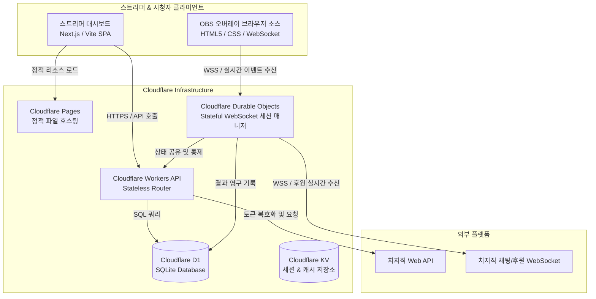
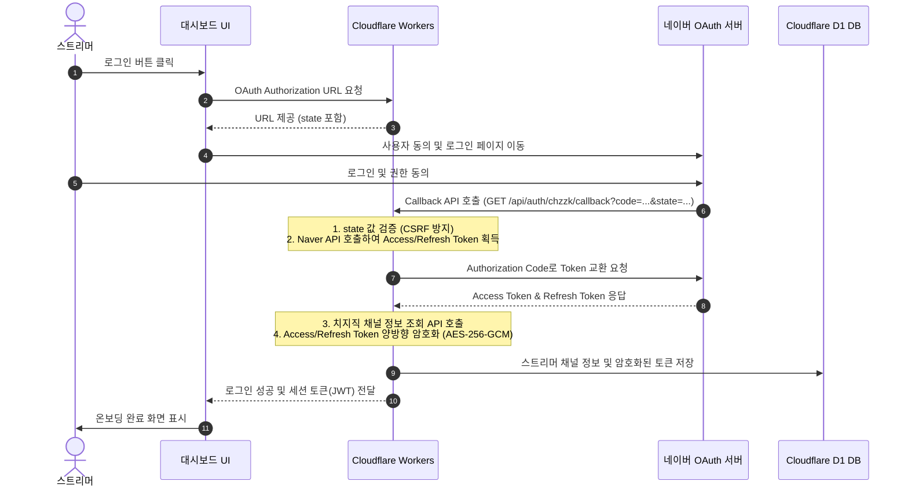
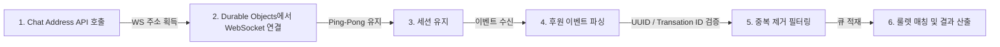

# 기술 요구사항 정의서 (TRD v0.1)

- **서비스명**: 치지직 후원 룰렛 서비스 (가칭)
- **작성 버전**: v0.1 (Draft)
- **작성일**: 2026-06-13
- **문서 상태**: Draft (초안 작성 중)

---

## 1. 시스템 아키텍처 (System Architecture)

본 서비스는 클라이언트 환경의 가벼움과 무중단 영속적 세션 감지를 위하여, 서버리스(Serverless) 및 엣지 컴퓨팅(Edge Computing) 아키텍처를 지향합니다. 인프라 비용 절감과 전 세계 엣지에서의 빠른 지연 속도를 위해 **Cloudflare 생태계**를 적극 활용합니다.



### 1.1. Cloudflare 단독 아키텍처 및 하이브리드 Node.js 설계 검토

| 아키텍처 구분 | 장점 | 단점 및 제약 사항 | 최종 채택 여부 |
| :--- | :--- | :--- | :---: |
| **Cloudflare 단독**<br>(Workers + Durable Objects) | - 엣지 인프라로 지연 시간 최소화 (1.5초 이내)<br>- 서버 유지보수 불필요 (Serverless)<br>- D1 DB 결합도가 높음 | - Durable Objects 사용을 위해 월 $5의 유료 플랜 필수<br>- WebSocket 연결 유지 시 CPU Time limits(50ms) 모니터링 필요 | **1순위 (PoC 수행)** |
| **하이브리드**<br>(Workers + Node.js 전용 백엔드) | - 표준 WebSocket/Socket.io 환경 구현 용이<br>- CPU 시간 제한 및 플랫폼 제약 없음 | - 별도 가상 머신(Fly.io / AWS ECS 등) 호스팅 관리 비용 발생<br>- Cold Start 및 네트워크 Hop 추가로 지연 증가 우려 | **대안 (PoC 실패 시)** |

---

## 2. 치지직 OAuth 연동 구조

치지직 로그인 및 채널 정보를 연동하기 위해 네이버/치지직 OAuth 2.0 프로토콜을 사용합니다.



### 2.1. 토큰 저장 및 자동 갱신(Refresh) 정책
- **토큰 암호화**: Access Token 및 Refresh Token은 평문으로 저장하지 않으며, Cloudflare Workers Environment Variable로 관리되는 마스터 키(`ENCRYPTION_KEY`)를 이용해 **AES-256-GCM** 방식으로 암호화하여 D1 DB에 저장합니다.
- **자동 갱신 프로세스**:
  - API 요청 시 치지직 API가 `401 Unauthorized`를 반환하거나 토큰 만료 시간이 10분 이내로 남은 경우, 백엔드는 즉시 저장된 암호화된 Refresh Token을 복호화합니다.
  - 네이버 토큰 갱신 엔드포인트(`https://nid.naver.com/oauth2.0/token?grant_type=refresh_token&...`)를 호출하여 새로운 Access Token을 획득합니다.
  - 새 토큰을 다시 암호화하여 D1 DB를 업데이트하고, 실패한 API 요청을 재시도합니다.

---

## 3. 치지직 실시간 후원 수신 구조

치지직 세션 소켓을 안정적으로 유지하고 후원 이벤트를 실시간으로 파싱하는 모듈 설계입니다.



### 3.1. 치지직 WebSocket 연결 명세
1. **Chat Address 조회**:
   - `GET https://api.chzzk.naver.com/service/v1/channels/{channelId}` 에서 `chatChannelId`를 파싱합니다.
   - `GET https://comm-api.chzzk.naver.com/im/v1/chat/connectAddress` 에서 WebSocket 서버 엔드포인트 리스트(예: `wss://kr-ss1.chat.chzzk.naver.com/chat`)를 수신합니다.
2. **소켓 핸드셰이크 및 세션 핑퐁**:
   - Durable Objects에서 `new WebSocket(address)`를 선언하여 세션을 유지합니다.
   - 연결 직후 1회 `SEND` 메시지 형식으로 인증 정보(Access Token 및 세션 토큰)를 전송하여 핸드셰이크를 완료합니다.
   - 치지직 명세에 규정된 주기(예: 20초)마다 `PING` 프레임을 발송하고, 서버로부터 `PONG`이 정상 수신되는지 감시합니다. `PONG`이 지정 시간 내에 오지 않을 경우 소켓을 강제 종료하고 재연결을 개설합니다.

### 3.2. 장애 복구 및 재연결 정책
- **Exponential Backoff**: 소켓 에러 또는 연결 비정상 종료 시 시스템은 다음과 같은 대기 시간을 거쳐 순차적으로 재연결을 시도합니다.
  - `T_delay = min(base * (2 ^ attempt), max_delay) + jitter` (base = 1초, max_delay = 60초, jitter = 무작위 0~500ms)
- **알림 정책**: 5회 이상 연속으로 재연결에 실패하여 세션 유실이 장기화될 경우, 스트리머 관리 대시보드로 장애 웹소켓 메시지를 전송하고 대시보드 상단에 경고 인디케이터를 점멸시킵니다.

---

## 4. 실시간 이벤트 전송 및 OBS 오버레이 구조

산출된 룰렛 당첨 결과를 방송 화면(OBS 오버레이)에 실시간으로 전달하는 구조입니다.

### 4.1. 실시간 전달 기술 스택 비교

| 기술 스택 | 장점 | 단점 | 최종 채택 여부 |
| :--- | :--- | :--- | :---: |
| **WebSocket (WSS)** | - 완전한 양방향 통신 지원<br>- 연결 지연 시간이 거의 없음 (Sub-100ms)<br>- Durable Objects와 직관적인 결합 가능 | - 엣지 서버 측 리소스(연결 유지 유지보수) 관리 필요 | **채택 (Primary)** |
| **Server-Sent Events (SSE)** | - HTTP 프로토콜 상에서 단방향 스트리밍 구현 가능<br>- 클라이언트 재연결 자동 지원 | - 오버레이에서 서버로의 상호작용(예: 테스트 송출 응답)에 추가 HTTP POST가 필요함 | **대안 (Secondary)** |

### 4.2. OBS 오버레이 URL 보안 정책
- **URL 구조**: `https://roulette.streaming.service/overlay/roulette?token={UUIDv4}`
- **인증 방식**:
  - 오버레이가 백엔드 WSS 서버에 커넥션을 요청할 때, 쿼리 스트링의 `token` 값을 검증합니다.
  - DB의 `streamers.overlay_token`과 일치하면 세션을 등록하고 통신을 수락합니다.
- **토큰 무효화 및 재발급**:
  - 토큰이 방송 중 노출되는 등의 이유로 유출되었을 경우, 스트리머가 대시보드 내 [재발급] 버튼을 누르면 DB 상의 토큰을 즉시 무효화하고 새로운 UUIDv4를 생성합니다.
  - 기존 토큰을 사용 중이던 모든 활성화된 WebSocket 연결은 즉시 `4003 Policy Violation` 코드로 강제 세션 해제(Disconnect) 처리됩니다.

---

## 5. 데이터베이스(DB) 설계 초안

Cloudflare D1 (SQLite 엔진) 기반의 데이터베이스 테이블 스키마입니다.

### 5.1. D1 Schema 정의

#### 1) `streamers` (스트리머 계정 테이블)
```sql
CREATE TABLE streamers (
    id TEXT PRIMARY KEY,                       -- 치지직 채널 고유 ID
    channel_name TEXT NOT NULL,                 -- 채널명
    profile_image_url TEXT,                    -- 프로필 이미지 주소
    encrypted_access_token TEXT NOT NULL,      -- 암호화된 Access Token
    encrypted_refresh_token TEXT NOT NULL,     -- 암호화된 Refresh Token
    overlay_token TEXT NOT NULL UNIQUE,         -- OBS 오버레이 UUIDv4 토큰
    created_at DATETIME DEFAULT CURRENT_TIMESTAMP,
    updated_at DATETIME DEFAULT CURRENT_TIMESTAMP
);
CREATE UNIQUE INDEX idx_streamers_overlay_token ON streamers(overlay_token);
```

#### 2) `roulettes` (룰렛 템플릿 테이블)
```sql
CREATE TABLE roulettes (
    id INTEGER PRIMARY KEY AUTOINCREMENT,
    streamer_id TEXT NOT NULL,                 -- streamers.id 외래키
    name TEXT NOT NULL,                        -- 룰렛 이름
    trigger_amount INTEGER NOT NULL,           -- 트리거 작동 후원 금액 (예: 1000)
    is_active INTEGER NOT NULL DEFAULT 1,       -- 활성화 상태 (0: 비활성, 1: 활성)
    created_at DATETIME DEFAULT CURRENT_TIMESTAMP,
    FOREIGN KEY(streamer_id) REFERENCES streamers(id) ON DELETE CASCADE
);
CREATE INDEX idx_roulettes_streamer_amount ON roulettes(streamer_id, trigger_amount);
```

#### 3) `roulette_items` (룰렛 개별 구성 아이템 테이블)
```sql
CREATE TABLE roulette_items (
    id INTEGER PRIMARY KEY AUTOINCREMENT,
    roulette_id INTEGER NOT NULL,              -- roulettes.id 외래키
    name TEXT NOT NULL,                        -- 아이템 이름 (예: 애교, 꽝)
    weight INTEGER NOT NULL CHECK(weight > 0), -- 가중치 (정수)
    created_at DATETIME DEFAULT CURRENT_TIMESTAMP,
    FOREIGN KEY(roulette_id) REFERENCES roulettes(id) ON DELETE CASCADE
);
CREATE INDEX idx_roulette_items_parent ON roulette_items(roulette_id);
```

#### 4) `donation_logs` (후원 수신 및 룰렛 실행 결과 로그 테이블)
```sql
CREATE TABLE donation_logs (
    id INTEGER PRIMARY KEY AUTOINCREMENT,
    streamer_id TEXT NOT NULL,                 -- streamers.id 외래키
    transaction_id TEXT NOT NULL UNIQUE,       -- 치지직 중복 방지용 고유 ID
    donor_name TEXT NOT NULL,                  -- 후원자 닉네임 (익명 처리 반영)
    amount INTEGER NOT NULL,                   -- 후원 금액
    message TEXT,                              -- 후원 메시지
    roulette_name TEXT,                        -- 실행된 룰렛명
    won_item_name TEXT,                        -- 당첨된 아이템명
    status TEXT NOT NULL CHECK(status IN ('SUCCESS', 'FAILED', 'PENDING')), -- 처리 상태
    created_at DATETIME DEFAULT CURRENT_TIMESTAMP,
    FOREIGN KEY(streamer_id) REFERENCES streamers(id) ON DELETE CASCADE
);
CREATE INDEX idx_donation_logs_streamer ON donation_logs(streamer_id, created_at);
```

---

## 6. API 설계 초안

모든 REST API 엔드포인트는 JSON 포맷의 데이터 송수신을 기준으로 합니다.

### 6.1. REST API Endpoint

| 메서드 | 엔드포인트 | 설명 | 보호 여부 |
| :--- | :--- | :--- | :---: |
| **GET** | `/api/auth/chzzk` | 네이버 로그인 페이지로의 리다이렉트 제공 | X |
| **GET** | `/api/auth/chzzk/callback` | 네이버 OAuth Callback 처리 및 JWT 토큰 반환 | X |
| **GET** | `/api/profile` | 로그인된 스트리머 채널 정보 조회 | O (JWT) |
| **GET** | `/api/roulettes` | 스트리머가 등록한 전체 룰렛 리스트 조회 | O (JWT) |
| **POST** | `/api/roulettes` | 신규 룰렛 생성 (트리거 금액, 아이템 목록 포함) | O (JWT) |
| **PUT** | `/api/roulettes/{id}` | 기존 룰렛 수정 (활성화 토글 및 가중치 편집 포함) | O (JWT) |
| **DELETE**| `/api/roulettes/{id}` | 룰렛 삭제 | O (JWT) |
| **POST** | `/api/overlay/token/regenerate`| OBS 오버레이 토큰 무효화 및 신규 발급 | O (JWT) |
| **GET** | `/api/logs` | 룰렛 당첨 이력 및 후원 로그 조회 (페이징 지원) | O (JWT) |
| **POST** | `/api/logs/{id}/retry` | 특정 로그 건에 대한 강제 재송출 트리거 수행 | O (JWT) |

---

## 7. 보안 및 장애 대응 설계

### 7.1. 중복 이벤트 처리 구조 (Idempotency)
- 치지직으로부터 수신되는 모든 이벤트 데이터에서 고유 트랜잭션 식별자(`transaction_id`)를 파싱합니다.
- `donation_logs` 테이블의 `transaction_id` 필드는 **Unique Constraint**로 설정되어 있어 동일한 트랜잭션 ID의 데이터가 추가 인서트될 수 없습니다.
- 트랜잭션이 수신되면 백엔드 레벨에서 먼저 DB 조회를 통해 처리가 완료된 ID인지 검색하고, 이미 존재하는 경우 로그 기록과 룰렛 추첨, 오버레이 전송을 모두 즉시 스킵(Idempotent 처리)합니다.

### 7.2. CSRF 검증 및 오버레이 보호
- OAuth 인증 프로세스 시 네이버 로그인으로 보낼 `state` 파라미터에 CSRF 방지용 엣지 암호화 난수 토큰을 바인딩하고 콜백 시 대조합니다.
- OBS 오버레이 브라우저와 통신하는 WebSocket 서버는 헤더 Origin 검사와 URL 쿼리에 동봉된 `overlay_token` 파라미터가 유효하지 않을 경우 Handshake 단계에서 연결을 거절합니다.

---

## 8. 치지직 API PoC 항목

Cloudflare Durable Objects에서 정상적인 소켓 점유가 가능한지 파악하기 위한 사전 PoC 대상 목록입니다.

1. **치지직 WebSocket 프로토콜 호환성 검증**:
   - 치지직 WebSocket 서버가 일반적인 HTTP1.1 Upgrade WebSocket 규격을 표준 준수하는지 확인합니다.
   - Cloudflare Workers/Durable Objects의 `fetch` API 기반 WebSocket 핸들링 시 정상적인 핸드셰이크와 PING/PONG이 유지되는지 체크합니다.
2. **Durable Objects CPU 제한 테스트**:
   - 수십/수백 건의 동시 WebSocket 세션을 유지하는 동안 Durable Objects 단일 인스턴스에 걸리는 CPU 누적 시간(CPU Time)을 기록하고, Workers 플랫폼 한계(50ms) 도달 여부를 로컬 Wrangler 환경과 스테이징 배포 환경에서 프로파일링합니다.
3. **가중치 랜덤 추첨 알고리즘의 공정성 검증**:
   - 백엔드 가중치 기반 추첨 로직(가중치 누적 합 기반 Random 구간 매칭 알고리즘)이 대규모 반복 수행(10,000회 이상) 시 설정된 확률 편차에 수렴하는지 유닛 테스트 코드를 구동하여 검증합니다.
