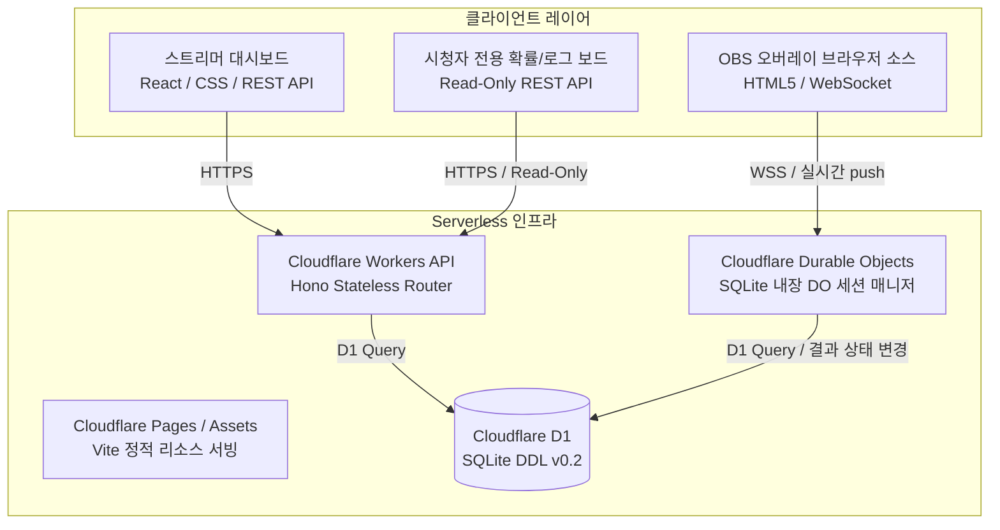

# 기술 요구사항 정의서 (TRD v0.2)

- **서비스명**: 치지직 후원 룰렛 템플릿 서비스 (가칭)
- **작성 버전**: v0.2 (Final)
- **작성일**: 2026-06-13
- **문서 상태**: Approved (최종본 승인)

---

## 1. 개정 시스템 아키텍처 (Revised Architecture)

v0.2에서는 다양한 후원 서비스 및 5대 UI 템플릿 제공, 시청자 전용 퍼블릭 보드 조회를 위해 데이터베이스 및 라우터 구조가 확장되었습니다.



---

## 2. 데이터베이스 스키마 설계 (v0.2 D1 SQLite DDL)

기획서 v0.2 규격을 만족시키기 위해 총 8개의 관계형 테이블 구조로 확장 및 마이그레이션을 완료했습니다.

### 2.1. 테이블 DDL 스키마
1. **`streamers`** (스트리머 채널 정보 및 토큰)
2. **`donation_services`** (후원 서비스 정의 마스터: 룰렛, 알림 등)
3. **`roulette_contents`** (룰렛 기본 설정 및 조건, 활성 상태)
4. **`roulette_items`** (룰렛 당첨 개별 항목 및 가중치)
5. **`ui_templates`** (5대 UI 템플릿 정의: Basic, Neon, Cute, Premium, Dark)
6. **`roulette_design_settings`** (룰렛별 UI 디자인 커스텀 정보)
7. **`donation_events`** (실시간 후원 수신 원본 트랜잭션 로그)
8. **`roulette_results`** (룰렛 가중치 추첨 당첨 결과 이력 로그)

---

## 3. 실시간 통신 및 템플릿 서빙 구조

### 3.1. 템플릿-내용 격리 렌더링
- OBS 오버레이 뷰어는 연결 시 쿼리 스트링의 `token`을 통해 백엔드 소켓에 접근합니다.
- 후원 이벤트 트리거(`ROULETTE_TRIGGER`) 발생 시, Durable Objects는 다음 패킷 데이터를 WebSocket으로 Push합니다:
  ```json
  {
    "type": "ROULETTE_TRIGGER",
    "transactionId": "chzzk-uuid-...",
    "donorName": "시청자닉네임",
    "amount": 1000,
    "message": "메시지내용",
    "rouletteName": "룰렛이름",
    "wonItemName": "당첨아이템명",
    "design": {
      "ui_template_id": 2,
      "primary_color": "#00C773",
      "font_preset": "Outfit",
      "display_duration_sec": 5
    }
  }
  ```
- 오버레이 클라이언트는 수신한 `design.ui_template_id` 값에 맞춰 해당하는 템플릿 테마 클래스명(`overlay-theme-neon-game` 등)을 다이내믹 바인딩하여 룰렛 판의 색상, 효과음, 폰트 및 애니메이션 노출 시간을 실시간 재구성합니다. 이로써 **디자인 템플릿이 변경되더라도 기존 룰렛 내용이 완전히 격리 보존**되는 구조를 확립했습니다.

### 3.2. 무료 플랜 Durable Objects 최적화
- Cloudflare 무료 Workers 플랜 환경과의 호환성을 극대화하기 위하여 `new_sqlite_classes = ["ChzzkSessionDO"]` 마이그레이션을 적용, D1 및 내장 SQLite 엔진과 유기적으로 작동하도록 최적화 배포했습니다.

---

## 4. 시청자 전용 읽기 모드 API 설계

시청자들의 신뢰와 투명성 제고를 위해 별도의 비인증(Public) API 엔드포인트를 제공합니다.

- **엔드포인트**: `GET /api/public/streamer/:channelId/roulette`
- **로직 흐름**:
  1. `:channelId`에 매칭되는 `streamers` 테이블 레코드 조회.
  2. 스트리머가 생성하여 활성화(`is_active = 1`)해 둔 `roulette_contents` 리스트 추출.
  3. 각 룰렛에 연결된 `roulette_items` 리스트의 가중치(`weight`) 합을 구한 후, 수학적 백분율로 환산한 당첨 확률(`(weight / totalWeight) * 100` %)을 읽기 전용으로 연산하여 결합.
  4. `roulette_results` 테이블을 Join 쿼리하여 최근 완료된 성공 로그 이력(`status = 'displayed'`) 20건을 타임라인 형식으로 결합하여 응답.
