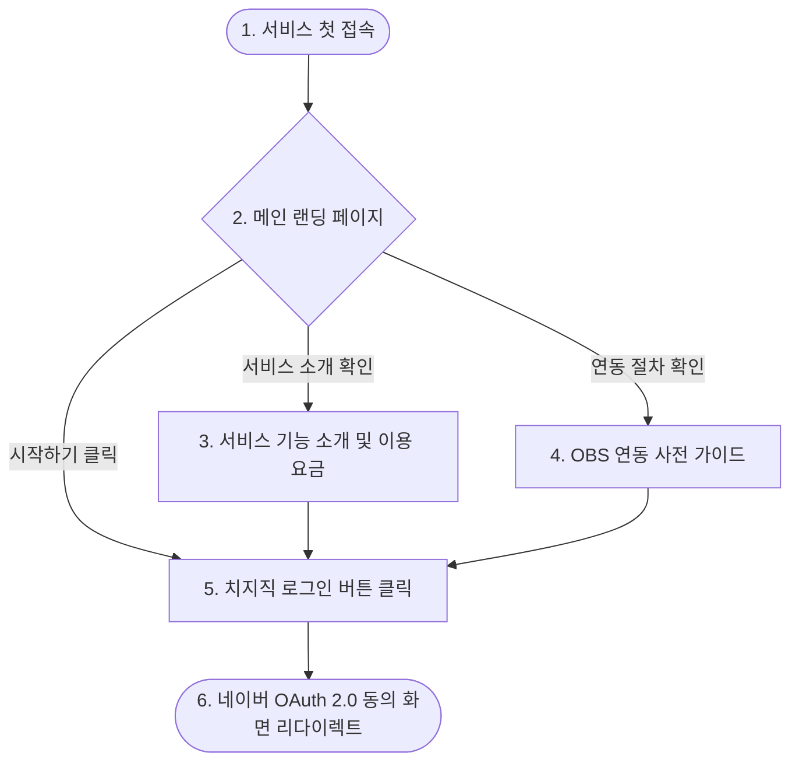
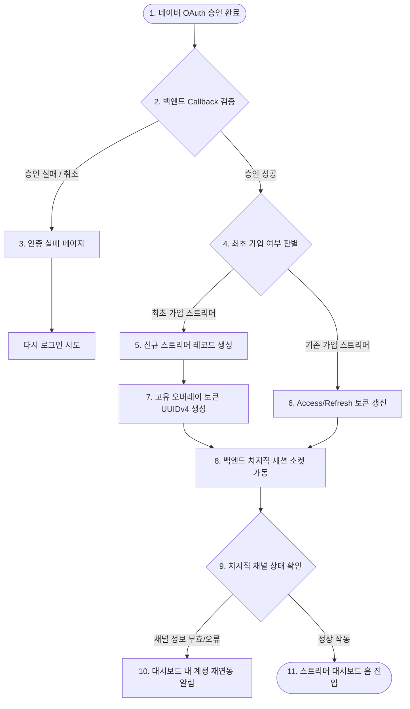
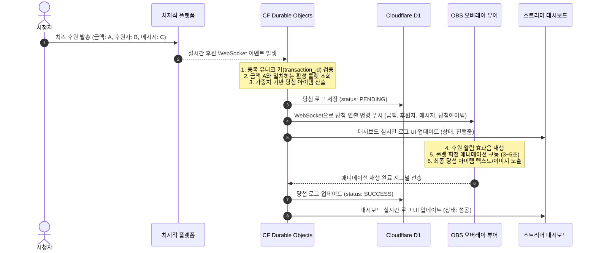
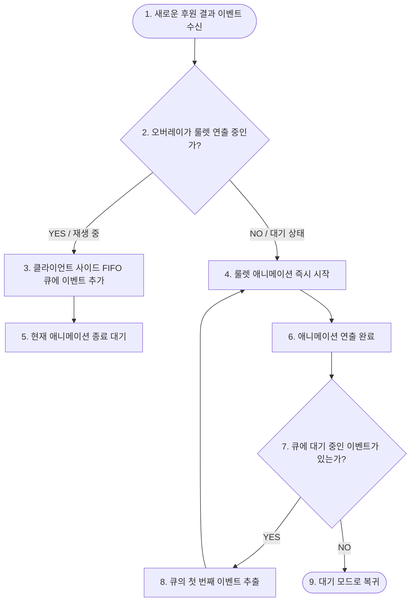

# 사용자 흐름 정의서 (User Flow v0.1)

- **서비스명**: 치지직 후원 룰렛 서비스 (가칭)
- **작성 버전**: v0.1 (Draft)
- **작성일**: 2026-06-13
- **문서 상태**: Draft (초안 작성 중)

---

## 1. 비로그인 사용자 흐름 (Guest User Flow)

로그인하지 않은 외부 방문자가 서비스의 가치를 파악하고 회원가입(네이버 로그인) 단계에 진입하는 흐름입니다.



- **상태 정의**:
  - **로그인 전**: 메인 대시보드 및 설정 페이지 접근이 불가능하며, 접근을 시도할 경우 자동으로 랜딩 페이지(`/`)로 리다이렉트 처리됩니다.
  - **가이드**: 스트리머가 사전에 준비해야 하는 네이버 로그인 권한 및 OBS 사용 최소 환경 조건(네트워크 속도 등)을 시각적으로 안내합니다.

---

## 2. 치지직 로그인 및 최초 온보딩 흐름 (Login & Onboarding Flow)

스트리머가 최초로 로그인을 수행한 후 서비스가 요구하는 필수 데이터 및 연동을 검증하는 흐름입니다.



- **핵심 포인트**: 
  - 최초 로그인 시 시스템은 스트리머의 방송 오버레이를 식별할 고유 오버레이 토큰(UUIDv4)을 단 1회 자동 생성하여 바인딩합니다.
  - 로그인 성공과 동시에 백엔드(Durable Objects)에서는 치지직 소켓 세션을 구동하여 실시간 이벤트 대기 상태로 들어갑니다.

---

## 3. 룰렛 생성 및 설정 흐름 (Roulette CRUD Flow)

스트리머가 시청자의 후원 시 작동할 룰렛 콘텐츠를 작성하고 제어하는 화면상의 흐름입니다.

```mermaid
graph TD
    DashHome([1. 대시보드 홈]) --> RouletteList[2. 룰렛 콘텐츠 목록 조회]
    RouletteList -->|목록이 비어있음| EmptyView[3. 신규 생성 유도 빈 상태 UI]
    RouletteList -->|추가 버튼 클릭| ModalCreate[4. 룰렛 생성 모달 오픈]
    
    ModalCreate --> FormInput[5. 기본 정보 입력]
    Note over FormInput: - 룰렛 이름<br>- 작동 금액 (예: 1,000원)<br>- 활성화 여부 토글 (On/Off)
    
    FormInput --> ItemInput[6. 룰렛 구성 아이템 추가]
    Note over ItemInput: - 아이템 이름 (예: 벌칙 애교, 꽝)<br>- 가중치 입력 (정수)
    
    ItemInput --> WeightCheck{7. 가중치 정합성 검사}
    WeightCheck -->|가중치 값이 0 이하이거나 비어있음| ValidationError[8. 입력값 에러 메시지 표시]
    WeightCheck -->|검증 성공| ClickSave[9. 저장 버튼 클릭]
    
    ClickSave --> DBSave[10. D1 DB 저장 완료]
    DBSave --> RefreshList([11. 목록 새로고침 및 모달 닫기])
```

- **입력값 검증 정책**: 
  - 각 아이템의 가중치는 0보다 큰 자연수이어야 합니다.
  - 가중치가 적용되면 시스템이 자동으로 전체 가중치 합을 분모로 하여 각 아이템의 당첨 확률(%)을 계산하고 UI에 실시간으로 표시해 줍니다.

---

## 4. OBS 오버레이 연결 및 설정 흐름 (OBS Setup Flow)

스트리머가 방송 송출 프로그램인 OBS Studio에 룰렛 오버레이 화면을 연결하는 물리적 조작 흐름입니다.

```mermaid
graph TD
    DashHome([1. 대시보드 홈]) --> OverlayMenu[2. 오버레이 설정 메뉴 선택]
    OverlayMenu --> ViewToken[3. 오버레이 URL 확인]
    ViewToken --> ClickCopy[4. [클립보드 복사] 버튼 클릭]
    
    ClickCopy --> OpenOBS[5. OBS Studio 실행]
    OpenOBS --> AddSource[6. 소스 목록 -> [브라우저 소스] 추가]
    AddSource --> PasteURL[7. 복사한 오버레이 URL 붙여넣기]
    PasteURL --> SetResolution[8. 해상도 설정]
    Note over SetResolution: 너비: 1920, 높이: 1080 입력 필수<br>(또는 1280x720)
    
    SetResolution --> VerifyOverlay{9. 오버레이 화면 확인}
    VerifyOverlay -->|배경이 투명하지 않거나 검은 화면| ConfigCSS[10. OBS 내 커스텀 CSS 지우기]
    VerifyOverlay -->|정상 렌더링| ReadyStatus([11. 오버레이 실시간 수신 대기 상태])
```

---

## 5. 실시간 후원 발생 및 송출 흐름 (Donation & Overlay Flow)

시청자가 후원을 하고, 시스템이 룰렛 결과를 도출하여 OBS 방송 화면에 노출시키는 핵심 백엔드/프론트엔드 유기적 흐름입니다.



---

## 6. 연속 후원 발생 및 큐(Queue) 연출 흐름 (FIFO Event Queue Flow)

단시간에 여러 건의 후원이 밀려올 경우, 방송 연출이 유실되거나 겹쳐서 깨지지 않도록 백엔드 및 오버레이 클라이언트 사이드에서 이벤트를 큐(Queue)로 격리하여 실행하는 제어 흐름입니다.



---

## 7. 장애 및 세션 재연결 흐름 (Failure & Reconnection Flow)

네트워크 단절, 치지직 세션 무효화 등 장애 발생 시 복구 및 유실 후원 처리 흐름입니다.

```mermaid
graph TD
    SessionDrop([1. 치지직 WebSocket 세션 끊김 감지]) --> BackoffRetry{2. 지수 백오프 자동 재연결 시도}
    
    BackoffRetry -->|재연결 성공| ResumeStatus[3. 세션 정상화 및 데이터 수신 재개]
    BackoffRetry -->|5회 연속 실패 / 최종 오류| AlertStreamer[4. 대시보드 화면에 세션 끊김 경고 인디케이터 점멸]
    
    AlertStreamer --> ManualCheck[5. 스트리머가 대시보드 내 [재연동] 버튼 클릭]
    ManualCheck --> ReAuth([6. 치지직 계정 재인증 진행 및 소켓 초기화])
    
    %% 유실 후원 수동 구제 흐름
    SessionDrop -.-> LostDono[7. 세션 유실 시간 동안 들어온 후원은 자동 룰렛 누락]
    LostDono --> ViewLogs[8. 스트리머가 대시보드 후원 로그 메뉴 확인]
    ViewLogs --> ClickRetry[9. 누락된 후원 우측의 [수동 재송출] 버튼 클릭]
    ClickRetry --> SendSavedResult[10. 기존 산출된 당첨 결과를 기반으로 OBS에 오버레이 강제 송출]
```

- **실패 구제 조치**:
  - `수동 재송출` 버튼 작동 시, 새로운 결과를 가중치로 다시 굴리지 않습니다. 
  - 후원 시점에 백엔드에서 미리 안전하게 산출해 두었던 당첨 항목(`donation_logs.won_item_name`)을 OBS로 강제 리플레이 렌더링함으로써 룰렛 결과의 조작 가능성을 사전 차단합니다.

---

## 8. 오버레이 테스트 송출 흐름 (Test Stream Flow)

실제 후원을 발생시키기 전, 스트리머가 오버레이 화면의 크기, 소리, 애니메이션이 올바르게 출력되는지 확인해 보기 위해 가상의 이벤트를 발생시키는 흐름입니다.

```mermaid
graph TD
    DashHome([1. 대시보드 홈]) --> OverlayMenu[2. 오버레이 설정 메뉴 선택]
    OverlayMenu --> TestWidget[3. 테스트 송출 컨트롤러 영역]
    
    TestWidget --> SelectRoulette[4. 테스트 대상 룰렛 선택]
    SelectRoulette --> InputDonoInfo[5. 가상의 후원 금액, 닉네임, 메시지 입력]
    InputDonoInfo --> ClickTestBtn[6. [테스트 송출] 버튼 클릭]
    
    ClickTestBtn --> TriggerVirtualEvent[7. 가상 룰렛 이벤트 생성 및 소켓 전송]
    TriggerVirtualEvent --> PlayOBS[8. OBS 오버레이에 가상 룰렛 회전 연출 작동]
    PlayOBS --> CompleteTest([9. 스트리머가 연출 상태 확인 후 조율 완료])
```

- **특징**:
  - 테스트 송출 데이터는 실제 후원이 아니므로 `donation_logs` 테이블에 영구 저장하지 않습니다.
  - 가상 이벤트 플래그(`is_test: true`)를 동봉하여 오버레이로 전달하며, 대시보드 상의 실제 수입 통계에도 포함하지 않습니다.

---

## 9. 유저 플로우 검수 체크리스트 (자가 진단)

- [x] 비로그인 유저가 접근하여 가이드를 확인하고 로그인을 거쳐 최초 온보딩에 이르는 과정이 유기적인가?
- [x] 로그인 상태에 따른 접근 제한 및 세션 분리가 명확한가?
- [x] OBS Studio 소스 추가 및 너비/높이 해상도(1920x1080) 설정 가이드 단계가 플로우에 포함되어 있는가?
- [x] 시청자 후원 -> 감지 -> 결과 도출 -> OBS 송출 애니메이션 구동 -> 완료 데이터 처리의 전체 연결고리가 정의되었는가?
- [x] 연속 후원이 몰려올 때 유실되거나 연출이 꼬이지 않도록 하는 FIFO 큐 흐름이 설계되었는가?
- [x] 세션 단절 발생 시의 복구 프로세스(지수 백오프, 대시보드 알림, 수동 재송출을 통한 구제)가 수립되었는가?
- [x] 실제 치즈 충전 없이도 연동을 확인하기 위한 가상 테스트 송출 흐름이 정의되어 있는가?
