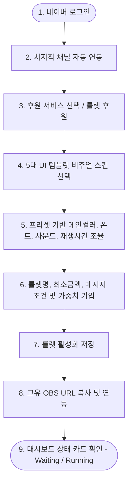
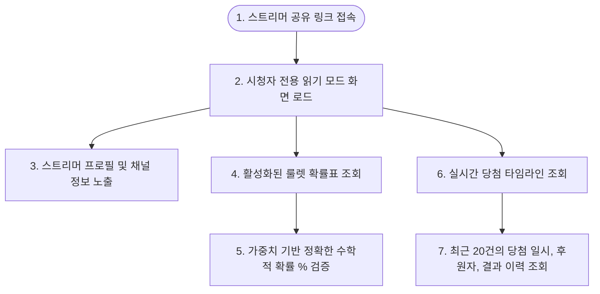
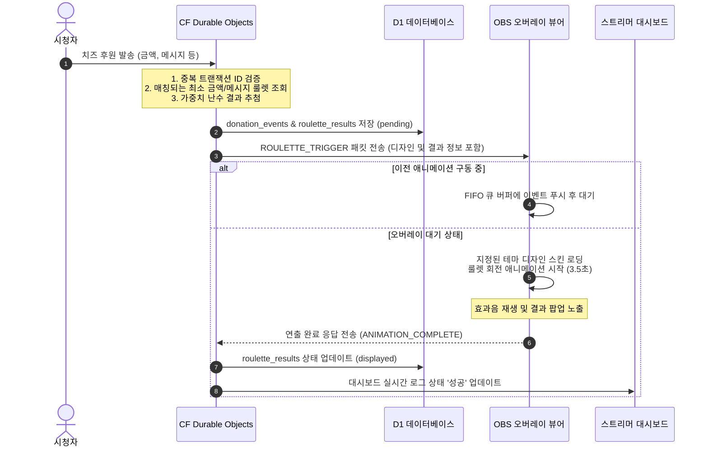

# 사용자 흐름 정의서 (User Flow v0.2)

- **서비스명**: 치지직 후원 룰렛 템플릿 서비스 (가칭)
- **작성 버전**: v0.2 (Final)
- **작성일**: 2026-06-13
- **문서 상태**: Approved (최종본 승인)

---

## 1. 개정 사용자 여정 (Revised User Journeys)

v0.2 기획 요구사항 및 시청자 투명성 제고를 위해 개편된 3대 사용자 여정 정의입니다.

### 1.1. 스트리머 설정 & 방송 연동 여정

### 1.2. 시청자 룰렛 확인 및 검증 여정 (읽기 모드)

### 1.3. 실시간 후원 발생 및 큐(Queue) 순차 재생 흐름

---

## 2. 룰렛 연동 동작 상태 정의

적용 완료 후 스트리머 대시보드 및 시스템에 표시되는 핵심 상태(State) 카드 명세입니다.

| 상태 | 아이콘/색상 | 동작 상태 및 전환 시나리오 |
| :--- | :---: | :--- |
| **Draft** | 회색 | 룰렛 정보 입력 중이며 아직 저장하지 않은 설계 초안 상태 |
| **Ready** | 파란색 | 룰렛 구성 및 아이템 입력 완료. 템플릿 디자인이 연결되어 적용 대기 중 |
| **Waiting** | 주황색 | 후원 연동하기를 눌러 활성화했으나, OBS 오버레이 브라우저가 접속하지 않았거나 항목이 부족한 대기 상태 |
| **Running** | 초록색 | OBS 브라우저 소스가 연결되어 실시간 후원 유입 시 즉시 룰렛이 구동되는 실행 상태 |
| **Paused** | 노란색 | 스트리머가 수동으로 일시 중지하여 후원이 들어와도 오버레이에 룰렛을 노출시키지 않는 상태 |
| **Error / Revoked**| 빨간색 | 치지직 세션 만료, 토큰 무효화 등으로 강제 연결이 실패한 오류 상태 (해결 가이드 퀵링크 연계) |
